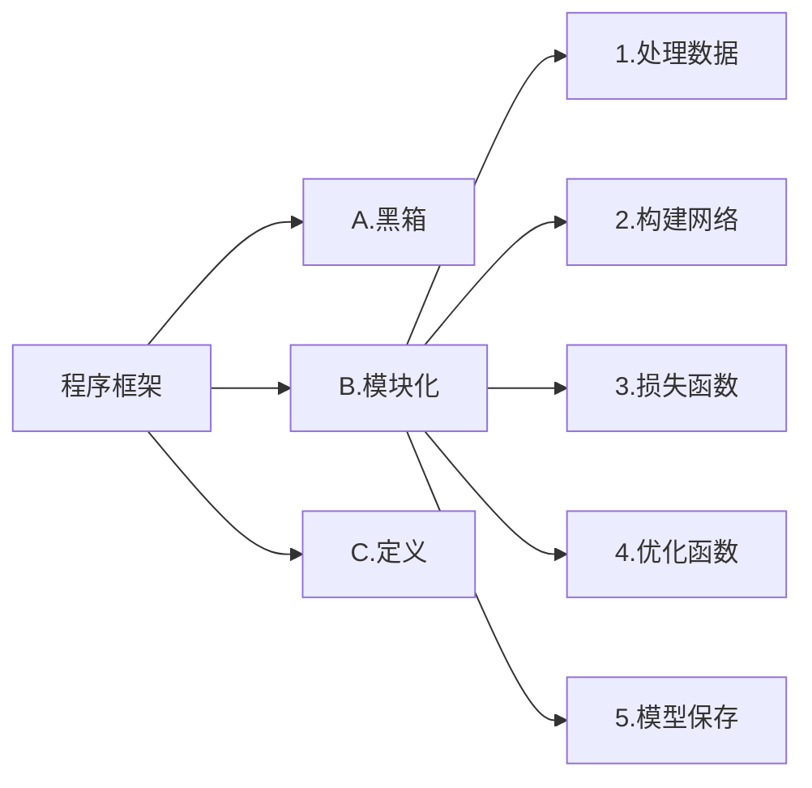

记录深度学习基本概念，不断更新中，项目地址：[DLpractice](https://github.com/Arrowes/DLpractice)
<!--more-->

从机器学习到深度学习：[从机器学习谈起](https://www.cnblogs.com/subconscious/p/4107357.html)，[从神经元到深度学习](https://www.cnblogs.com/subconscious/p/5058741.html)
什么是卷积讲解视频：[大白话讲解卷积神经网络工作原理](https://www.bilibili.com/video/BV1sb411P7pQ/?share_source=copy_web&vd_source=b148fb6f311bfe6f3870ad8f4dfda92a)

[DL500问](https://github.com/scutan90/DeepLearning-500-questions)

# 深度学习框架



GPU 网络和数据要同时送进GPU

## 激活函数 Activate Function
激活函数是深度学习神经网络中的一个重要组成部分，它用来引入*非线性性质*，使神经网络能够学习复杂的函数关系。激活函数接收神经元的输入，并产生输出作为下一层神经元的输入。在神经网络中，激活函数通常被应用于每个神经元的输出，使神经网络能够进行非线性映射和学习。

激活函数的主要作用有以下几点：
+ 非线性映射：激活函数引入非线性性质，使神经网络可以逼近和表示复杂的非线性函数。如果没有激活函数，多层神经网络的组合将等效于单一层的线性变换。
+ 特征提取：激活函数有助于神经网络从输入数据中提取关键特征，例如边缘、纹理、形状等，以便更好地完成分类、回归和其他任务。
+ 解决梯度消失问题：某些激活函数（如ReLU）有助于减轻梯度消失问题，使深层网络能够更好地进行反向传播和训练。

一些常见的激活函数包括：

激活函数                       |特点          |图像
------------------------------|--------------|---------
 $$softmax(x_i) = \frac{e^{x_i}}{\sum_{j=0}^{N} e^{x_j}}$$  | 将未规范化的预测变换为非负数并且总和为1，同时让模型保持可导的性质;常用在分类网络的最后一层，把网络输出转化为各类别的概率。 |首先对每个未规范化的预测求幂，这样可以确保输出非负。为了确保最终输出的概率值总和为1，再让每个求幂后的结果除以它们的总和
挤压函数（squashing function）$$sigmoid(x) = \frac 1{1 + exp(−x)}$$  | 将输入映射到范围(0, 1)，常用于二元分类问题。sigmoid可以视为softmax的特例 | 
双曲正切 $$tanh(x) = \frac {1 − exp(−2x)}{1 + exp(−2x)}$$   |   将输入映射到范围(-1, 1)，也用于某些分类和回归问题, 当输入在0附近时，tanh函数接近线性变换。形状类似于sigmoid函数，不同的是tanh函数关于坐标系原点中心对称。（LSTM）|
修正线性单元（Rectified Linear Unit）$$ReLU(x) = max(x, 0)$$  $$LeakyReLU=max(αx,x)$$ |求导表现得特别好：要么让参数消失，要么让参数通过。最常用的激活函数，通常能够加速收敛和减轻梯度消失问题（Transfromer）； LeakyReLU中通常设α=0.01来调整负值的零梯度，缓解dead ReLU问题（YOLO） 若α为可学习参数，则为PReLU|    
指数线性单元 (Exponential Linear Units) |   对小于零的情况采用类似指数计算的方式进行输出。与 ReLU 相比，ELU 有负值，这会使激活的平均值接近零。均值激活接近于零可以使学习更快，因为它们使梯度更接近自然梯度。但计算量较大 |


## 感受野(Receptive field)
感受野是指在卷积神经网络中，输出特征图上的一个像素点对应于输入图像上的感受区域大小。感受野的大小可以用来衡量网络在某一层上能够“看到”输入图像的范围，从而影响网络对局部和全局信息的感知能力。


$   n_{output.features}=[\frac{n_{input.features}+2p_{adding.size}-k_{ernel.size}}{s_{tride.size}}+1]   $
较小的感受野通常用于捕获局部特征，而较大的感受野则有助于捕获全局信息。


## 卷积
  


## 反向传播
待续

## Optimizer


$$SGD → SGDM → NAG → AdaGrad → AdaDelta → Adam → Nadam$$
  


## Batch size
batch size的大小影响的是训练过程中的完成*每个epoch所需的时间* $^1$（假设算力确定了）和每次迭代(iteration)之间*梯度的平滑程度* $^2$。
> 1. 假设训练集大小为N，每个epoch中mini-batch大小为b，那么完成每个epoch所需的迭代次数为 N/b , 因此完成每个epoch所需的时间会随着迭代次数的增加而增加
2. 如pytorch\tensorflow等深度学习框架，在进行mini-batch的loss反向传播时，一般都是先将每个mini-batch中每个样本得到的loss求sum后再平均化之后再反求梯度，进行迭代，因此b的大小决定了相邻迭代batch之间的梯度平滑程度。一个batch内所含样本越多，这个batch的梯度应该越能反映真实的梯度，因此这样的大batch间梯度不会跨越太大

因此：大的batch_size往往建议可以相应取大点learning_rate, 因为梯度震荡小，大 learning_rate可以加速收敛过程，也可以防止陷入到局部最小值，而小batch_size用小learning_rate迭代，防止错过最优点，一直上下震荡没法收敛 
>1. 若是loss还能降，指标还在升，那说明欠拟合，还没收敛，应该继续train，增大epoch。
2. 若是loss还能再降，指标也在降，说明过拟合了，那就得采用提前终止（减少epoch）或采用weight_decay等防过拟合措施。
3. 若是设置epoch=16，到第8个epoch，loss也不降了，指标也不动了，说明8个epoch就够了，剩下的白算了。

## 损失函数「loss function」
来度量模型的预测值$\hat{y}$与真实值$y$的差异程度的运算函数，它是一个非负实值函数，通常使用$L(y, \hat{y})$来表示，损失函数越小，模型的鲁棒性就越好。
### 基于距离度量的损失函数
基于距离度量的损失函数通常将输入数据映射到基于距离度量的特征空间上，如欧氏空间、汉明空间等，将映射后的样本看作空间上的点，采用合适的损失函数度量特征空间上样本真实值和模型预测值之间的距离。特征空间上两个点的距离越小，模型的预测性能越好。
**L1范数损失函数（MAE）**
$$L_{MSE}=\frac{1}{n}\sum_{i=1}^{n}|y_i-\hat{y_i}|$$
又称为曼哈顿距离，表示残差的绝对值之和。L1损失函数对离群点有很好的鲁棒性，但它在残差为零处却不可导,且更新的梯度始终相同；
**L2损失函数（MSE均方误差损失函数）**
$$L_{MSE}=\frac{1}{n}\sum_{i=1}^{n}(y_i-\hat{y_i})^2$$
在回归问题中，均方误差损失函数用于度量样本点到回归曲线的距离，通过最小化平方损失使样本点可以更好地拟合回归曲线。（L2损失又被称为欧氏距离，是一种常用的距离度量方法，通常用于度量数据点之间的相似度。）
### 基于概率分布度量的损失函数
基于概率分布度量的损失函数是将样本间的相似性转化为随机事件出现的可能性，即通过度量样本的真实分布与它估计的分布之间的距离，判断两者的相似度，一般用于涉及概率分布或预测类别出现的概率的应用问题中，在分类问题中尤为常用。
**KL散度（ Kullback-Leibler divergence）**
$$L_{MSE}=\sum_{i=1}^{n}\hat{y_i}log(\frac{y_i}{\hat{y_i}})$$
也被称为相对熵，是一种非对称度量方法，常用于度量两个概率分布之间的距离。KL散度也可以衡量两个随机分布之间的距离，两个随机分布的相似度越高的，它们的KL散度越小，可以用于比较文本标签或图像的相似性。
**交叉熵损失函数「Cross Entropy Loss」**
$$L=-[ylog\hat{y}+(1-y)log(1-\hat{y})]$$
$$L=\sum_{i=1}^{N}y^ilog\hat{y}^i+(1-y^i)log(1-\hat{y}^i)$$
交叉熵是信息论中的一个概念，最初用于估算平均编码长度，引入机器学习后，用于评估当前训练得到的概率分布与真实分布的差异情况。为了使神经网络的每一层输出从线性组合转为非线性逼近，以提高模型的预测精度，在以交叉熵为损失函数的神经网络模型中一般选用tanh、sigmoid、softmax或ReLU作为激活函数。

交叉熵损失函数刻画了实际输出概率与期望输出概率之间的相似度，也就是交叉熵的值越小，两个概率分布就越接近，特别是在正负样本不均衡的分类问题中，常用交叉熵作为损失函数。目前，交叉熵损失函数是卷积神经网络中最常使用的分类损失函数，它可以有效避免梯度消散。在二分类情况下也叫做对数损失函数

在多分类任务中，经常采用 softmax 激活函数+交叉熵损失函数，因为交叉熵描述了两个概率分布的差异，然而神经网络输出的是向量，并不是概率分布的形式。所以需要 softmax激活函数将一个向量进行“归一化”成概率分布的形式，再采用交叉熵损失函数计算 loss。

在Pytorch中，BCELoss和BCEWithLogitsLoss是一组常用的二元交叉熵损失函数，常用于二分类问题。区别在于BCELoss的输入需要先进行Sigmoid处理，而BCEWithLogitsLoss则是将Sigmoid和BCELoss合成一步，也就是说BCEWithLogitsLoss函数内部自动先对output进行Sigmoid处理，再对output 和target进行BCELoss计算。 

one-hot独热编码：将类别变量转换为机器学习算法易于利用的一种形式的过程。

# 注意力机制（Attention Mechanism）
自上而下有意识的聚焦称为**聚焦式注意力**，自下而上无意识、由外界刺激引发的注意力称为**显著式注意力**。
神经网络中的注意力机制是在计算能力有限的情况下，将计算资源分配给更重要的任务，同时解决信息超载问题的一种资源分配方案，到2014年，Volodymyr的《Recurrent Models of Visual Attention》一文中将其应用在视觉领域，后来伴随着2017年Ashish Vaswani的《Attention is all you need》中Transformer结构的提出，注意力机制在NLP,CV相关问题的网络设计上被广泛应用。
注意力有两种，一种是软注意力(soft attention)，另一种则是强注意力(hard attention)。
**软注意力**更关注区域或者通道，是确定性的注意力，学习完成后直接可以通过网络生成，最关键的地方是软注意力是可微的，这是一个非常重要的地方。可以微分的注意力就可以通过神经网络算出梯度并且前向传播和后向反馈来学习得到注意力的权重。
**强注意力**是更加关注点，也就是图像中的每个点都有可能延伸出注意力，同时强注意力是一个随机的预测过程，更强调动态变化。当然，最关键是强注意力是一个不可微的注意力，训练过程往往是通过增强学习(reinforcement learning)来完成的。
## 软注意力的注意力域
### 空间域（Spatial Domain）
空间域将原始图片中的空间信息变换到另一个空间中并保留了关键信息。
普通的卷积神经网络中的池化层（pooling layer）直接用一些max pooling 或者average pooling 的方法，将图片信息压缩，减少运算量提升准确率。
发明者认为之前pooling的方法太过于暴力，直接将信息合并会导致关键信息无法识别出来，所以提出了一个叫 **空间转换器（spatial transformer）** 的模块，将图片中的的空间域信息做对应的空间变换，从而能将关键的信息提取出来。


### 通道域（Channel Domain）
通道注意力机制在计算机视觉中，更关注特征图中channel之间的关系，而普通的卷积会对通道做通道融合，这个开山鼻祖是SENet,后面有GSoP-Net，FcaNet 对SENet中的squeeze部分改进，EACNet对SENet中的excitation部分改进，SRM,GCT等对SENet中的scale部分改进。

[SENet](https://arxiv.org/abs/1709.01507),[pytorch](https://github.com/moskomule/senet.pytorch)
SENet《Squeeze-and-Excitation Networks》是CVPR17年的一篇文章，提出SE module。在卷积神经网络中，卷积操作更多的是关注感受野，在通道上默认为是所有通道的融合（深度可分离卷积不对通道进行融合，但是没有学习通道之间的关系，其主要目的是为了减少计算量），SENet提出SE模块，将注意力放到通道之间，希望模型可以学习到不同通道之间的权重：
  

### 时域注意力机制
时域注意力机制在cv领域主要考虑有时序信息的领域，如视频领域中的动作识别方向，其注意力机制主要是在时序列中，关注某一时序即某一帧的信息。

### 通道和空间注意力机制
通道和空间注意力是基于通道注意力和空间注意力机制，将两者有效的结合在一起，让注意力能关注到两者，又称混合注意力机制，如CBAM,BAM,scSE等，同时基于混合注意力机制的一些关注点，如Triplet Attention 关注各种跨维度的相互作用；Coordinate Attention, DANet关注长距离的依赖；RGA 关注关系感知注意力。还有一种混合注意力机制，为3D的attention :Residual attention,SimAM, Strip Pooling, SCNet等。

[CBAM](https://arxiv.org/abs/1807.06521),[github](https://github.com/luuuyi/CBAM.PyTorch) 
CBAM (Convolutional Block Attention Module)是SENet的一种拓展，SENet主要基于通道注意力，CBAM是通道注意力和空间注意力融合的注意力机制。
  
如上图所示，输入一个h*w*c的特征图，通过channel Attention Module 生成通道注意力权重对输入特征图在通道层添加权重，再通过spatial Attention Module 生成空间注意力权重，对特征图在空间层添加权重，输出特征图。

# Metrics 评估
## 混淆矩阵


X横坐标为正确的分类（即你用标签所标注的真实分类）
Y纵坐标为模型所预测的分类（即图片经过模型推理后模型将其辨别为的分类）
> True positives (TP): 猫🐱的图片被正确识别成了猫🐱。（猫🐱的正确分类预测）
True negatives(TN): 背景的图片被正确识别为背景。（非猫🐱被预测为其他动物或背景）
False positives(FP): 背景的图片被错误识别为猫🐱。（非猫🐱被预测为猫🐱）
False negatives(FN): 猫🐱的图片被错误识别为背景。（猫🐱被预测为其他动物或者背景）

## Evaluation parameters
**准确率 Accuracy**：在正负样本数量接近的情况下，准确率越高，模型的性能越好（当测试样本不平衡时，该指标会失去意义。）
$$Accuracy=\frac{TP+TN}{TP+FP+TN+FN}$$  
**精准率（查准率） precision**：代表在总体预测结果中真阳性的预测数，针对预测结果，当区分能力强时，容易将部分（与负样本相似度高）正样本排除。
$$precision(P)=\frac{TP}{TP+FP}$$
**召回率（查全率） recall**：所有ground truths中真阳性的预测数，针对原样本，当敏感度高时，容易将部分（与正样本相似度高）负样本也判断为正样本。
$$recall(R)=\frac{TP}{TP+FN}$$
**F1 score**：对Precision和Recall两个指标的调和平均值（类似平均速度），F1分值越高，目标检测的准确性越好。F1-score最常用于数据集的类别不平衡的情况。
$$F_1 score=2\cdot \frac{P\cdot R}{P+R}$$
**AP**：同时考察Precision和Recall两个指标来衡量模型对于各个类别的性能。 
$$AP_i=\int_0^1P_i(R_i)dR_i$$
**mAP**：表示AP的平均值，并用作衡量目标检测算法的总体检测精度的度量。
将recall设置为横坐标，precision设置为纵坐标。PR曲线下围成的面积即AP，所有类别AP平均值即mAP.
$$mAP=\frac1n\sum_{i = 1}^{n}AP_i$$
**置信度 Confidence**：置信度设定越大，Prediction约接近1，Recall越接近0，要寻找最优的F1分数，需要遍历置信度。
  

**交并比 IoU**（Intersection over Union）：是目标检测中使用的一个概念，IoU计算的是“预测的边框”和“真实的边框”的交叠率，即它们的交集和并集的比值。最理想情况是完全重叠，即比值为1。

*map@0.5*即IoU=0.5，预测框和标注框的交集与非交集占比相同，都为50%；
*mAP@.5:.95*表示在不同IoU阈值（从0.5到0.95，步长0.05）（0.5、0.55、0.6、0.65、0.7、0.75、0.8、0.85、0.9、0.95）上的平均mAP。


**NMS**（Non-Maximum Suppression，非极大值抑制）
一种用于目标检测任务的后处理技术，主要用于消除冗余的检测框，保留最可能准确的预测结果。
在目标检测中，模型（如YOLO、Faster R-CNN等）通常会对同一目标生成多个重叠的预测框（Bounding Box），每个框带有置信度分数。NMS通过筛选，保留置信度最高且位置最合理的框，抑制其他冗余的框，从而避免重复检测。
1. 按置信度排序：将所有预测框按置信度从高到低排序。选择最高置信度的框：取出当前列表中置信度最高的框，加入最终保留列表。
2. 计算IoU并抑制重叠框：计算该框与剩余所有框的交并比（IoU，Intersection over Union）。若某框与当前框的IoU超过设定的阈值（如0.5），则认为它们是同一目标，直接删除。
3. 重复步骤2~3：对剩余框重复上述过程，直到所有框被处理。
IoU阈值：通常设为0.3~0.7，控制框的重叠容忍度。阈值越低，抑制越严格。
置信度阈值：预过滤掉低置信度的框（例如只保留置信度≥0.5的框）。


**ROC曲线**(Receiver Operating Characteristic 受试者工作特征)
$$TPR=\frac{TP}{TP+FN},FPR=\frac{FP}{FP+TN}$$可以理解为分类器对正样本的覆盖敏感性和对负样本的敏感性的权衡。
在ROC曲线图中，每个点以对应的FPR值为横坐标，以TPR值为纵坐标 


**AUC值**：PR曲线下方的面积


> 1.AUC = 1，是完美分类器，采用这个预测模型时，存在至少一个阈值能得出完美预测。绝大多数预测的场合，不存在完美分类器。
2.0.5 < AUC < 1，优于随机猜测。这个分类器（模型）妥善设定阈值的话，能有预测价值。
3.AUC = 0.5，跟随机猜测一样（例：丢铜板），模型没有预测价值。
4.AUC < 0.5，比随机猜测还差；但只要总是反预测而行，就优于随机猜测。

ROC曲线图中，越靠近(0,1)的点对应的模型分类性能越好。而且可以明确的一点是，ROC曲线图中的点对应的模型，它们的不同之处仅仅是在分类时选用的阈值(Threshold)不同，每个点所选用的阈值都对应某个样本被预测为正类的概率值。
## 模型计算量(FLOPs)和参数量(Params)
**计算量 FLOPs**：FLOP时指浮点运算次数，s是指秒，即每秒浮点运算次数的意思，考量一个网络模型的计算量的标准。硬件要求是在于芯片的floaps（指的是gpu的运算能力）
**参数量 Params**：是指网络模型中需要训练的参数总数。硬件要求在于显存大小
1.**卷积层**
计算时间复杂度(计算量)
$$Time\sim O(\sum_{l=1}^D M_l^2\cdot K_l^2\cdot C_{l-1}\cdot C_l)$$

计算空间复杂度(参数量)
$$Space\sim O(\sum_{l=1}^D K_l^2\cdot C_{l-1}\cdot C_l+\sum_{l=1}^D M^2\cdot C_l)$$

```
参数量
(kernel*kernel) *channel_input*channel_output
kernel*kernel 就是 weight * weight
其中kernel*kernel ＝ 1个feature的参数量

计算量
(kernel*kernel*map*map) *channel_input*channel_output
kernel*kernel 就是weight*weight
map*map是下个featuremap的大小，也就是上个weight*weight到底做了多少次运算
其中kernel*kernel*map*map＝　1个feature的计算量
```
2.池化层
无参数
3.**全连接层**
``参数量＝计算量＝weight_in*weight_out  #模型里面最费参数的就是全连接层``

**换算计算量**,一般一个参数是指一个float，也就是４个字节,1kb=1024字节

# Transformer
  
  
  

# 相关概念
## 联邦学习
联邦学习（Federated Learning）是一种先进的分布式机器学习方法，它在数据隐私保护和数据利用效率方面具有显著的优势。在联邦学习中，多个参与方（也称为客户端或节点）可以在保持数据本地化的同时，共享模型训练的成果。
让各个企业自己进行模型的训练，各个企业在完成模型的训练之后，将各自模型的参数上传至一个中心服务器（也可以是点对点），中心服务器结合各个企业的参数（可以上传梯度，也可以是自己更新后的参数），重新拟定新的参数（例如通过加权平均，这一步叫做联邦聚合），将新的参数下发至各个企业，企业将新参数部署到模型上，从而继续新的训练，这个过程可以进行反复的迭代，直到模型收敛，或者满足其他的条件。


## 分布式训练
单机单卡情况下，信息都在一台机器上，无所谓分发。而分布式训练中，信息是要被“分发”的，分发的不同方式，常被称为“并行方式”。通常，习惯上将分发方分为“数据并行”和“模型并行”两种：
+ 模型并行(Model Parallelism)：将模型进行切分，完整的数据 被送至各个训练节点，与 切分后的模型 进行运算，最后将多个节点的运算结果合并；适用于模型规模大的情况
+ 数据并行(Data Parallelism)：将样本数据进行切分，切分后的数据 被送至各个训练节点，与 完整的模型 进行运算，最后将多个节点的信息进行合并；适用于数据量大的情况
    1. 数据划分：不同GPU设备上划分出不同的mini-batch，作为训练的数据集
    2. 前向+反向:不同GPU设备上用相同的模型，用各自接收到的mini-batch数据进行训练（前向和反向传播)
    3. 梯度同步更新:每个GPU设备得到了mini-batch训练后的权重值，这些值需要汇总然后更新至每一个GPU设备，保证每一次迭代后，每个GPU设备上的模型完全一致。
    

> 分布式训练中的学习率自动缩放：在数据并行中，多个GPU同时处理不同的数据子集（每个GPU的批量大小为 B），总批量大小为 B × GPU数量。例如，单GPU批量大小为256，使用4个GPU时，总批量大小变为1024。
更大的批量意味着梯度估计的方差更小，更新方向更准确。为了保持参数更新的有效步长与单GPU训练一致，需要按比例调整学习率。

分布式系统中因为面临大量的信息同步、更新需求，因此传统的点对点(P2P, Point-to-point)的通信方式不能很好的满足需求。需要使用集合通信库(Collective communication Library)，用于分布式训练时，多个计算设备之间的集合通信，常见的有 Open MPI、NCCL:
+ Open MPI:Open MPI项目是一个开源MPI（消息传递接口 ）实现，由学术，研究和行业合作伙伴联盟开发和维护。因此，Open MPI可以整合高性能计算社区中所有专家，技术和资源，以构建可用的最佳MPI库。
+ Gloo:facebook开源的一套集体通信库，他提供了对机器学习中有用的一些集合通信算法如：barrier, broadcast, allreduce
+ NCCL:NVIDIA Collective Communications Library, 英伟达基于NCIDIA-GPU的一套开源的集体通信库，如其官网描述：NVIDIA集体通信库（NCCL）实现了针对NVIDIA GPU性能优化的多GPU和多节点集体通信原语。NCCL提供了诸如all-gather, all-reduce, broadcast, reduce, reduce-scatter等实现，这些实现优化后可以通过PCIe和NVLink等高速互联，从而实现高带宽和低延迟。 因为NCCL则是NVIDIA基于自身硬件定制的，能做到更有针对性且更方便优化，故在英伟达硬件上，NCCL的效果往往比其它的通信库更好。
  + P2P（Peer-to-Peer）是指单个节点内的 GPU 之间直接通信，而不需要通过 CPU 或系统内存中转，可以显著提高通信效率。但若某些 GPU 之间没有直接的 P2P 连接（NVLink 或 PCIe P2P），NCCL可能会初始化后挂死，通过设置 NCCL_P2P_DISABLE=1，可以强制 NCCL 使用系统内存中转的方式代替 P2P 通信，从而避免这些问题。

NCCL遇到显卡P2P通信问题:[1](https://huo.zai.meng.li/p/vllm%E5%90%AF%E5%8A%A8%E6%97%B6nccl%E9%81%87%E5%88%B0%E6%98%BE%E5%8D%A1p2p%E9%80%9A%E4%BF%A1%E9%97%AE%E9%A2%98/) [2](https://huo.zai.meng.li/p/vllm%E5%90%AF%E5%8A%A8%E6%97%B6nccl%E9%81%87%E5%88%B0%E6%98%BE%E5%8D%A1p2p%E9%80%9A%E4%BF%A1%E9%97%AE%E9%A2%98/)


# MMDetection

[MMDetection](https://mmdetection.readthedocs.io/zh-cn/latest/) 由 7 个主要部分组成，apis、structures、datasets、models、engine、evaluation 和 visualization。
+ apis 为模型推理提供高级 API。
+ structures 提供 bbox、mask 和 DetDataSample 等数据结构。
+ datasets 支持用于目标检测、实例分割和全景分割的各种数据集。
  + transforms 包含各种数据增强变换。
  + samplers 定义了不同的数据加载器采样策略。
+ models 是检测器最重要的部分，包含检测器的不同组件。
  + detectors 定义所有检测模型类。
  + data_preprocessors 用于预处理模型的输入数据。
  + backbones 包含各种骨干网络。
  + necks 包含各种模型颈部组件。
  + dense_heads 包含执行密集预测的各种检测头。
  + roi_heads 包含从 RoI 预测的各种检测头。
  + seg_heads 包含各种分割头。
  + losses 包含各种损失函数。
  + task_modules 为检测任务提供模块，例如 assigners、samplers、box coders 和 prior generators。
  + layers 提供了一些基本的神经网络层。
+ engine 是运行时组件的一部分。
  + runner 为 MMEngine 的执行器提供扩展。
  + schedulers 提供用于调整优化超参数的调度程序。
  + optimizers 提供优化器和优化器封装。
  + hooks 提供执行器的各种钩子。
+ evaluation 为评估模型性能提供不同的指标。
+ visualization 用于可视化检测结果。

[文档 - 环境安装与验证](https://mmdetection.readthedocs.io/zh-cn/latest/get_started.html)
1. 使用 MIM 安装 MMEngine 和 MMCV。
2. 从源码安装MMDetection
3. 验证
> Debug: 
1.验证推理时报AssertionError: MMCV == 2.2.0 is used but incompatible. Please install mmcv>=2.0.0rc4, <2.2.0. 解决: mmdet/__init__.py", line 17 强行改版本适配 <=
2.ModuleNotFoundError: No module named 'mmdet' 解决：编译mmdetection：python setup.py develop
3.cuda版本问题：conda install pytorch == 1.13.1 torchvision == 0.14.1 torchaudio==0.13.1 cudatoolkit=11.7 pytorch-cuda=11.7 -c pytorch -c nvidia

[训练 & 测试](https://mmdetection.readthedocs.io/zh-cn/latest/user_guides/index.html#id1)：使用开源模型和数据集来执行常见的训练和测试任务

[实用工具](https://mmdetection.readthedocs.io/zh-cn/latest/user_guides/index.html#id2)：
+ 查看模型配置:`python tools/misc/print_config.py ./configs/_base_/models/mask-rcnn_r50_fpn.py`
+ 列出所有模型：`models = DetInferencer.list_models('mmdet')`

+ 推理：推理的高层编程接口——推理器Inferencer
    ```py
    from mmdet.apis import DetInferencer
    inferencer = DetInferencer('rtmdet_tiny_8xb32-300e_coco')   # 初始化模型
    inferencer('demo/demo.jpg', show=False,out_dir='./outputs',print_result=True)   # 推理示例图片
    # 快速验证：
    python demo/image_demo.py demo/demo.jpg rtmdet_tiny_8xb32-300e_coco.py --weights rtmdet_tiny_8xb32-300e_coco_20220902_112414-78e30dcc.pth --device cpu
    ```
    
+ 下载COCO数据集：`python tools/misc/download_dataset.py --dataset-name coco2017`

+ 测试：`python tools/test.py ${CONFIG_FILE} ${CHECKPOINT_FILE} [--out ${RESULT_FILE}] [--show]`
    ```sh
    python tools/test.py configs/rtmdet/rtmdet_l_8xb32-300e_coco.py checkpoints/rtmdet_l_8xb32-300e_coco_20220719_112030-5a0be7c4.pth --show-dir rtmdet_l_8xb32-300e_coco_results
    ```
+ 训练：
    ```sh
    python tools/train.py {CONFIG_FILE} [optional arguments]
    python tools/train.py configs/retinanet/retinanet_r50_fpn_1x_coco.py
    ```
+ `tensorboard --logdir=work_dirs`:
    tensorboard可视化--在`../_base_/default_runtime.py`--visualizer中：
    ```py
    vis_backends = [
        dict(type='LocalVisBackend'),
        dict(type='TensorboardVisBackend')
    ]
    ```

## [配置文件](https://mmdetection.readthedocs.io/zh-cn/latest/user_guides/config.html#id1)
[MMEngine - 配置（CONFIG）详细文档](https://mmengine.readthedocs.io/zh-cn/latest/advanced_tutorials/config.html)
在 MMDetection 中，一个模型被定义为一个配置文件 和对应被存储在 checkpoint 文件内的模型参数的集合。
`./mmdetection/configs/_base_/..`
在 config/_base_ 文件夹下有 4 个基本组件类型，分别是：数据集(dataset)，模型(model)，训练策略(schedule)和运行时的默认设置(default runtime)。许多方法，例如 Faster R-CNN、Mask R-CNN、Cascade R-CNN、RPN、SSD 能够很容易地构建出来。由 _base_ 下的组件组成的配置，被我们称为 原始配置(primitive)。
1. 模型配置: 在 mmdetection 的配置中，我们使用 model 字段来配置检测算法的组件。 除了 backbone、neck 等神经网络组件外，还需要 data_preprocessor、train_cfg 和 test_cfg。 data_preprocessor 负责对 dataloader 输出的每一批数据进行预处理。 模型配置中的 train_cfg 和 test_cfg 用于设置训练和测试组件的超参数。
2. 数据集和评测器配置: 在使用执行器 进行训练、测试、验证时，我们需要配置 Dataloader。构建数据 dataloader 需要设置数据集（dataset）和数据处理流程（data pipeline）。 由于这部分的配置较为复杂，我们使用中间变量来简化 dataloader 配置的编写。
3. 训练和测试的配置: MMEngine 的 Runner 使用 Loop 来控制训练，验证和测试过程。 用户可以使用这些字段设置最大训练轮次和验证间隔。
4. 优化相关配置: optim_wrapper 是配置优化相关设置的字段。优化器封装（OptimWrapper）不仅提供了优化器的功能，还支持梯度裁剪、混合精度训练等功能。param_scheduler 字段用于配置参数调度器（Parameter Scheduler）来调整优化器的超参数（例如学习率和动量）。 用户可以组合多个调度器来创建所需的参数调整策略。
5. 钩子配置与运行相关配置：用户可以在训练、验证和测试循环上添加钩子，以便在运行期间插入一些操作。配置中有两种不同的钩子字段，一种是 default_hooks，另一种是 custom_hooks。
[MMEngine - Hook](https://mmengine.readthedocs.io/zh-cn/latest/tutorials/hook.html)


## [进阶教程](https://mmdetection.readthedocs.io/zh-cn/latest/advanced_guides/index.html)

自定义模型重点看：[组件定制](https://mmdetection.readthedocs.io/zh-cn/latest/advanced_guides/index.html#id2)

深入理解看：[中文教程](https://mmdetection.readthedocs.io/zh-cn/latest/article.html)

[MMEngine](https://mmengine.readthedocs.io/zh-cn/latest/get_started/introduction.html)，较深入时要看

### [算法组件](https://zhuanlan.zhihu.com/p/337375549)：
**训练核心组件**
1. Backbone: 任何一个 batch 的图片先输入到 backbone 中进行特征提取，典型的骨干网络是 ResNet, Darknet `mmdet/models/backbones`
2. Neck: 输出的单尺度或者多尺度特征图输入到 neck 模块中进行特征融合或者增强，neck 可以认为是 backbone 和 head 的连接层，主要负责对 backbone 的特征进行高效融合和增强，能够对输入的单尺度或者多尺度特征进行融合、增强输出等。典型的 neck 是 FPN `mmdet/models/necks`
3. Head: 上述多尺度特征最终输入到 head 部分，一般都会包括分类和回归分支输出;目标检测算法输出一般包括分类和框坐标回归两个分支，不同算法 head 模块复杂程度不一样，灵活度比较高。在网络构建方面，理解目标检测算法主要是要理解 head 模块。`mmdet/models/dense_heads + roi_heads`
虽然 head 部分的网络构建比较简单，但是由于正负样本属性定义、正负样本采样和 bbox 编解码模块都在 head 模块中进行组合调用，故 MMDetection 中最复杂的模块就是 head。
3. 1. Enhance: 在整个网络构建阶段都可以引入一些即插即用增强算子来增加提取提取能力，典型的例如 SPP、DCN、注意力机制 等等
3. 2. BBox Assigner，BBox Sampler：目标检测 head 输出一般是特征图，对于分类任务存在严重的正负样本不平衡，可以通过正负样本属性分配和采样策略控制 `mmdet/core/bbox/assigners + samplers`
3. 3. BBox Encoder：为了方便收敛和平衡多分支，一般都会对 gt bbox 进行编码，如归一化 `mmdet/core/bbox/coder`
3. 4. Loss: 最后一步是计算分类和回归 loss，进行训练 `mmdet/models/losses`
8. Training tricks: 在训练过程中也包括非常多的 trick，例如优化器选择等，参数调节也非常关键

`bbox_head.forward_train`

**测试核心组件**
BBox Decoder：对应Encoder `mmdet/core/bbox/coder`
BBox PostProcess：最常用的后处理就是非极大值抑制以及其变种。`mmdet/core/post_processing`
Testing tricks：典型的是多尺度测试以及各种模型集成手段

`bbox_head.get_bboxes`


### [整体构建细节](https://zhuanlan.zhihu.com/p/341954021)


Pipeline: 由一系列按照插入顺序运行的数据处理模块组成，每个模块完成某个特定功能，例如 Resize，因为其流式顺序运行特性，故叫做 Pipeline。


MMDataParallel:处理Dataloader中pytorch 无法解析的DataContainer 对象,且额外实现了 `train_step()` 和 `val_step() `两个函数，可以被 Runner 调用

Model:


Runner:封装了 OpenMMLab 体系下各个框架的训练和验证详细流程，其负责管理训练和验证过程中的整个生命周期，通过预定义回调函数，用户可以插入定制化 Hook ，从而实现各种各样的需求。


整体代码抽象


```py
#=================== tools/train.py ==================
# 1.初始化配置
cfg = Config.fromfile(args.config)
# 2.判断是否为分布式训练模式
# 3.初始化 logger
logger = get_root_logger(log_file=log_file, log_level=cfg.log_level)
# 4.收集运行环境并且打印，方便排查硬件和软件相关问题
env_info_dict = collect_env()
# 5.初始化 model
model = build_detector(cfg.model, ...)
# 6.初始化 datasets

#=================== mmdet/apis/train.py ==================
# 1.初始化 data_loaders ，内部会初始化 GroupSampler
data_loader = DataLoader(dataset,...)
# 2.基于是否使用分布式训练，初始化对应的 DataParallel
if distributed:
  model = MMDistributedDataParallel(...)
else:
  model = MMDataParallel(...)
# 3.初始化 runner
runner = EpochBasedRunner(...)
# 4.注册必备 hook
runner.register_training_hooks(cfg.lr_config, optimizer_config,
                               cfg.checkpoint_config, cfg.log_config,
                               cfg.get('momentum_config', None))
# 5.如果需要 val，则还需要注册 EvalHook           
runner.register_hook(eval_hook(val_dataloader, **eval_cfg))
# 6.注册用户自定义 hook
runner.register_hook(hook, priority=priority)
# 7.权重恢复和加载
if cfg.resume_from:
    runner.resume(cfg.resume_from)
elif cfg.load_from:
    runner.load_checkpoint(cfg.load_from)
# 8.运行，开始训练
runner.run(data_loaders, cfg.workflow, cfg.total_epochs)
```

Runner训练和验证代码抽象
runner 对象内部的 run 方式是一个通用方法，可以运行任何 workflow，目前常用的主要是 train 和 val。
```py
def train(self, data_loader, **kwargs):
    self.model.train()
    self.mode = 'train'
    self.data_loader = data_loader
    self.call_hook('before_train_epoch')
    for i, data_batch in enumerate(self.data_loader):
        self.call_hook('before_train_iter')
        self.run_iter(data_batch, train_mode=True)
        self.call_hook('after_train_iter')

    self.call_hook('after_train_epoch')

def val(self, data_loader, **kwargs):
  ...

#核心函数实际上是 self.run_iter()，如下：
def run_iter(self, data_batch, train_mode, **kwargs):
    if train_mode:
        # 对于每次迭代，最终是调用如下函数
        outputs = self.model.train_step(data_batch,...)
    else:
        # 对于每次迭代，最终是调用如下函数
        outputs = self.model.val_step(data_batch,...)

    if 'log_vars' in outputs:
        self.log_buffer.update(outputs['log_vars'],...)
    self.outputs = outputs

#上述 self.call_hook() 表示在不同生命周期调用所有已经注册进去的 hook，而字符串参数表示对应的生命周期。以 OptimizerHook 为例，其执行反向传播、梯度裁剪和参数更新等核心训练功能：
@HOOKS.register_module()
class OptimizerHook(Hook):

    def __init__(self, grad_clip=None):
        self.grad_clip = grad_clip

    def after_train_iter(self, runner):
        runner.optimizer.zero_grad()
        runner.outputs['loss'].backward()
        if self.grad_clip is not None:
            grad_norm = self.clip_grads(runner.model.parameters())
        runner.optimizer.step()

#可以发现 OptimizerHook 注册到的生命周期是 after_train_iter，故在每次 train() 里面运行到self.call_hook('after_train_iter') 时候就会被调用，其他 hook 也是同样运行逻辑。
```

Model 训练和测试代码抽象
训练和验证的时候实际上调用了 model 内部的 train_step 和 val_step 函数，理解了两个函数调用流程就理解了 MMDetection 训练和测试流程。
由于 model 对象会被 DataParallel 类包裹，故实际上上此时的 model，是指的 MMDataParallel, 以train_step 流程为例，其内部完成调用流程图示如下：


### [Head流程](https://zhuanlan.zhihu.com/p/343433169)

```py
#============= mmdet/models/detectors/single_stage.py/SingleStageDetector ============
def forward_train(...):
    super(SingleStageDetector, self).forward_train(img, img_metas)
    # 先进行 backbone+neck 的特征提取
    x = self.extract_feat(img)
    # 主要是调用 bbox_head 内部的 forward_train 方法
    losses = self.bbox_head.forward_train(x, ...)
    return losses
```
读起来有点吃力，后续结合源码读

    

# 修改
```sh
│
├───configs
│   └───FedPSD
│           yolo.py
│
├───mmdet
│   ├───datasets
│   │   │   markingpoint.py
│   │   │   __init__.py
│   │   │
│   │   └───pipelines   #pipeline似乎可以复用，在配置文件里改？
│   │       │   formating.py    
│   │       │   loading.py  #数据加载
│   │       │   transforms.py   #数据处理
│   │       └───__init__.py
│   │
│   └───models
│       ├───dense_heads
│       │   │   psd_head.py
│       │   └───__init__.py
│       │
│       └───detectors
│           │   parking_slot_det.py
│           └───__init__.py
```
在修改之后，需要重新编译mmdet,在根目录使用 
`python setup.py install` `pip install -v -e .`, 否则会报错

## notes
+ `@TRANSFORMS.register_module()`
这是 MMDetection 库提供的一个 Python 装饰器。它用于将一个新的模块（通常是一个定义数据增强或预处理操作的类）注册到 MMDetection 库的流水线系统中。位于一个类定义的上方。
TRANSFORMS: 这是 MMDetection 中的一个注册表，用于存储目标检测流水线中使用的不同数据增强和预处理步骤。
register_module(): 这是 TRANSFORMS 注册表中的一个函数，用于注册一个新的模块。