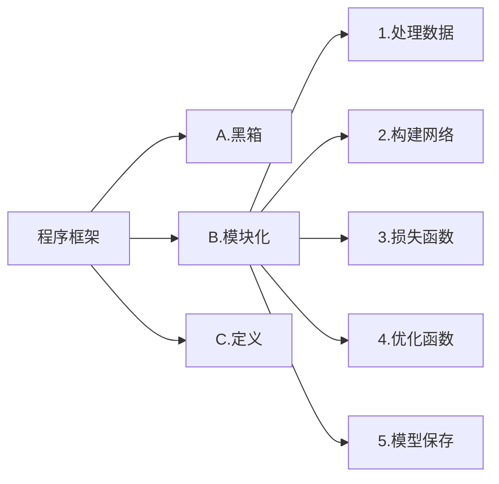

# [深度学习框架](bilibili.com/video/BV14f4y1q7ms?p=3)

  
GPU 网络和数据要同时送进GPU

## 感受野
感受野被定义为卷积神经网络特征所能看到输入图像的区域，换句话说特征输出受感受野区域内的像素点的影响。 

## Optimizer
### Adam和SGD
  
$$SGD → SGDM → NAG → AdaGrad → AdaDelta → Adam → Nadam$$
  

## Batch size
batch size的大小影响的是训练过程中的完成①*每个epoch所需的时间*（假设算力确定了）和每次迭代(iteration)之间②*梯度的平滑程度*。
> ①假设训练集大小为N，每个epoch中mini-batch大小为b，那么完成每个epoch所需的迭代次数为 N/b , 因此完成每个epoch所需的时间会随着迭代次数的增加而增加
②如pytorch\tensorflow等深度学习框架，在进行mini-batch的loss反向传播时，一般都是先将每个mini-batch中每个样本得到的loss求sum后再平均化之后再反求梯度，进行迭代，因此b的大小决定了相邻迭代batch之间的梯度平滑程度。一个batch内所含样本越多，这个batch的梯度应该越能反映真实的梯度，因此这样的大batch间梯度不会跨越太大

因此：大的batch_size往往建议可以相应取大点learning_rate, 因为梯度震荡小，大 learning_rate可以加速收敛过程，也可以防止陷入到局部最小值，而小batch_size用小learning_rate迭代，防止错过最优点，一直上下震荡没法收敛 
>1. 若是loss还能降，指标还在升，那说明欠拟合，还没收敛，应该继续train，增大epoch。
2. 若是loss还能再降，指标也在降，说明过拟合了，那就得采用提前终止（减少epoch）或采用weight_decay等防过拟合措施。
3. 若是设置epoch=16，到第8个epoch，loss也不降了，指标也不动了，说明8个epoch就够了，剩下的白算了。

## 损失函数
### 交叉熵损失函数「Cross Entropy Loss」
$$L=-[ylog\hat{y}+(1-y)log(1-\hat{y})]$$
$$L=\sum_{i=1}^{N}y^ilog\hat{y}^i+(1-y^i)log(1-\hat{y}^i)$$
在Pytorch中，BCELoss和BCEWithLogitsLoss是一组常用的二元交叉熵损失函数，常用于二分类问题。区别在于BCELoss的输入需要先进行Sigmoid处理，而BCEWithLogitsLoss则是将Sigmoid和BCELoss合成一步，也就是说BCEWithLogitsLoss函数内部自动先对output进行Sigmoid处理，再对output 和target进行BCELoss计算。 
BCELoss和BCEWithLogitsLoss还提供了两个重要参数： 
> weight：可用于控制各样本的权重，常用作对对齐后的数据进行mask操作（设为0） 
reduction：控制损失输出模式。设为"sum"表示对样本进行求损失和；设为"mean"表示对样本进行求损失的平均值；而设为"none"表示对样本逐个求损失，输出与输入的shape一样。
此外BCEWithLogitsLoss还提供了参数pos_weight用于设置损失的class权重，用于缓解样本的不均衡问题。

# 注意力机制（Attention Mechanism）
自上而下有意识的聚焦称为**聚焦式注意力**，自下而上无意识、由外界刺激引发的注意力称为**显著式注意力**。
神经网络中的注意力机制是在计算能力有限的情况下，将计算资源分配给更重要的任务，同时解决信息超载问题的一种资源分配方案，到2014年，Volodymyr的《Recurrent Models of Visual Attention》一文中将其应用在视觉领域，后来伴随着2017年Ashish Vaswani的《Attention is all you need》中Transformer结构的提出，注意力机制在NLP,CV相关问题的网络设计上被广泛应用。
注意力有两种，一种是软注意力(soft attention)，另一种则是强注意力(hard attention)。
**软注意力**更关注区域或者通道，是确定性的注意力，学习完成后直接可以通过网络生成，最关键的地方是软注意力是可微的，这是一个非常重要的地方。可以微分的注意力就可以通过神经网络算出梯度并且前向传播和后向反馈来学习得到注意力的权重。
**强注意力**是更加关注点，也就是图像中的每个点都有可能延伸出注意力，同时强注意力是一个随机的预测过程，更强调动态变化。当然，最关键是强注意力是一个不可微的注意力，训练过程往往是通过增强学习(reinforcement learning)来完成的。
## 软注意力的注意力域
### 空间域（Spatial Domain）
空间域将原始图片中的空间信息变换到另一个空间中并保留了关键信息。
普通的卷积神经网络中的池化层（pooling layer）直接用一些max pooling 或者average pooling 的方法，将图片信息压缩，减少运算量提升准确率。
发明者认为之前pooling的方法太过于暴力，直接将信息合并会导致关键信息无法识别出来，所以提出了一个叫 **空间转换器（spatial transformer）** 的模块，将图片中的的空间域信息做对应的空间变换，从而能将关键的信息提取出来。  
### 通道域（Channel Domain）
通道注意力机制在计算机视觉中，更关注特征图中channel之间的关系，而普通的卷积会对通道做通道融合，这个开山鼻祖是SENet,后面有GSoP-Net，FcaNet 对SENet中的squeeze部分改进，EACNet对SENet中的excitation部分改进，SRM,GCT等对SENet中的scale部分改进。

[SENet](https://arxiv.org/abs/1709.01507),[pytorch](https://github.com/moskomule/senet.pytorch)
SENet《Squeeze-and-Excitation Networks》是CVPR17年的一篇文章，提出SE module。在卷积神经网络中，卷积操作更多的是关注感受野，在通道上默认为是所有通道的融合（深度可分离卷积不对通道进行融合，但是没有学习通道之间的关系，其主要目的是为了减少计算量），SENet提出SE模块，将注意力放到通道之间，希望模型可以学习到不同通道之间的权重：  

### 时域注意力机制
时域注意力机制在cv领域主要考虑有时序信息的领域，如视频领域中的动作识别方向，其注意力机制主要是在时序列中，关注某一时序即某一帧的信息。

### 通道和空间注意力机制
通道和空间注意力是基于通道注意力和空间注意力机制，将两者有效的结合在一起，让注意力能关注到两者，又称混合注意力机制，如CBAM,BAM,scSE等，同时基于混合注意力机制的一些关注点，如Triplet Attention 关注各种跨维度的相互作用；Coordinate Attention, DANet关注长距离的依赖；RGA 关注关系感知注意力。还有一种混合注意力机制，为3D的attention :Residual attention,SimAM, Strip Pooling, SCNet等。

[CBAM](https://arxiv.org/abs/1807.06521),[github](https://github.com/luuuyi/CBAM.PyTorch) 
CBAM (Convolutional Block Attention Module)是SENet的一种拓展，SENet主要基于通道注意力，CBAM是通道注意力和空间注意力融合的注意力机制。  
如上图所示，输入一个h*w*c的特征图，通过channel Attention Module 生成通道注意力权重对输入特征图在通道层添加权重，再通过spatial Attention Module 生成空间注意力权重，对特征图在空间层添加权重，输出特征图。

# Metrics 评估
## 混淆矩阵
  
X横坐标为正确的分类（即你用标签所标注的真实分类）
Y纵坐标为模型所预测的分类（即图片经过模型推理后模型将其辨别为的分类）
> True positives (TP): 缺陷的图片被正确识别成了缺陷。（本缺陷的正确分类预测）
True negatives(TN): 背景的图片被正确识别为背景。（非本缺陷被预测为其他分类缺陷或背景）
False positives(FP): 背景的图片被错误识别为缺陷。（非本缺陷被预测为本缺陷）
False negatives(FN): 缺陷的图片被错误识别为背景。（本缺陷被预测为其他缺陷或者背景）

## Evaluation parameters
$$Accuracy=\frac{TP+TN}{TP+FP+TN+FN}$$
  
**准确率 Accuracy**：在正负样本数量接近的情况下，准确率越高，模型的性能越好（当测试样本不平衡时，该指标会失去意义。）
**精准率（查准率） precision**：代表在总体预测结果中真阳性的预测数，针对预测结果，当区分能力强时，容易将部分（与负样本相似度高）正样本排除。
**召回率（查全率） recall**：所有ground truths中真阳性的预测数，针对原样本，当敏感度高时，容易将部分（与正样本相似度高）负样本也判断为正样本。
**F1 score**：正确率和召回率的调和平均数，F1分值越高，目标检测的准确性越好。
**AP**：同时考察Precision和Recall两个指标来衡量模型对于各个类别的性能。 
**mAP**：表示AP的平均值，并用作衡量目标检测算法的总体检测精度的度量。
将recall设置为横坐标，precision设置为纵坐标。PR曲线下围成的面积即AP，所有类别AP平均值即mAP.
**置信度 Confidence**：置信度设定越大，Prediction约接近1，Recall越接近0，要寻找最优的F1分数，需要遍历置信度。
  
**交并比 IoU**（Intersection over Union）：是目标检测中使用的一个概念，IoU计算的是“预测的边框”和“真实的边框”的交叠率，即它们的交集和并集的比值。最理想情况是完全重叠，即比值为1。map@0.5即IoU=0.5，预测框和标注框的交集与非交集占比相同，都为50%。   

**ROC曲线**(Receiver Operating Characteristic 受试者工作特征)
$$TPR=\frac{TP}{TP+FN},FPR=\frac{FP}{FP+TN}$$可以理解为分类器对正样本的覆盖敏感性和对负样本的敏感性的权衡。
在ROC曲线图中，每个点以对应的FPR值为横坐标，以TPR值为纵坐标  
**AUC值**：ROC曲线围成的面积
  
> 1.AUC = 1，是完美分类器，采用这个预测模型时，存在至少一个阈值能得出完美预测。绝大多数预测的场合，不存在完美分类器。
2.0.5 < AUC < 1，优于随机猜测。这个分类器（模型）妥善设定阈值的话，能有预测价值。
3.AUC = 0.5，跟随机猜测一样（例：丢铜板），模型没有预测价值。
4.AUC < 0.5，比随机猜测还差；但只要总是反预测而行，就优于随机猜测。

ROC曲线图中，越靠近(0,1)的点对应的模型分类性能越好。而且可以明确的一点是，ROC曲线图中的点对应的模型，它们的不同之处仅仅是在分类时选用的阈值(Threshold)不同，每个点所选用的阈值都对应某个样本被预测为正类的概率值。

# Transformer
    
