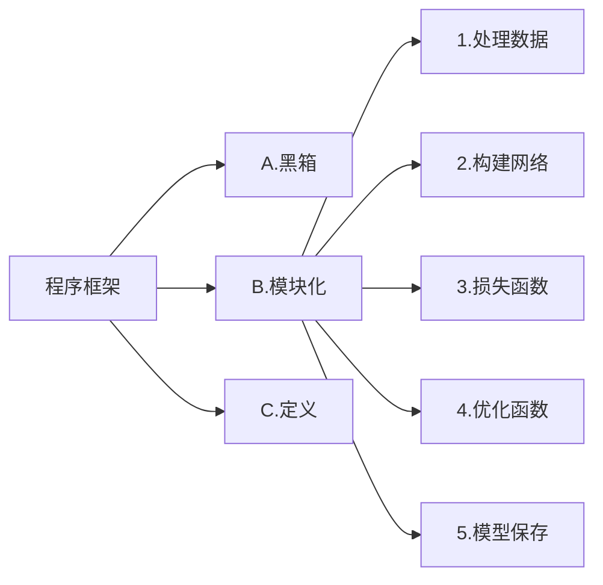

记录深度学习基本概念，不断更新中，项目地址：[DLpractice](https://github.com/Arrowes/DLpractice)
<!--more-->

从机器学习到深度学习：[从机器学习谈起](https://www.cnblogs.com/subconscious/p/4107357.html)，[从神经元到深度学习](https://www.cnblogs.com/subconscious/p/5058741.html)
什么是卷积讲解视频：[大白话讲解卷积神经网络工作原理](https://www.bilibili.com/video/BV1sb411P7pQ/?share_source=copy_web&vd_source=b148fb6f311bfe6f3870ad8f4dfda92a)

[DL500问](https://github.com/scutan90/DeepLearning-500-questions)

# 深度学习框架

```mermaid
graph LR
A[程序框架]-->B[A.黑箱]
A-->C[B.模块化] -->1.处理数据
C-->2.构建网络
C-->3.损失函数
C-->4.优化函数
C-->5.模型保存
A-->E[C.定义]
```


GPU 网络和数据要同时送进GPU

## 激活函数 Activate Function
激活函数是深度学习神经网络中的一个重要组成部分，它用来引入*非线性性质*，使神经网络能够学习复杂的函数关系。激活函数接收神经元的输入，并产生输出作为下一层神经元的输入。在神经网络中，激活函数通常被应用于每个神经元的输出，使神经网络能够进行非线性映射和学习。

激活函数的主要作用有以下几点：
+ 非线性映射：激活函数引入非线性性质，使神经网络可以逼近和表示复杂的非线性函数。如果没有激活函数，多层神经网络的组合将等效于单一层的线性变换。
+ 特征提取：激活函数有助于神经网络从输入数据中提取关键特征，例如边缘、纹理、形状等，以便更好地完成分类、回归和其他任务。
+ 解决梯度消失问题：某些激活函数（如ReLU）有助于减轻梯度消失问题，使深层网络能够更好地进行反向传播和训练。

一些常见的激活函数包括：

激活函数                       |特点          |图像
------------------------------|--------------|---------
 $$softmax(x_i) = \frac{e^{x_i}}{\sum_{j=0}^{N} e^{x_j}}$$  | 将未规范化的预测变换为非负数并且总和为1，同时让模型保持可导的性质;常用在分类网络的最后一层，把网络输出转化为各类别的概率。 |首先对每个未规范化的预测求幂，这样可以确保输出非负。为了确保最终输出的概率值总和为1，再让每个求幂后的结果除以它们的总和
挤压函数（squashing function）$$sigmoid(x) = \frac 1{1 + exp(−x)}$$  | 将输入映射到范围(0, 1)，常用于二元分类问题。sigmoid可以视为softmax的特例 | 
双曲正切 $$tanh(x) = \frac {1 − exp(−2x)}{1 + exp(−2x)}$$   |   将输入映射到范围(-1, 1)，也用于某些分类和回归问题, 当输入在0附近时，tanh函数接近线性变换。形状类似于sigmoid函数，不同的是tanh函数关于坐标系原点中心对称。（LSTM）|
修正线性单元（Rectified Linear Unit）$$ReLU(x) = max(x, 0)$$  $$LeakyReLU=max(αx,x)$$ |求导表现得特别好：要么让参数消失，要么让参数通过。最常用的激活函数，通常能够加速收敛和减轻梯度消失问题（Transfromer）； LeakyReLU中通常设α=0.01来调整负值的零梯度，缓解dead ReLU问题（YOLO） 若α为可学习参数，则为PReLU|    
指数线性单元 (Exponential Linear Units) |   对小于零的情况采用类似指数计算的方式进行输出。与 ReLU 相比，ELU 有负值，这会使激活的平均值接近零。均值激活接近于零可以使学习更快，因为它们使梯度更接近自然梯度。但计算量较大 |


## 感受野(Receptive field)
感受野是指在卷积神经网络中，输出特征图上的一个像素点对应于输入图像上的感受区域大小。感受野的大小可以用来衡量网络在某一层上能够“看到”输入图像的范围，从而影响网络对局部和全局信息的感知能力。


$   n_{output.features}=[\frac{n_{input.features}+2p_{adding.size}-k_{ernel.size}}{s_{tride.size}}+1]   $
较小的感受野通常用于捕获局部特征，而较大的感受野则有助于捕获全局信息。


## 卷积
一个卷积核（kernel）为3×3、步长（stride）为1、填充（padding）为1的二维卷积：

  

### 空洞卷积（膨胀卷积）（Dilated Convolution / Atrous Convolution）
为扩大感受野，在卷积核里面的元素之间插入空格来“膨胀”内核，形成“空洞卷积”（或称膨胀卷积），并用膨胀率参数L表示要扩大内核的范围，即在内核元素之间插入L-1个空格。当L=1时，则内核元素之间没有插入空格，变为标准卷积。
如下图为膨胀率L=2的空洞卷积：


### 可分离卷积（Separable Convolution）
#### 空间可分离卷积（Spatially Separable Convolutions）
将卷积核分解为两项独立的核分别进行操作。分解后的卷积计算过程如下图，先用3x1的卷积核作横向扫描计算，再用1x3的卷积核作纵向扫描计算，最后得到结果。采用可分离卷积的计算量比标准卷积要少。


#### 深度可分离卷积（Depthwise Separable Convolutions）
一种高效的卷积方式，它通过先对每个通道单独做空间上的卷积（depthwise），再用 1×1 卷积融合通道信息（pointwise），与标准卷积相比显著减少了参数量和计算成本，特别适合部署在轻量级或移动设备上，同时仍保有较强的特征提取能力。
   1. 使用3个卷积核分别对输入层的3个通道作卷积计算，再堆叠在一起。
   2. 再使用1x1的卷积（3个通道）进行计算，得到只有1个通道的结果
   3. 重复多次1x1的卷积操作（如下图为128次），则最后便会得到一个深度的卷积结果。
   

可变形卷积（Deformable Convolution, DCN）是一种改进的卷积操作，它通过引入可学习的“偏移量（offsets）”来动态调整卷积核的采样位置，使网络能够更好地适应图像中的几何变形和复杂结构。
传统卷积卷积核在特征图上采样的位置是固定的、规则的（如 3×3 网格）。可变形卷积在每个采样点上增加一个可学习的偏移量 Δ𝑝，使得卷积核能够“变形”，灵活地选择更合适的采样位置。
使卷积核不再局限于规则网格，而是可以根据任务需求自适应地调整感受野。

二维高斯核：这种高斯核生成的方式使得置信度图在真实关键点位置达到峰值，并向周围平滑地衰减，为模型提供了更平滑、更有信息量的监督信号，而不是一个孤立的点。

## 上采样
放大特征图（feature map）尺寸的技术：转置卷积 (Deconvolution)、上采样 (Upsampling) 和 上池化 (Unpooling)
### 转置卷积/反卷积
与普通卷积相反，它将小尺寸的输入映射到更大的输出。常用于语义分割、图像生成等任务中。
通过在输入特征图的像素之间填充0（这个过程称为 dilation），并在周围添加 padding，然后进行一次标准的卷积操作，从而实现输出尺寸的放大。卷积核的权重是通过反向传播学习得到的。由于其学习特性，反卷积能够生成比插值方法更精细、信息更丰富的特征图。但计算量更大。


### 上池化
池化（Pooling）操作的逆操作，特别是最大池化（Max Pooling）的逆操作。它旨在将特征图恢复到池化前的大小。
利用池化过程中记录的位置信息来恢复特征图的结构。在进行最大池化时，不仅会保留池化区域内的最大值，还会记录这个最大值在原始特征图中的位置索引。在上池化阶段，会创建一个与池化前尺寸相同的全零特征图，然后根据之前记录的位置索引，将池化后的特征值放回相应位置。其余位置则保持为0。

在U-Net等经典的图像分割网络中，解码器部分可能会先使用上采样或上池化来放大尺寸，然后再通过卷积层（或反卷积层）来学习和丰富特征。

图（a）是输入层；
图（b）是14\*14反卷积的结果；
图（c）（d）是28\*28的UnPooling和反卷积的结果；
图（e）（f）是56\*56的Unpooling和反卷积的结果；
图（g）（h）是112\*112 UnPooling和反卷积的结果；
图（i）（j）是224\*224的UnPooling和反卷积的结果

### 普通上采样
上采样泛指所有将图像或特征图分辨率扩大的技术。在深度学习中，它通常特指那些不带可学习参数的、基于插值（Interpolation）的方法。
+ 最近邻插值 (Nearest Neighbor Interpolation): 将输出图像中每个像素的值设为输入图像中最近邻像素的值。这种方法简单快速，但容易产生块状效应。
+ 双线性插值 (Bilinear Interpolation): 考虑了输入图像中四个最近邻像素的加权平均值，生成的图像更平滑。
+ 双三次插值 (Bicubic Interpolation): 考虑了更广泛的邻域（16个像素），效果更好，但计算更复杂。
#### 双线性插值（Bilinear Interpolation）
双线性插值是图像缩放中最常见的插值方法之一，目标插值位置在像素格子中间，用周围 4 个像素按距离加权平均，估计这个位置的值。核心思想是在二维平面上先沿一个方向做一次线性插值，再沿另一个方向再做一次线性插值。

在深度学习里，它常用于：
+ 特征图上采样（如语义分割解码器、FPN、UNet）
+ 输入图像 resize 到固定分辨率
+ 对齐不同尺度特征（融合前的尺寸统一）

假设目标点坐标为 $(x, y)$，其周围四个像素点分别为：

> |$Q_{11}(x_1,y_1)$------$Q_{21}(x_2,y_1)$|
|-----------------(x,y)-----------------|
|$Q_{12}(x_1,y_2)$------$Q_{22}(x_2,y_2)$|

则双线性插值结果为：
$$
f(x,y)=\frac{1}{(x_2-x_1)(y_2-y_1)}
\begin{bmatrix}x_2-x & x-x_1\end{bmatrix}
\begin{bmatrix}
f(Q_{11}) & f(Q_{12})\\
f(Q_{21}) & f(Q_{22})
\end{bmatrix}
\begin{bmatrix}y_2-y\\y-y_1\end{bmatrix}
$$

更直观地看，可以拆成两次一维插值：

1. 在 $y=y_1$ 上，对 $Q_{11}$ 和 $Q_{21}$ 线性插值，得到 $R_1$
2. 在 $y=y_2$ 上，对 $Q_{12}$ 和 $Q_{22}$ 线性插值，得到 $R_2$
3. 在 $x$ 固定处，对 $R_1$ 和 $R_2$ 再做一次线性插值，得到最终值

+ 相比最近邻插值，结果更平滑、锯齿更少
+ 计算量小于双三次插值，速度和效果比较均衡
+ 会引入一定模糊，高频细节可能被平滑

PyTorch 中常见写法：
```python
import torch.nn.functional as F

# x: [N, C, H, W]
y = F.interpolate(x, size=(h_out, w_out), mode='bilinear', align_corners=False)
```

## 反向传播
待续

## Optimizer


$$SGD → SGDM → NAG → AdaGrad → AdaDelta → Adam → Nadam$$
  

### 学习率与优化器调度策略

| 策略名称 | 作用 | 说明 |
|----------|------|------|
| **Warmup** | 稳定训练初期 | 学习率从小逐渐升高，避免梯度爆炸 |
| **余弦退火（Cosine Annealing）** | 平滑收敛 | 学习率按余弦曲线下降，后期趋近于零 |
| **Step Decay** | 分段衰减 | 每隔固定 epoch 将学习率乘以一个因子 |
| **Exponential Decay** | 指数衰减 | 学习率按指数函数持续下降 |
| **Cyclical Learning Rate (CLR)** | 提升探索能力 | 学习率在两个边界之间周期性波动 |
| **OneCycle Policy** | 快速收敛 | 学习率先升后降，动量反向变化 |
| **自适应学习率（如 Adam、RMSprop）** | 自动调整 | 根据梯度历史动态调整每个参数的学习率 |

### 动量与梯度控制策略

| 策略名称 | 作用 | 说明 |
|----------|------|------|
| **动量（Momentum）** | 加速收敛 | 保留上一次梯度方向，减少震荡 |
| **周期性动量调整** | 提升泛化 | 动量值随训练周期变化，配合 CLR 使用 |
| **梯度裁剪（Gradient Clipping）** | 防止梯度爆炸 | 限制梯度最大值，常用于 RNN 或 Transformer |
| **梯度累积（Gradient Accumulation）** | 显存优化 | 多个小 batch 累积后再更新参数，适用于大模型 |

### 模型正则化与泛化策略

| 策略名称 | 作用 | 说明 |
|----------|------|------|
| **Dropout** | 防止过拟合 | 随机丢弃神经元，增强模型鲁棒性 |
| **L1/L2 正则化** | 限制权重 | 控制模型复杂度，避免过拟合 |
| **Early Stopping** | 提前终止训练 | 验证集性能不再提升时停止训练 |
| **Label Smoothing** | 提升分类鲁棒性 | 将标签分布平滑处理，减少过拟合倾向 |
| **Stochastic Depth** | 深度网络正则化 | 随机跳过某些层，常用于 ResNet/ViT |

### 常见组合推荐

| 目标 | 推荐策略组合 |
|------|---------------|
| 稳定训练 | Warmup + Cosine Annealing + Gradient Clipping |
| 控制过拟合 | Dropout + L2 正则化 + Early Stopping |
| 提升精度 | Mixup + Label Smoothing + OneCycle Policy |
| 显存受限 | Gradient Accumulation + Mixed Precision Training |
| 多任务场景 | MTL + Shared Backbone + Task-specific Heads |

## Batch size
batch size的大小影响的是训练过程中的完成*每个epoch所需的时间* $^1$（假设算力确定了）和每次迭代(iteration)之间*梯度的平滑程度* $^2$。
> 1. 假设训练集大小为N，每个epoch中mini-batch大小为b，那么完成每个epoch所需的迭代次数为 N/b , 因此完成每个epoch所需的时间会随着迭代次数的增加而增加
2. 如pytorch\tensorflow等深度学习框架，在进行mini-batch的loss反向传播时，一般都是先将每个mini-batch中每个样本得到的loss求sum后再平均化之后再反求梯度，进行迭代，因此b的大小决定了相邻迭代batch之间的梯度平滑程度。一个batch内所含样本越多，这个batch的梯度应该越能反映真实的梯度，因此这样的大batch间梯度不会跨越太大

因此：大的batch_size往往建议可以相应取大点learning_rate, 因为梯度震荡小，大 learning_rate可以加速收敛过程，也可以防止陷入到局部最小值，而小batch_size用小learning_rate迭代，防止错过最优点，一直上下震荡没法收敛 
>1. 若是loss还能降，指标还在升，那说明欠拟合，还没收敛，应该继续train，增大epoch。
2. 若是loss还能再降，指标也在降，说明过拟合了，那就得采用提前终止（减少epoch）或采用weight_decay等防过拟合措施。
3. 若是设置epoch=16，到第8个epoch，loss也不降了，指标也不动了，说明8个epoch就够了，剩下的白算了。

## 损失函数「loss function」
来度量模型的预测值$\hat{y}$与真实值$y$的差异程度的运算函数，它是一个非负实值函数，通常使用$L(y, \hat{y})$来表示，损失函数越小，模型的鲁棒性就越好。
**基于距离度量的损失函数**
基于距离度量的损失函数通常将输入数据映射到基于距离度量的特征空间上，如欧氏空间、汉明空间等，将映射后的样本看作空间上的点，采用合适的损失函数度量特征空间上样本真实值和模型预测值之间的距离。特征空间上两个点的距离越小，模型的预测性能越好。
### L1范数损失函数（MAE）
$$L_{MSE}=\frac{1}{n}\sum_{i=1}^{n}|y_i-\hat{y_i}|$$
又称为曼哈顿距离，表示残差的绝对值之和。L1损失函数对离群点有很好的鲁棒性，但它在残差为零处却不可导,且更新的梯度始终相同；
### L2损失函数（MSE均方误差损失函数）
$$L_{MSE}=\frac{1}{n}\sum_{i=1}^{n}(y_i-\hat{y_i})^2$$
在回归问题中，均方误差损失函数用于度量样本点到回归曲线的距离，通过最小化平方损失使样本点可以更好地拟合回归曲线。（L2损失又被称为欧氏距离，是一种常用的距离度量方法，通常用于度量数据点之间的相似度。）

### Wing Loss
`Wing Loss` 常用于关键点回归（如人脸关键点、姿态估计），核心思路是：
- 小误差区域放大梯度，推动关键点更精细地对齐
- 大误差区域保持近似线性，避免异常点主导训练

设误差 $x=\hat{y}-y$，其常见形式为：

$$
L(x)=
\begin{cases}
w\ln(1+\frac{|x|}{\epsilon}), & |x|<w \\
|x|-C, & |x|\ge w
\end{cases}
$$

其中：
- $w$：控制“非线性放大区间”的阈值
- $\epsilon$：控制曲线弯曲程度
- $C=w-w\ln(1+\frac{w}{\epsilon})$，用于保证分段处连续

与 L1/L2 相比，Wing Loss 在小误差区间更敏感，通常能提升关键点定位精度；在遮挡或噪声样本存在时，也比纯 L2 更稳。
**基于概率分布度量的损失函数**
基于概率分布度量的损失函数是将样本间的相似性转化为随机事件出现的可能性，即通过度量样本的真实分布与它估计的分布之间的距离，判断两者的相似度，一般用于涉及概率分布或预测类别出现的概率的应用问题中，在分类问题中尤为常用。
### KL散度（ Kullback-Leibler divergence）
$$L_{MSE}=\sum_{i=1}^{n}\hat{y_i}log(\frac{y_i}{\hat{y_i}})$$
也被称为相对熵，是一种非对称度量方法，常用于度量两个概率分布之间的距离。KL散度也可以衡量两个随机分布之间的距离，两个随机分布的相似度越高的，它们的KL散度越小，可以用于比较文本标签或图像的相似性。

### 交叉熵损失函数
https://www.bbbdata.com/text/337

#### 香农信息量（Shannon Information）
表示某个事件发生时所携带的信息量：
$$I(x) = -\log_b P(x) = -\ln P(x)$$

- $ P(x) $：事件 $ x $ 的概率  
- $ b $：对数底，通常取 2（单位为 bit）或 $ e $（单位为 nat）  
- 概率越小，信息量越大（越“惊讶”）
#### CE
交叉熵（Cross Entropy）是信息论中的一个概念，最初用于估算平均编码长度，引入机器学习后，用于评估当前训练得到的概率分布与真实分布的差异情况。是在不知道真实分布、仅有猜测的概率时，我们知道真相时所获得的信息量期望；交叉熵的意义是，它可用于评估我们认知概率的准确性，在认知概率与真实概率一致，交叉熵是最小的，反过来说，交叉熵越小则说明预测越准确

衡量两个概率分布之间（交叉）的差异，真实分布 $ y $ 与预测分布 $ \hat{y} $：

$$H(y, \hat{y}) = - \sum_{i=1}^{n} y_i \ln(\hat{y}_i)$$
 
- $ y_i $：真实标签（通常是 one-hot）  
- $ \hat{y}_i $：模型预测的概率（通常是 softmax 输出）
  
交叉熵是模型对正确类别预测概率的负对数期望
#### CE loss
交叉熵损失函数(Cross-Entropy Loss)是一种常用于概率预测模型的损失函数。交叉熵损失函数是指，基于模型的预测概率，在知道真实标签时的交叉熵
$$CE Loss =- \frac{1}{m} \sum_{i=1}^{m}\sum_{j=1}^{C}y_i,_j · \ln(\hat{y}_i,_j) = - \frac{1}{m} \sum_{i=1}^{m}\sum_{i(y_i=k)} · \ln(\hat{y}_i,_k) = - \frac{1}{m} \sum_{i=1}^{m}· \ln(\hat{y}_i,_k)$$
* $m$： 样本的总数（一个 batch 的大小）。求平均就是期望
* $ C $：类别数 
* i：样本的索引（从 1 到 m）。
* j：类别的索引（从 1 到 C）。
* 如果是One-Hot 编码，y_i,k=1,其他为0，可以得到简化的第3个公式

C=2时，得到二元交叉熵损失**BCE loss** (Binary Cross-Entropy Loss)公式:
$$BCE Loss =- \frac{1}{m} \sum_{i=1}^{m} [y_i \cdot \ln(\hat{y}_i) + (1 - y_i) \cdot \ln(1 - \hat{y}_i)]$$
* $y_i$：第 $i$ 个样本的真实标签，在二分类中 $y_i$ 的值通常是 1（代表正类）或 0（代表负类）。
* $\hat{y}_i$：模型对第 $i$ 个样本预测为正类 (类别 1) 的概率。 (这通常是 Sigmoid 函数的输出，值在 0 和 1 之间)。
* $(1 - \hat{y}_i)$：模型对第 $i$ 个样本预测为负类 (类别 0) 的概率。
* $\hat{y} = \sigma(x) = \frac{1}{1 + e^{-x}}$ 时，即$\hat{y}_i$为 Sigmoid 函数的输出，则为**BCEWithLogitsLoss**，意思是这个Loss可以直接输入原始Logits值，而不需要是概率，因为集成了Sigmoid（二分类）或Softmax（多分类）

交叉熵越小，期望获得的信息量就越小，说明我们对本身事物越掌握，也即模型的预测概率越准确
所以交叉熵损失函数的目的，就是最小化期望信息量，也即最大化模型概率预测的准确程度


#### Focal loss
`Focal Loss` 是一种专门为解决**类别不平衡问题**而设计的损失函数，尤其在目标检测（如 RetinaNet）和语义分割中非常有效
Focal Loss 是对传统的 CE Loss 的一种改进。它的核心思想是： **降低容易分类样本的损失权重，聚焦在难分类样本上。**。它是一个动态缩放的交叉熵损失，通过一个动态缩放因子，可以动态降低训练过程中易区分样本的权重，从而将重心快速聚焦在那些难区分的样本（有可能是正样本，也有可能是负样本，但都是对训练网络有帮助的样本）。
这对于数据集中**正负样本极度不平衡**的情况非常有用，比如：
- 检测图像中的小目标
- 分割稀疏区域（如车道线、肿瘤）

以二分类为例，Focal Loss 的公式如下：

$$\text{FL}(p_t) =- [\alpha_i y_i (1 - \hat{y}_i)^\gamma \cdot \ln(\hat{y}_i) + (1 - \alpha_i)(1 - y_i) \hat{y}_i^\gamma \cdot \ln(1 - \hat{y}_i)]= -\alpha_t (1 - p_t)^\gamma \log(p_t)$$

其中：
- $ p_t $：模型对真实类别的预测概率
- $ \alpha_t $：类别权重（控制正负样本不平衡）,通常设为 0.25 [正类（y=1）的重要性是 0.25，而负类（y=0）的重要性是 0.75）
- $ \gamma $：聚焦因子，控制对易分类样本的抑制程度，通常设为 2
  - 如果样本**易分类**（模型很有把握，$\hat{y}_i \to 1$），那么 $(1 - \hat{y}_i)^\gamma \to 0$。这个因子的值会变得非常小，从而**极大地降低**了这个“简单”样本对总损失的贡献。
  - 如果样本**难分类**（模型预测错误，$\hat{y}_i \to 0$），那么 $(1 - \hat{y}_i)^\gamma \to 1$。损失几乎不受影响，模型会**重点关注**它。
  - $\gamma = 0$ 时，Focal Loss 就退化为了标准的（加权）BCE Loss。

```python
import torch
import torch.nn.functional as F

def focal_loss(inputs, targets, alpha=0.25, gamma=2.0):
    BCE_loss = F.binary_cross_entropy_with_logits(inputs, targets, reduction='none')
    pt = torch.exp(-BCE_loss)  # pt = sigmoid(inputs) if BCE used
    focal_term = alpha * (1 - pt) ** gamma
    return (focal_term * BCE_loss).mean()
```

one-hot独热编码：将类别变量转换为机器学习算法易于利用的一种形式的过程。

### RMI Loss（Region Mutual Information Loss）
`RMI Loss` 常用于语义分割，本质上是把像素级监督扩展到“局部区域的统计相关性”约束。相比只看单像素分类误差的 CE/BCE，RMI 更关注邻域结构是否一致（边界、纹理、形状连续性）。

核心思想：
- 将预测图与标签图按窗口（如 $3\times3$、$5\times5$）展开为局部向量
- 通过协方差矩阵建模局部区域联合分布
- 最大化预测与标签的互信息（或最小化其负值）

常见组合写法：

$$
L = L_{BCE/CE} + \lambda L_{RMI}
$$

其中 $\lambda$ 用于平衡像素级分类监督和区域结构监督。

实践经验：
- 对小目标和细边界（如道路边缘、器官轮廓）通常更友好
- 在类别不平衡和边界复杂场景中，往往优于单独 CE/BCE
- 计算量高于普通 CE，训练时需要关注显存与窗口大小设置

### IoU Loss

在目标检测和图像分割任务中，交并比 IoU Loss（Intersection over Union Loss）用于衡量预测框与真实框之间的重叠程度。相比于传统的 L1/L2 或 Smooth L1 损失，IoU 类损失更关注几何上的匹配，对边界框回归尤为关键。下面是主流几种 IoU 类损失的介绍：

| 损失类型     | 特点与优势                                         | 适用场景                         |
|--------------|----------------------------------------------------|----------------------------------|
| IoU Loss     | 基础形式，仅考虑重叠区域比例                      | 边界框回归基础版本              |
| GIoU Loss    | 引入最小闭包区域作为惩罚项，解决无交集的问题     | 较大偏移框，对空区域更敏感      |
| DIoU Loss    | 加入中心点距离作为惩罚，提高定位精度             | 对目标位置要求高的检测任务      |
| CIoU Loss    | 综合考虑中心点距离、重叠率、纵横比               | 高精度框回归，如人脸检测等      |
| SIoU Loss    | 引入角度、方向对齐等几何信息，优化收敛速度       | 高稳定性和收敛效率的检测模型    |

- **IoU**：
  $$IoU = \frac{\text{Area of Overlap}}{\text{Area of Union}}$$

- **GIoU Loss**：
GIOU Loss 是传统 IoU Loss 的改进版，它在 IoU 的基础上增加了一个惩罚项，解决了当预测框与真实框**不相交**时 IoU Loss=0, 梯度为零、无法优化的问题，使得模型能够学习如何将分离的框相互靠近。

$$L_{GIoU} = 1 - GIOU$$

$$GIOU = IoU - \frac{|C| - |A \cup B|}{|C|}$$

* **IoU**: 预测框 A 和真实框 B 的交并比。
* **C**: 能同时包含 A 和 B 的**最小闭包矩形**（Smallest Enclosing Box）。
* $\frac{|C| - |A \cup B|}{|C|}$: 这就是**惩罚项**。它计算的是闭包区域中不属于两个框联合区域的面积比例。两个框距离越远，这个惩罚项越大，GIOU 值就越小。

**取值范围**：GIOU 的值域为 $[-1, 1]$。**1**: 完美重合。**趋近 -1**: 不重叠且相距非常远。
**既是度量也是损失**：不仅可以像 IoU 一样作为评估指标，其 $1 - GIOU$ 的形式更是一个优秀的损失函数。
**关注非重叠区域**：通过闭包区域 C，它不仅仅关心重叠部分，还关心两个框的**相对位置关系**。

**收敛速度问题**：在训练后期，当预测框与真实框重叠方式比较特殊时（如一个框完全包含另一个框），GIOU 会退化成 IoU，无法进一步区分对齐的好坏，可能导致收敛较慢。
**对齐方式不敏感**：当两个框的 IoU 和 GIOU 值相同时，它们中心点的距离和长宽比可能差异很大，GIOU 并未考虑这些因素。这也催生了后续的 DIOU 和 CIOU 等更优的损失函数。
- **DIoU Loss**：
  $$DIoU = IoU - \frac{\rho^2(b, b^{gt})}{c^2}$$
  其中 $ \rho $ 是中心距离，$ c $ 是对角线长度。

- **CIoU Loss**：
  在 DIoU 基础上增加形状约束项，综合角度与纵横比。

IoU Loss 系列通过引入几何对齐、惩罚项等方式，让模型在训练时更关注框的位置与形状，提升检测精度和稳定性。

# 注意力机制（Attention Mechanism）
自上而下有意识的聚焦称为**聚焦式注意力**，自下而上无意识、由外界刺激引发的注意力称为**显著式注意力**。
神经网络中的注意力机制是在计算能力有限的情况下，将计算资源分配给更重要的任务，同时解决信息超载问题的一种资源分配方案，到2014年，Volodymyr的《Recurrent Models of Visual Attention》一文中将其应用在视觉领域，后来伴随着2017年Ashish Vaswani的《Attention is all you need》中Transformer结构的提出，注意力机制在NLP,CV相关问题的网络设计上被广泛应用。
注意力有两种，一种是软注意力(soft attention)，另一种则是强注意力(hard attention)。
**软注意力**更关注区域或者通道，是确定性的注意力，学习完成后直接可以通过网络生成，最关键的地方是软注意力是可微的，这是一个非常重要的地方。可以微分的注意力就可以通过神经网络算出梯度并且前向传播和后向反馈来学习得到注意力的权重。
**强注意力**是更加关注点，也就是图像中的每个点都有可能延伸出注意力，同时强注意力是一个随机的预测过程，更强调动态变化。当然，最关键是强注意力是一个不可微的注意力，训练过程往往是通过增强学习(reinforcement learning)来完成的。
## 软注意力的注意力域
### 空间域（Spatial Domain）
空间域将原始图片中的空间信息变换到另一个空间中并保留了关键信息。
普通的卷积神经网络中的池化层（pooling layer）直接用一些max pooling 或者average pooling 的方法，将图片信息压缩，减少运算量提升准确率。
发明者认为之前pooling的方法太过于暴力，直接将信息合并会导致关键信息无法识别出来，所以提出了一个叫 **空间转换器（spatial transformer）** 的模块，将图片中的的空间域信息做对应的空间变换，从而能将关键的信息提取出来。


### 通道域（Channel Domain）
通道注意力机制在计算机视觉中，更关注特征图中channel之间的关系，而普通的卷积会对通道做通道融合，这个开山鼻祖是SENet,后面有GSoP-Net，FcaNet 对SENet中的squeeze部分改进，EACNet对SENet中的excitation部分改进，SRM,GCT等对SENet中的scale部分改进。

[SENet](https://arxiv.org/abs/1709.01507),[pytorch](https://github.com/moskomule/senet.pytorch)
SENet《Squeeze-and-Excitation Networks》是CVPR17年的一篇文章，提出SE module。在卷积神经网络中，卷积操作更多的是关注感受野，在通道上默认为是所有通道的融合（深度可分离卷积不对通道进行融合，但是没有学习通道之间的关系，其主要目的是为了减少计算量），SENet提出SE模块，将注意力放到通道之间，希望模型可以学习到不同通道之间的权重：
  

### 时域注意力机制
时域注意力机制在cv领域主要考虑有时序信息的领域，如视频领域中的动作识别方向，其注意力机制主要是在时序列中，关注某一时序即某一帧的信息。

### 通道和空间注意力机制
通道和空间注意力是基于通道注意力和空间注意力机制，将两者有效的结合在一起，让注意力能关注到两者，又称混合注意力机制，如CBAM,BAM,scSE等，同时基于混合注意力机制的一些关注点，如Triplet Attention 关注各种跨维度的相互作用；Coordinate Attention, DANet关注长距离的依赖；RGA 关注关系感知注意力。还有一种混合注意力机制，为3D的attention :Residual attention,SimAM, Strip Pooling, SCNet等。

[CBAM](https://arxiv.org/abs/1807.06521),[github](https://github.com/luuuyi/CBAM.PyTorch) 
CBAM (Convolutional Block Attention Module)是SENet的一种拓展，SENet主要基于通道注意力，CBAM是通道注意力和空间注意力融合的注意力机制。
  
如上图所示，输入一个h*w*c的特征图，通过channel Attention Module 生成通道注意力权重对输入特征图在通道层添加权重，再通过spatial Attention Module 生成空间注意力权重，对特征图在空间层添加权重，输出特征图。

# Metrics 评估
## 混淆矩阵


X横坐标为正确的分类（即你用标签所标注的真实分类）
Y纵坐标为模型所预测的分类（即图片经过模型推理后模型将其辨别为的分类）
> True positives (TP): 猫🐱的图片被正确识别成了猫🐱。（猫🐱的正确分类预测）
True negatives(TN): 背景的图片被正确识别为背景。（非猫🐱被预测为其他动物或背景）
False positives(FP): 背景的图片被错误识别为猫🐱。（非猫🐱被预测为猫🐱）
False negatives(FN): 猫🐱的图片被错误识别为背景。（猫🐱被预测为其他动物或者背景）

## Evaluation parameters
**准确率 Accuracy**：在正负样本数量接近的情况下，准确率越高，模型的性能越好（当测试样本不平衡时，该指标会失去意义。）
$$Accuracy=\frac{TP+TN}{TP+FP+TN+FN}$$  
**精准率（查准率） precision**：代表在总体预测结果中真阳性的预测数，针对预测结果，当区分能力强时，容易将部分（与负样本相似度高）正样本排除。
$$precision(P)=\frac{TP}{TP+FP}$$
**召回率（查全率） recall**：所有ground truths中真阳性的预测数，针对原样本，当敏感度高时，容易将部分（与正样本相似度高）负样本也判断为正样本。
$$recall(R)=\frac{TP}{TP+FN}$$
**F1 score**：对Precision和Recall两个指标的调和平均值（类似平均速度），F1分值越高，目标检测的准确性越好。F1-score最常用于数据集的类别不平衡的情况。
$$F_1 score=2\cdot \frac{P\cdot R}{P+R}$$
**AP**：同时考察Precision和Recall两个指标来衡量模型对于各个类别的性能。 
$$AP_i=\int_0^1P_i(R_i)dR_i$$
**mAP**：表示AP的平均值，并用作衡量目标检测算法的总体检测精度的度量。
将recall设置为横坐标，precision设置为纵坐标。PR曲线下围成的面积即AP，所有类别AP平均值即mAP.
$$mAP=\frac1n\sum_{i = 1}^{n}AP_i$$
**置信度 Confidence**：置信度设定越大，Prediction约接近1，Recall越接近0，要寻找最优的F1分数，需要遍历置信度。
  

**交并比 IoU**（Intersection over Union）：是目标检测中使用的一个概念，IoU计算的是“预测的边框”和“真实的边框”的交叠率，即它们的交集和并集的比值。最理想情况是完全重叠，即比值为1。

*mAP@0.5*：IoU阈值设为 0.5，即预测框与真实框的重叠面积占比 ≥ 50% 就算正确。对每个类别计算 AP，再取平均值得到 mAP。评估标准较宽松，适合快速验证模型是否具备基本检测能力。
*mAP@0.5:0.95*：在 IoU 阈值从 0.5 到 0.95（步长为 0.05） 的 10 个点上分别计算 AP，然后取平均。更严格地评估模型在不同定位精度要求下的表现。全面衡量模型稳定性和定位能力，常用于学术论文和高精度场景（如自动驾驶）。
如果一个模型在 mAP@0.5 上表现很好，但在 mAP@0.5:0.95 上得分低，说明它能大致定位目标，但在精确定位方面表现不佳。


**NMS**（Non-Maximum Suppression，非极大值抑制）
一种用于目标检测任务的后处理技术，主要用于消除冗余的检测框，保留最可能准确的预测结果。
在目标检测中，模型（如YOLO、Faster R-CNN等）通常会对同一目标生成多个重叠的预测框（Bounding Box），每个框带有置信度分数。NMS通过筛选，保留置信度最高且位置最合理的框，抑制其他冗余的框，从而避免重复检测。
1. 按置信度排序：将所有预测框按置信度从高到低排序。选择最高置信度的框：取出当前列表中置信度最高的框，加入最终保留列表。
2. 计算IoU并抑制重叠框：计算该框与剩余所有框的交并比（IoU，Intersection over Union）。若某框与当前框的IoU超过设定的阈值（如0.5），则认为它们是同一目标，直接删除。
3. 重复步骤2\~3：对剩余框重复上述过程，直到所有框被处理。
IoU阈值：通常设为0.3\~0.7，控制框的重叠容忍度。阈值越低，抑制越严格。
置信度阈值：预过滤掉低置信度的框（例如只保留置信度≥0.5的框）。


**ROC曲线**(Receiver Operating Characteristic 受试者工作特征)
$$TPR=\frac{TP}{TP+FN},FPR=\frac{FP}{FP+TN}$$可以理解为分类器对正样本的覆盖敏感性和对负样本的敏感性的权衡。
在ROC曲线图中，每个点以对应的FPR值为横坐标，以TPR值为纵坐标 


**AUC值**：PR曲线下方的面积


> 1.AUC = 1，是完美分类器，采用这个预测模型时，存在至少一个阈值能得出完美预测。绝大多数预测的场合，不存在完美分类器。
2.0.5 < AUC < 1，优于随机猜测。这个分类器（模型）妥善设定阈值的话，能有预测价值。
3.AUC = 0.5，跟随机猜测一样（例：丢铜板），模型没有预测价值。
4.AUC < 0.5，比随机猜测还差；但只要总是反预测而行，就优于随机猜测。

ROC曲线图中，越靠近(0,1)的点对应的模型分类性能越好。而且可以明确的一点是，ROC曲线图中的点对应的模型，它们的不同之处仅仅是在分类时选用的阈值(Threshold)不同，每个点所选用的阈值都对应某个样本被预测为正类的概率值。
## 模型计算量(FLOPs)和参数量(Params)
**计算量 FLOPs**：FLOPs指浮点运算次数，Floating-point Operations Per Second，s是指秒，即每秒浮点运算次数的意思，考量一个网络模型的计算量的标准。硬件要求是在于芯片的floaps（指的是gpu的运算能力）
FLOPS：（全部大写），每秒所执行的浮点运算次数，理解为计算速度, 是一个衡量硬件性能/模型速度的指标，即一个芯片的算力。
MACCs：multiply-accumulate operations，乘-加操作次数，MACCs 大约是 FLOPs 的一半。将 w[0]∗x[0]+... 视为一个乘法累加或 1 个 MACC。
MAC: Memory Access Cost 内存访问代价。指的是输入单个样本（一张图像），模型/卷积层完成一次前向传播所发生的内存交换总量，即模型的空间复杂度，单位是 Byte。
**参数量 Params**：是指网络模型中需要训练的参数总数。硬件要求在于显存大小
1.**卷积层**
计算时间复杂度(计算量)
$$Time\sim O(\sum_{l=1}^D M_l^2\cdot K_l^2\cdot C_{l-1}\cdot C_l)$$

计算空间复杂度(参数量)
$$Space\sim O(\sum_{l=1}^D K_l^2\cdot C_{l-1}\cdot C_l+\sum_{l=1}^D M^2\cdot C_l)$$

```
参数量
(kernel*kernel) *channel_input*channel_output
kernel*kernel 就是 weight * weight
其中kernel*kernel ＝ 1个feature的参数量

计算量
(kernel*kernel*map*map) *channel_input*channel_output
kernel*kernel 就是weight*weight
map*map是下个featuremap的大小，也就是上个weight*weight到底做了多少次运算
其中kernel*kernel*map*map＝　1个feature的计算量
```
2.池化层
无参数
3.**全连接层**
``参数量＝计算量＝weight_in*weight_out  #模型里面最费参数的就是全连接层``

**换算计算量**,一般一个参数是指一个float，也就是４个字节,1kb=1024字节

# Transformer
Transformer 的核心在于注意力机制（Attention Mechanism），注意力机制由三个字母构建：Q (Query)、K (Key)、V (Value)。
用经典的“图书馆检索”类比来解释 Q、K、V：
Query (Q - 查询)：相当于你走到图书馆系统前，输入的“搜索词”（例如：“机器学习入门”）。它是你带着的目的或问题。
Key (K - 键)：相当于图书馆里每一本书背面的“标签或书名”。系统会用你的 Q 去和所有的 K 进行比对，计算相似度。
Value (V - 值)：相当于这本“书的具体内容”。当系统发现某本书的 K 和你的 Q 高度匹配时，它就会把这本书的 V（内容）提取出来交给你。
数学表达如下：
$$Attention(Q, K, V) = \text{softmax}\left(\frac{QK^T}{\sqrt{d_k}}\right)V$$
公式的物理意义是：用 Q 和 K 算点积（计算相似度打分），然后把分数作为权重，去对 V 进行加权求和。

在自动驾驶感知中，图像特征图（BEV 特征）本身充当了浩如烟海的图书馆（它提供了 Keys 和 Values）。
Q: Object Query（对象查询/可学习查询）。
在 PivotNet 中提到的 Point Query 和 Line Query，本质上就是这种 Object Query。它们具有以下极其特殊的性质：
+ 无中生有的“参数”：在网络刚开始训练时，Point Query 可能只是一组随机生成的、没有任何意义的数字向量。
+ 不断进化的“侦察兵”：在经过成千上万张图片的训练后，这些 Query 通过梯度下降“学习”到了特定的技能。如寻找高对比度的“边缘”、寻找“黄色与黑色的交界点”。
+ 交叉注意力 (Cross-Attention)：在推理时，这些训练有素的 Query 会带着它们各自学到的“问题（特征偏好和位置偏好）”，去和 BEV 特征图（Keys 和 Values）进行交互。


## DETR (DEtection TRansformer)
1. CNN 骨干网络 (Backbone)：DETR 没有完全抛弃 CNN，使用 ResNet 等经典的 CNN 来提取图像的基础特征，生成一张浓缩了图像信息的特征图。
2. Transformer 编码器 (Encoder)：CNN 提取的特征图被拉平，并加上位置编码（Positional Encoding，附加的位置信息）后，送入 Transformer Encoder。Encoder深度理解输入数据的上下文。 它的输入是一堆带有位置编码的原始特征，输出则是经过深度交流、融合了全局信息的“高级特征图”。
    + 自注意力机制（Self-Attention）：Encoder 的核心运算机制，使得图像中的每一个像素都能感知到全局上下文。Query (Q)、Key (K)、Value (V) 全部来源于同一个输入源。让输入序列中的每一个元素，都去和同一序列中的其他所有元素计算“相关性”，从而更新自己的理解。
3. Transformer 解码器（Decoder）:交叉注意力和自注意力的区别在于信息来源不同，是割裂的双向的：Query (Q) 来自Object Query，而 Key (K) 和 Value (V) 来自CNN 提取的特征图。
    + Q: Object Query: DETR 初始化了固定数量的 $N$ 个（通常设为 100）Object Query。这 100 个 Query 就像 100 个带着特定位置偏好和特征偏好的“侦察兵”。它们在 Decoder 中，通过交叉注意力（Cross-Attention）不断向 Encoder 提取的全局特征图“提问并抓取”自己感兴趣的物体信息。
    + Cross-Attention: 实现信息的跨模态或跨模块提取。在 DETR/PivotNet 中，是让侦察兵（Query）去庞大的背景报告（Encoder 输出的特征图）里定向抓取信息。
4. 预测头 (Prediction Heads)最后，这 100 个 Query 会各自独立地通过一个简单的前馈网络（FFN），直接输出 100 个预测结果。每个结果包含两个信息：类别（包括具体的物体类别，或者一个特殊的“无物体/背景”类别 $\varnothing$）。边界框坐标（归一化后的中心点 $x, y$ 和宽高 $w, h$）。
    + FFN: Attention 机制（无论是 Self 还是 Cross）本质上是在做空间维度 / 序列维度上的信息混合 (Spatial/Sequence Mixing)，它只负责算出“谁和谁有关联”，但仅仅依靠线性加权，网络的非线性表达能力是不够的。FFN 负责的是特征通道维度上的信息混合 (Channel Mixing)。它对序列中的每一个元素（Point-wise / Position-wise）独立且等价地进行深度的非线性变换。FFN 通常是一个包含两个线性变换层（全连接层）和中间一个非线性激活函数（如 ReLU 或 GELU）
5. 训练方式：匈牙利算法 (Hungarian Algorithm) 驱动的二分图匹配(Bipartite Matching)

在一个标准的 Transformer Block 中，数据流是这样的：
1. 数据先经过 Self-Attention，完成元素彼此之间的上下文互相理解。
2. （如果是 Decoder）再经过 Cross-Attention，去外部特征源抓取特定信息。
3. 最后经过 FFN，在每个元素自己的特征通道内进行非线性的升维和提炼。
4. 每一层之间都会穿插残差连接 (Residual Connection) 和 层归一化 (LayerNorm)，以确保深层网络的梯度稳定传播。

# 相关概念
## 联邦学习
联邦学习（Federated Learning）是一种先进的分布式机器学习方法，它在数据隐私保护和数据利用效率方面具有显著的优势。在联邦学习中，多个参与方（也称为客户端或节点）可以在保持数据本地化的同时，共享模型训练的成果。
让各个企业自己进行模型的训练，各个企业在完成模型的训练之后，将各自模型的参数上传至一个中心服务器（也可以是点对点），中心服务器结合各个企业的参数（可以上传梯度，也可以是自己更新后的参数），重新拟定新的参数（例如通过加权平均，这一步叫做联邦聚合），将新的参数下发至各个企业，企业将新参数部署到模型上，从而继续新的训练，这个过程可以进行反复的迭代，直到模型收敛，或者满足其他的条件。


## 分布式训练
单机单卡情况下，信息都在一台机器上，无所谓分发。而分布式训练中，信息是要被“分发”的，分发的不同方式，常被称为“并行方式”。通常，习惯上将分发方分为“数据并行”和“模型并行”两种：
+ 模型并行(Model Parallelism)：将模型进行切分，完整的数据 被送至各个训练节点，与 切分后的模型 进行运算，最后将多个节点的运算结果合并；适用于模型规模大的情况
+ 数据并行(Data Parallelism)：将样本数据进行切分，切分后的数据 被送至各个训练节点，与 完整的模型 进行运算，最后将多个节点的信息进行合并；适用于数据量大的情况
    1. 数据划分：不同GPU设备上划分出不同的mini-batch，作为训练的数据集
    2. 前向+反向:不同GPU设备上用相同的模型，用各自接收到的mini-batch数据进行训练（前向和反向传播)
    3. 梯度同步更新:每个GPU设备得到了mini-batch训练后的权重值，这些值需要汇总然后更新至每一个GPU设备，保证每一次迭代后，每个GPU设备上的模型完全一致。
    

> 分布式训练中的学习率自动缩放：在数据并行中，多个GPU同时处理不同的数据子集（每个GPU的批量大小为 B），总批量大小为 B × GPU数量。例如，单GPU批量大小为256，使用4个GPU时，总批量大小变为1024。
更大的批量意味着梯度估计的方差更小，更新方向更准确。为了保持参数更新的有效步长与单GPU训练一致，需要按比例调整学习率。

分布式系统中因为面临大量的信息同步、更新需求，因此传统的点对点(P2P, Point-to-point)的通信方式不能很好的满足需求。需要使用集合通信库(Collective communication Library)，用于分布式训练时，多个计算设备之间的集合通信，常见的有 Open MPI、NCCL:
+ Open MPI:Open MPI项目是一个开源MPI（消息传递接口 ）实现，由学术，研究和行业合作伙伴联盟开发和维护。因此，Open MPI可以整合高性能计算社区中所有专家，技术和资源，以构建可用的最佳MPI库。
+ Gloo:facebook开源的一套集体通信库，他提供了对机器学习中有用的一些集合通信算法如：barrier, broadcast, allreduce
+ NCCL:NVIDIA Collective Communications Library, 英伟达基于NCIDIA-GPU的一套开源的集体通信库，如其官网描述：NVIDIA集体通信库（NCCL）实现了针对NVIDIA GPU性能优化的多GPU和多节点集体通信原语。NCCL提供了诸如all-gather, all-reduce, broadcast, reduce, reduce-scatter等实现，这些实现优化后可以通过PCIe和NVLink等高速互联，从而实现高带宽和低延迟。 因为NCCL则是NVIDIA基于自身硬件定制的，能做到更有针对性且更方便优化，故在英伟达硬件上，NCCL的效果往往比其它的通信库更好。
  + P2P（Peer-to-Peer）是指单个节点内的 GPU 之间直接通信，而不需要通过 CPU 或系统内存中转，可以显著提高通信效率。但若某些 GPU 之间没有直接的 P2P 连接（NVLink 或 PCIe P2P），NCCL可能会初始化后挂死，通过设置 NCCL_P2P_DISABLE=1，可以强制 NCCL 使用系统内存中转的方式代替 P2P 通信，从而避免这些问题。

NCCL遇到显卡P2P通信问题:[1](https://huo.zai.meng.li/p/vllm%E5%90%AF%E5%8A%A8%E6%97%B6nccl%E9%81%87%E5%88%B0%E6%98%BE%E5%8D%A1p2p%E9%80%9A%E4%BF%A1%E9%97%AE%E9%A2%98/) [2](https://huo.zai.meng.li/p/vllm%E5%90%AF%E5%8A%A8%E6%97%B6nccl%E9%81%87%E5%88%B0%E6%98%BE%E5%8D%A1p2p%E9%80%9A%E4%BF%A1%E9%97%AE%E9%A2%98/)


## 曼哈顿距离 (Manhattan distance)
曼哈顿距离（Manhattan distance），也叫 城市街区距离（City Block Distance） 或 L1 距离，是一种常见的距离度量方法。它的名字来源于美国纽约曼哈顿的街道布局——街道呈网格状，行走时只能沿着水平或垂直方向移动。
𝑑 ( 𝑃 1 , 𝑃 2 ) = ∣ 𝑥 1 − 𝑥 2 ∣ + ∣ 𝑦 1 − 𝑦 2 ∣
应用场景
机器学习：在 KNN、聚类等算法中作为距离度量。
优化问题：L1 范数常用于稀疏解（如 Lasso 回归）。
图像处理：计算像素间的差异。
路径规划：在网格地图中估算步数或路径长度。

## 匈牙利算法（Hungarian Algorithm）
+ Step 1：代价矩阵的每一行减去其最小的值。
+ Step 2：然后，对第一步完成后的代价矩阵的每一列减去其最小的值。
+ Step 3：接着，用最小的行与列来覆盖代价矩阵中已经是0的元素。如果这个行与列的总数达到n，算法结束，否则进入Step 4。
+ Step 4：对于所有没有被覆盖的元素，找出其中的最小值，然后所有没有被覆盖的元素减去该最小值，所有被覆盖了两次的元素（行覆盖了一次，列又覆盖一次）加上该最小值。然后重新回到Step3。当找到对应的 0元素后，代入回最开始的原来的代价矩阵中对应的位置，便能找到最小的匹配。

在目标检测中：
模型会输出 一组预测框（通常数量比真实框多）。
数据集提供 一组真实框（ground truth）。
我们需要把预测框和真实框 一一对应，才能计算损失函数。
如果直接用 IoU 或贪心匹配，可能出现：
一个真实框被多个预测框匹配/有些预测框没有对应真实框/导致训练不稳定

匈牙利算法的作用
匈牙利算法解决的是 最优匹配问题：
输入：预测框集合 𝑃，真实框集合 𝐺。
构造一个 代价矩阵 𝐶，其中元素 𝑐𝑖𝑗表示预测框 𝑝𝑖与真实框 𝑔𝑗的匹配代价。
输出：一个最优分配方案，使得总代价最小。
代价矩阵的构造
在检测任务中，代价通常由以下部分组成：
分类代价：预测类别与真实类别的交叉熵。
位置代价：预测框与真实框的 L1 距离。
IoU 代价：预测框与真实框的重叠度（1 - IoU）。

## 全卷积网络（FCNs）
全卷积网络（Fully Convolutional Networks, FCNs）是一种专门用于图像语义分割的深度学习架构，它将传统卷积神经网络中的全连接层替换为卷积层，从而能够处理任意尺寸的输入图像，并输出与输入同尺寸的像素级预测结果。
核心思想
去掉全连接层：传统 CNN 在最后通常有全连接层用于分类，而 FCN 将其替换为卷积层，使得输出不再是单一类别，而是一个空间分布（热力图）。
端到端训练：输入原始图像，输出预测分割图，不需要额外的手工特征设计。
任意尺寸输入：由于没有全连接层，FCN 可以接受不同大小的图像作为输入。
上采样（Upsampling）：通过反卷积（转置卷积）或插值方法恢复特征图尺寸，使输出与原图大小一致。
跳级结构（Skip connections）：结合深层语义信息和浅层细节信息，提高分割精度和细节保真度。
