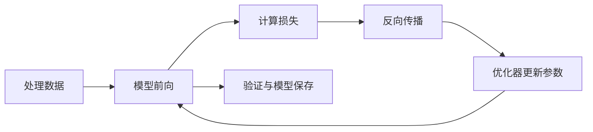

深度学习原理与复习笔记：基础算子、训练与损失、注意力与典型网络、检测后处理、评估及并行训练。项目地址：[DLpractice](https://github.com/Arrowes/DLpractice)。
<!--more-->

# 学习路线与速查

第一次复习按下表顺序阅读；解决具体问题时直接进入对应章节。本文侧重原理，API 实践见 [PyTorch 笔记](/Pytorch/)，训练经验见 [训练笔记](/DLtrain/)，量化与工程部署见 [部署笔记](/DLdeploy/)。

| 顺序 | 主题 | 重点问题 |
| --- | --- | --- |
| 1 | [基础算子](#dl-basics) | 张量形状如何变化？卷积、归一化、上采样分别做什么？ |
| 2 | [训练与优化](#dl-training) | 梯度如何产生和更新？batch size 与学习率如何配合？ |
| 3 | [损失函数](#dl-losses) | 回归、分类和几何任务如何选损失？API 应输入 logits 还是概率？ |
| 4 | [注意力机制](#dl-attention) | 空间、通道、软注意力和硬注意力如何区分？ |
| 5 | [典型网络架构](#dl-architectures) | EfficientNet、Transformer、DETR、FCN 如何组织特征？ |
| 6 | [检测后处理](#dl-postprocessing) | NMS 按什么规则去重？工程变体有哪些适用条件？ |
| 7 | [评估与资源开销](#dl-metrics) | AP、ROC-AUC、FLOPs、参数量和显存分别衡量什么？ |
| 8 | [并行训练与联邦学习](#dl-distributed) | 多设备之间同步梯度还是参数？ |
| 9 | [辅助算法](#dl-algorithms) / [复习自测](#dl-review) | 距离与匹配如何用于检测？能否解释易混淆点？ |

入门材料：[从机器学习谈起](https://www.cnblogs.com/subconscious/p/4107357.html)、[从神经元到深度学习](https://www.cnblogs.com/subconscious/p/5058741.html)、[卷积讲解视频](https://www.bilibili.com/video/BV1sb411P7pQ/)、[DL500问](https://github.com/scutan90/DeepLearning-500-questions)。公式和 API 说明优先对照各节给出的官方文档与原论文；项目实现记录会单独标明待核验内容。

<span id="dl-basics"></span>

# 基础算子

## 深度学习框架

训练的基本数据流是“数据 → 模型 → 预测 → 损失 → 梯度 → 参数更新”。验证与推理复用前向过程，但通常不计算梯度。


```mermaid
graph LR
    A[处理数据] --> B[模型前向]
    B --> C[计算损失]
    C --> D[反向传播]
    D --> E[优化器更新参数]
    E --> B
    B --> F[验证与模型保存]
```


使用 GPU 时，参与同一运算的模型参数与输入张量需要位于兼容的设备上；标签也应放到计算损失所用的设备。

### 常用组件速查

| 组件 | 作用与易错点 | 常用 PyTorch API |
| --- | --- | --- |
| 卷积 | 局部连接与参数共享；忽略边界且步长为 1 时具有平移等变性，并非输出不变 | `nn.Conv2d` |
| 全连接 | 对最后一维进行仿射变换：$y=xW^T+b$ | `nn.Linear` |
| 池化 | 在局部窗口聚合特征，常用于下采样；本身通常无可学习参数 | `nn.MaxPool2d`、`nn.AvgPool2d` |
| BatchNorm | 对每个通道使用 batch 和空间维统计量，不保证输出为正态分布 | `nn.BatchNorm2d` |
| LayerNorm | 按 `normalized_shape` 指定的最后若干维归一化，不依赖其他样本 | `nn.LayerNorm` |
| GroupNorm | 将通道分组，在每个样本的组内通道和空间维归一化 | `nn.GroupNorm` |
| 自注意力 | 按内容相关性聚合其他位置的信息 | `nn.MultiheadAttention` |
| 残差连接 | $y=F(x)+x$ 为梯度提供直接路径；相加前需对齐形状 | `out = branch(x) + shortcut(x)` |
| Dropout | 训练时随机置零并缩放部分激活，起正则化作用；推理时关闭 | `nn.Dropout` |

卷积的平移性质参考 [Group Equivariant CNNs](https://proceedings.mlr.press/v48/cohenc16.html)；归一化维度参考 [LayerNorm](https://docs.pytorch.org/docs/stable/generated/torch.nn.LayerNorm.html) 和 [GroupNorm](https://docs.pytorch.org/docs/stable/generated/torch.nn.GroupNorm.html)。

## 激活函数 Activate Function
激活函数引入非线性，使网络能够表达复杂映射；如果只叠加线性或仿射层，整体仍可合并成一个仿射变换。不同激活的输出范围与梯度性质不同，应结合任务和网络结构选择。

激活函数                       |特点          |图像
------------------------------|--------------|---------
 $$softmax(x_i) = \frac{e^{x_i}}{\sum_{j=1}^{N} e^{x_j}}$$  | 将 logits 转换为非负且总和为 1 的概率分布；常用于单标签多分类模型的输出解释。 | 对 logits 求指数，再按类别总和归一化
挤压函数（squashing function）$$sigmoid(x) = \frac 1{1 + exp(−x)}$$  | 将输入映射到范围(0, 1)，常用于二元分类问题。两类 softmax 的一个输出可写成两类 logits 之差的 sigmoid | 
双曲正切 $$tanh(x) = \frac {1 − exp(−2x)}{1 + exp(−2x)}$$   |   将输入映射到范围(-1, 1)，也用于某些分类和回归问题, 当输入在0附近时，tanh函数接近线性变换。形状类似于sigmoid函数，不同的是tanh函数关于坐标系原点中心对称。（LSTM）|
修正线性单元（Rectified Linear Unit）$$ReLU(x) = max(x, 0)$$  $$LeakyReLU=max(αx,x)$$ |ReLU 对正输入的导数为 1，对负输入为 0；长期处于负区间可能出现 dead ReLU。LeakyReLU 在负区间保留斜率 α，若 α 可学习则为 PReLU。具体网络也可能使用 GELU、SiLU 等激活|    
指数线性单元 (Exponential Linear Units) |   负半轴采用指数形式并趋向负饱和值；与 ReLU 的差别主要在负值输出和梯度，训练效果与速度需要结合任务验证 |

## 感受野(Receptive field)
感受野是指在卷积神经网络中，输出特征图上的一个像素点对应于输入图像上的感受区域大小。感受野的大小可以用来衡量网络在某一层上能够“看到”输入图像的范围，从而影响网络对局部和全局信息的感知能力。


理论感受野由卷积核、步长、膨胀率及层级决定。设第 $l$ 层的有效卷积核为 $k_l^{eff}=d_l(k_l-1)+1$，相邻输出在原图上的间距为 $j_l$，则：

$$r_l=r_{l-1}+(k_l^{eff}-1)j_{l-1},\qquad j_l=j_{l-1}s_l$$

从 $r_0=j_0=1$ 开始递推。例如连续两层 $3\times3$、stride=1、dilation=1 的卷积，理论感受野为 $5\times5$。实际梯度影响还存在有效感受野的差异；感受野大小与输出特征图尺寸是两个概念。
较小的感受野通常用于捕获局部特征，而较大的感受野则有助于捕获全局信息。


## 卷积
一个卷积核（kernel）为3×3、步长（stride）为1、填充（padding）为1的二维卷积：


### 输出尺寸与权重形状

单个空间维度的输出尺寸为：

$$L_{out}=\left\lfloor\frac{L_{in}+2p-d(k-1)-1}{s}+1\right\rfloor$$

其中 $k$ 为卷积核尺寸，$s$ 为步长，$p$ 为填充，$d$ 为膨胀率。高、宽分别计算。

`Conv2d` 的权重形状为 `[C_out, C_in / groups, K_h, K_w]`；普通卷积使用 `groups=1`。以 RGB 输入 3 通道、输出 16 通道、卷积核 $3\times3$ 为例：

- 权重形状为 `[16, 3, 3, 3]`，共 $16\times3\times3\times3=432$ 个权重；启用 bias 时再加 16 个参数。
- 一个输出通道在一个空间位置使用 $3\times3\times3=27$ 个权重，与对应输入逐元素相乘、求和，再加偏置。
- 同一组权重在不同空间位置重复使用，这就是参数共享。特征由训练数据与目标共同决定，不保证每个通道对应可解释的单一物体部件。
- NV12 等 YUV 格式的存储平面数不等于网络输入通道数；需要按预处理实际生成的张量确认形状，不能直接把“两个平面”视为两通道输入。

省略 batch 维，在 `groups=1`、`stride=1`、`dilation=1`、`padding=0` 时，普通卷积的一个输出可写成：

$$y_o(i,j)=\sum_c\sum_u\sum_v W_{o,c,u,v}X_{c,i+u,j+v}+b_o$$

权重通过初始化或加载预训练模型得到，再由优化器更新。若按输出通道做结构化剪枝，例如删去 16 个滤波器中的 4 个，权重形状会变为 `[12, 3, 3, 3]`；还必须同步调整后续层输入通道、BN 参数和相关分支。

参考：[Conv2d 的尺寸与权重定义](https://docs.pytorch.org/docs/stable/generated/torch.nn.Conv2d.html)、[YUV 存储格式](https://kernel.org/doc/html/v5.18/userspace-api/media/v4l/pixfmt-yuv-planar.html)。


### 空洞卷积（膨胀卷积）（Dilated Convolution / Atrous Convolution）
为扩大感受野，在卷积核里面的元素之间插入空格来“膨胀”内核，形成“空洞卷积”（或称膨胀卷积），并用膨胀率参数L表示要扩大内核的范围，即在内核元素之间插入L-1个空格。当L=1时，则内核元素之间没有插入空格，变为标准卷积。
如下图为膨胀率L=2的空洞卷积：


### 可分离卷积（Separable Convolution）
#### 空间可分离卷积（Spatially Separable Convolutions）
将二维空间卷积拆成沿高度的 3×1 卷积和沿宽度的 1×3 卷积，可减少部分计算。并非任意二维卷积核都能精确分解成两个一维核；可分离性或低秩近似是额外条件。


#### 深度可分离卷积（Depthwise Separable Convolutions）
一种高效的卷积方式，它通过先对每个通道单独做空间上的卷积（depthwise），再用 1×1 卷积融合通道信息（pointwise），与标准卷积相比显著减少了参数量和计算成本，特别适合部署在轻量级或移动设备上，同时仍保有较强的特征提取能力。
当 depthwise multiplier=1 时，depthwise 卷积独立处理每个输入通道；随后一个有多个输出通道的 1×1 pointwise 卷积完成通道混合。例如从 3 通道输出到 128 通道，只需设置 pointwise 卷积的 `out_channels=128`。
   

### 可变形卷积（Deformable Convolution, DCN）

传统卷积在规则网格（如 3×3）上采样。可变形卷积为每个采样点学习偏移量 $\Delta p$，调整规则采样网格上各点的位置，使采样区域更好地适应几何变形和目标结构。

## BatchNorm

`BatchNorm2d(C)` 接收 `[N,C,H,W]`。训练时对每个通道的 N、H、W 维统计均值与方差，再标准化并施加可学习的缩放和平移：

$$\hat{x}=\frac{x-\mu}{\sqrt{\sigma^2+\epsilon}},\qquad y=\gamma\hat{x}+\beta$$

| 参数或状态 | 含义 |
| --- | --- |
| `num_features=C` | 通道数 |
| `eps` | 数值稳定项，避免除零 |
| `affine=True` | 学习每通道的 `weight`（γ）和 `bias`（β），合计 2C 个参数 |
| `momentum` | running 统计量的更新系数，与优化器 momentum 含义不同 |
| `running_mean`、`running_var` | 默认推理时使用的累计统计量，不是可学习参数 |
| `track_running_stats` | 为 False 时不保存 running 统计量，推理仍使用当前输入统计量 |

易错点：标准化不会把任意分布变为正态分布，经过 γ、β 后的输出也不保证均值 0、方差 1。默认设置下，`train()` 使用当前 batch 统计量，`eval()` 使用 running 统计量；`eval()` 本身不会关闭自动求导。训练时用于归一化的方差采用有偏估计，而 running variance 更新使用无偏估计。

部署时，使用固定 running 统计量的 Conv + BN 可融合为一个卷积；使用当前输入统计量的 BN 不能直接按这一方式静态融合。参考 [BatchNorm2d 官方文档](https://docs.pytorch.org/docs/stable/generated/torch.nn.BatchNorm2d.html)。

## PyTorch 代码综合调用示例

以下展示如何在 PyTorch 中组合使用上述部分核心组件，构建一个用于演示组件组合的网络块：

```python
import torch
import torch.nn as nn

class CoreComponentsBlock(nn.Module):
    def __init__(self, in_channels, out_channels):
        super(CoreComponentsBlock, self).__init__()

        # 1. Convolutional Layer
        self.conv = nn.Conv2d(in_channels, out_channels, kernel_size=3, padding=1, bias=False)

        # 2. BatchNorm Layer
        self.bn = nn.BatchNorm2d(out_channels)

        # 3. 非线性激活
        self.relu = nn.ReLU()

        # 4. Dropout Layer
        self.dropout = nn.Dropout(p=0.2)

        # 5. Pooling Layer
        self.pool = nn.MaxPool2d(kernel_size=2, stride=2)

        # Project shortcut channels when needed
        self.downsample = None
        if in_channels != out_channels:
            self.downsample = nn.Conv2d(in_channels, out_channels, kernel_size=1, bias=False)

    def forward(self, x):
        # Save input for Residual Connection
        identity = x
        if self.downsample is not None:
            identity = self.downsample(x)

        # Feature extraction pipeline
        out = self.conv(x)
        out = self.bn(out)
        out = self.relu(out)
        out = self.dropout(out)

        # Residual Connection (Add input back to output)
        out = out + identity

        # Downsampling via Pooling
        out = self.pool(out)
        return out

# Instantiate and test the block
# [Batch=2, Channel=3, Height=32, Width=32]
block = CoreComponentsBlock(in_channels=3, out_channels=16)
dummy_input = torch.randn(2, 3, 32, 32)
output = block(dummy_input)

assert output.shape == (2, 16, 16, 16)
print("Output shape:", output.shape)
```

## 上采样
上采样是扩大空间分辨率的总称，常见实现包括插值、转置卷积和最大上池化。

### 转置卷积/反卷积

转置卷积是与卷积对应的转置线性映射，可实现可学习上采样，但不是卷积的真正逆运算，也不保证恢复丢失的信息或优于插值。`stride>1` 时可用输入元素间插零来理解；这里的插零由 stride 决定，不等同于 API 中控制卷积核采样间隔的 dilation。


### 上池化
最大上池化利用最大池化时保存的索引，将保留值放回对应位置，其余位置补零。它是部分逆操作，不能恢复池化时丢掉的其他值。

分割解码器常用插值或转置卷积扩大分辨率；依赖池化索引的架构也可使用最大上池化。

图（a）是输入层；
图（b）是14\*14反卷积的结果；
图（c）（d）是28\*28的UnPooling和反卷积的结果；
图（e）（f）是56\*56的Unpooling和反卷积的结果；
图（g）（h）是112\*112 UnPooling和反卷积的结果；
图（i）（j）是224\*224的UnPooling和反卷积的结果

### 普通上采样
上采样泛指所有将图像或特征图分辨率扩大的技术。在深度学习中，它通常特指那些不带可学习参数的、基于插值（Interpolation）的方法。
+ 最近邻插值 (Nearest Neighbor Interpolation): 将输出图像中每个像素的值设为输入图像中最近邻像素的值。这种方法简单快速，但容易产生块状效应。
+ 双线性插值 (Bilinear Interpolation): 考虑了输入图像中四个最近邻像素的加权平均值，生成的图像更平滑。
+ 双三次插值 (Bicubic Interpolation): 考虑了更广泛的邻域（16个像素），通常更平滑，但可能产生过冲，效果取决于任务。
#### 双线性插值（Bilinear Interpolation）
双线性插值是图像缩放中最常见的插值方法之一，目标插值位置在像素格子中间，用周围 4 个像素按距离加权平均，估计这个位置的值。核心思想是在二维平面上先沿一个方向做一次线性插值，再沿另一个方向再做一次线性插值。

在深度学习里，它常用于：
+ 特征图上采样（如语义分割解码器、FPN、UNet）
+ 输入图像 resize 到固定分辨率
+ 对齐不同尺度特征（融合前的尺寸统一）

假设目标点坐标为 $(x, y)$，其周围四个像素点分别为：

四个角分别是 $Q_{11}(x_1,y_1)$、$Q_{21}(x_2,y_1)$、$Q_{12}(x_1,y_2)$、$Q_{22}(x_2,y_2)$。

则双线性插值结果为：
$$
f(x,y)=\frac{1}{(x_2-x_1)(y_2-y_1)}
\begin{bmatrix}x_2-x & x-x_1\end{bmatrix}
\begin{bmatrix}
f(Q_{11}) & f(Q_{12})\\
f(Q_{21}) & f(Q_{22})
\end{bmatrix}
\begin{bmatrix}y_2-y\\y-y_1\end{bmatrix}
$$

更直观地看，可以拆成两次一维插值：

1. 在 $y=y_1$ 上，对 $Q_{11}$ 和 $Q_{21}$ 线性插值，得到 $R_1$
2. 在 $y=y_2$ 上，对 $Q_{12}$ 和 $Q_{22}$ 线性插值，得到 $R_2$
3. 在 $x$ 固定处，对 $R_1$ 和 $R_2$ 再做一次线性插值，得到最终值

+ 相比最近邻插值，结果更平滑、锯齿更少
+ 计算量小于双三次插值，速度和效果比较均衡
+ 会引入一定模糊，高频细节可能被平滑

PyTorch 中常见写法：
```python
import torch
import torch.nn.functional as F

x = torch.randn(1, 3, 16, 16)
h_out, w_out = 32, 32
# x: [N, C, H, W]
y = F.interpolate(x, size=(h_out, w_out), mode='bilinear', align_corners=False)
assert y.shape == (1, 3, 32, 32)
```

`align_corners=True` 对齐输入与输出角像素的中心；`False` 按像素区域边界对齐。两者使用不同采样坐标，训练、推理与部署应保持一致。

参考：[ConvTranspose2d](https://docs.pytorch.org/docs/stable/generated/torch.nn.ConvTranspose2d.html)、[MaxUnpool2d](https://docs.pytorch.org/docs/stable/generated/torch.nn.MaxUnpool2d.html)、[interpolate](https://docs.pytorch.org/docs/stable/generated/torch.nn.functional.interpolate.html)。

<span id="dl-training"></span>

# 训练与优化

## 反向传播

反向传播用链式法则计算损失对参数的梯度；优化器使用梯度更新参数，两者是不同步骤。典型训练循环是：

1. `optimizer.zero_grad()` 清空上一次梯度（有意做梯度累积时按累积周期清空）。
2. 前向计算预测与损失。
3. `loss.backward()` 计算并累积参数梯度。
4. 如需梯度裁剪，在反向之后、更新之前执行。
5. `optimizer.step()` 更新参数，再按调度器约定的频率调整学习率。

PyTorch 默认累积梯度，因此忘记清零会改变更新结果。验证时通常配合 `model.eval()` 和 `torch.no_grad()` / `torch.inference_mode()`。参考 [Autograd 入门](https://docs.pytorch.org/tutorials/beginner/basics/autogradqs_tutorial.html)。

## Optimizer


优化器可粗分为 SGD 及其动量/Nesterov 变体，以及 AdaGrad、AdaDelta、RMSprop、Adam、Nadam 等自适应方法；它们并非按顺序替代的升级链。AdamW 将权重衰减与梯度更新解耦，也应与 Adam 的正则化配置区分。


### 学习率与优化器调度策略

| 策略名称 | 作用 | 说明 |
|----------|------|------|
| **Warmup** | 稳定训练初期 | 学习率从小逐渐升高，减轻初期更新不稳定 |
| **余弦退火（Cosine Annealing）** | 平滑收敛 | 在设定周期内按余弦曲线降低至配置的 `eta_min` |
| **Step Decay** | 分段衰减 | 每隔固定 epoch 将学习率乘以一个因子 |
| **Exponential Decay** | 指数衰减 | 学习率按指数函数持续下降 |
| **Cyclical Learning Rate (CLR)** | 提升探索能力 | 学习率在两个边界之间周期性波动 |
| **OneCycle Policy** | 快速收敛 | 学习率先升后降，动量反向变化 |

### 动量与梯度控制策略

| 策略名称 | 作用 | 说明 |
|----------|------|------|
| **动量（Momentum）** | 加速收敛 | 累积历史梯度的衰减加权信息，帮助稳定更新方向 |
| **周期性动量调整** | 提升泛化 | 动量值随训练周期变化，配合 CLR 使用 |
| **梯度裁剪（Gradient Clipping）** | 防止梯度爆炸 | 区分按值裁剪和按总范数裁剪，需设置合适阈值 |
| **梯度累积（Gradient Accumulation）** | 显存优化 | 多个小 batch 累积后再更新参数，适用于大模型 |

### 模型正则化与泛化策略

| 策略名称 | 作用 | 说明 |
|----------|------|------|
| **Dropout** | 防止过拟合 | 随机丢弃神经元，增强模型鲁棒性 |
| **L1/L2 正则化** | 限制权重 | 控制模型复杂度，避免过拟合 |
| **Early Stopping** | 提前终止训练 | 验证集性能不再提升时停止训练 |
| **Label Smoothing** | 提升分类鲁棒性 | 将标签分布平滑处理，减少过拟合倾向 |
| **Stochastic Depth** | 深度网络正则化 | 随机跳过某些层，常用于 ResNet/ViT |

### 可尝试的训练策略

下面是实验起点，效果需要验证集确认；不应默认叠加所有策略。

| 目标 | 可尝试的组合 |
|------|---------------|
| 稳定训练 | Warmup + Cosine Annealing + Gradient Clipping |
| 控制过拟合 | Dropout + L2 正则化 + Early Stopping |
| 提升精度 | Mixup + Label Smoothing + OneCycle Policy |
| 显存受限 | Gradient Accumulation + Mixed Precision Training |
| 多任务场景 | MTL + Shared Backbone + Task-specific Heads |

## Batch size

普通单卡训练、不丢弃末尾样本时，每个 epoch 的 batch 数为 $\lceil N/b\rceil$。总耗时还取决于每步计算、数据读取和硬件利用率，不能只由迭代数判断。

较大 batch 通常减少采样梯度的噪声，但学习率的缩放方式取决于优化器、模型与训练设置。线性缩放学习率并配合 warmup 是大批量 SGD 的经验规则，不是通用定律；多卡与梯度累积的有效 batch 计算见 [并行训练](#dl-distributed)。

判断训练状态应同时观察训练集和验证集：

- 训练损失下降、验证表现改善：可以继续观察，并按学习率计划训练。
- 训练损失下降、验证表现持续恶化：可能过拟合，检查数据划分后考虑早停、数据增强或正则化。
- 指标短暂进入平台期：结合学习率计划和 patience 决定是否停止，不能仅凭某个 epoch 不变就认定后续训练无用。

参考：[优化器与调度器](https://docs.pytorch.org/docs/stable/optim.html)、[CosineAnnealingLR](https://docs.pytorch.org/docs/stable/generated/torch.optim.lr_scheduler.CosineAnnealingLR.html)、[大 batch SGD 与 warmup](https://arxiv.org/abs/1706.02677)。

<span id="dl-losses"></span>

# 损失函数「loss function」

损失函数定义模型需要优化的预测误差。损失下降表示这一目标改善，不能单独证明泛化、准确率或鲁棒性提高。

| 任务 | 常见选择 | 先检查什么 |
| --- | --- | --- |
| 连续值回归 | L1/MAE、MSE；特定关键点任务可尝试 Wing | 误差量纲、异常值与坐标归一化 |
| 单标签多分类 | CrossEntropyLoss | logits 维度、类别索引或概率标签 |
| 二分类、多标签分类 | BCEWithLogitsLoss | 每个输出对应的 0/1 目标，标签形状与 dtype |
| 分布匹配/蒸馏 | KLDivLoss | KL 方向、对数概率与 reduction |
| 密集分类的不平衡 | Focal Loss | 正负样本权重及难样本是否包含标注噪声 |
| 框回归、区域结构 | IoU 系列、RMI 等 | 几何定义、任务适用性及与分类损失的配比 |

<span id="dl-gaussian-kernel"></span>
## 二维高斯热力图（2D Gaussian Heatmap / 2D Gaussian Kernel）

二维高斯热力图本质上是把目标真实中心点附近的监督信号“扩散”成一个高斯分布。它既可以看作一种数学模板，也可以看作一种标签构造方法：

- 2D 高斯核：定义了中心点附近数值如何按二维高斯分布衰减的模板。
- 2D 高斯热力图：把这个模板应用到真实目标中心后，得到的监督热图。

它和 CenterNet 的关系非常直接：在 CenterNet 中，热力图分支的 Ground Truth 就是利用二维高斯核在目标中心位置附近生成的软标签，而不是简单地把中心像素设为 1，其他像素设为 0。

### 数学表达
二维高斯核的基础形式来自二维正态分布：

$$G(x, y) = \frac{1}{2\pi\sigma^2} \exp\left(-\frac{x^2 + y^2}{2\sigma^2}\right)$$

在热力图生成任务中，通常为了让中心峰值精确为 1，会去掉归一化系数，使用简化形式：

$$Y = \exp\left(-\frac{x^2 + y^2}{2\sigma^2}\right)$$

其中：

- $x, y$：当前像素相对于目标中心的位置偏移。
- $\sigma$：高斯标准差，控制热图扩散范围；目标越大，$\sigma$ 往往越大。

可以把它想象成在目标中心附近“洒上一圈墨水”或“打一个高斯光斑”：
- 中心值最大，通常设为 1；
- 离中心越远，响应越弱；
- 远离中心的位置趋近 0。

这种方式会把硬标签变成“软标签”，让网络在目标附近也有合理的监督信号，而不是因为偏离中心 1 个像素就被判定为 100% 错误。

### 为什么必须用二维高斯热力图？
如果用硬标签：

- 真实中心点是 1，其余所有位置都是 0；
- 目标周围只差 1 个像素，误差就会被视为非常严重；
- 正负样本比例极端失衡，网络难以稳定收敛。

如果用二维高斯热力图：

- 中心处仍然是最高峰；
- 周围位置按距离递减给出较高的标签值；
- 即使预测位置偏离真实中心一点，也会得到相对温和的误差惩罚。

这就是 CenterNet 能够在热力图回归中稳定训练并舍弃 Anchor 的关键数学基础。

在 CenterNet 的热力图分支中，这种高斯热力图就是训练时的真实标签；在推理时，网络仍会在热力图上用局部峰值检测找到目标中心。

## L1范数损失函数（MAE）

$$L_{MAE}=\frac{1}{n}\sum_{i=1}^{n}|y_i-\hat{y}_i|$$

MAE 是平均绝对误差，与 L1 距离相差平均因子。相较 MSE，它对大误差的惩罚增长较慢；残差为零处不可导，可使用次梯度，残差非零时梯度符号随方向变化。

## L2损失函数（MSE均方误差损失函数）

$$L_{MSE}=\frac{1}{n}\sum_{i=1}^{n}(y_i-\hat{y}_i)^2$$

MSE 是平均平方误差，与平方 L2 距离相关，并非开平方后的欧氏距离。大误差受到更强惩罚，因此对异常值较敏感。这里 $n$ 表示被平均的误差元素数，具体还要看张量形状与 reduction。

参考：[L1Loss](https://docs.pytorch.org/docs/stable/generated/torch.nn.L1Loss.html)、[MSELoss](https://docs.pytorch.org/docs/stable/generated/torch.nn.MSELoss.html)。

## Wing Loss
`Wing Loss` 常用于关键点回归（如人脸关键点、姿态估计），核心思路是：
- 小误差区域放大梯度，推动关键点更精细地对齐
- 大误差区域保持近似线性，避免异常点主导训练

设误差 $x=\hat{y}-y$，其常见形式为：

$$
L(x)=
\begin{cases}
w\ln(1+\frac{|x|}{\epsilon}), & |x|<w \\
|x|-C, & |x|\ge w
\end{cases}
$$

其中：
- $w$：控制“非线性放大区间”的阈值
- $\epsilon$：控制曲线弯曲程度
- $C=w-w\ln(1+\frac{w}{\epsilon})$，用于保证分段处连续

Wing Loss 用非线性小误差区间和线性大误差区间平衡关键点精细定位与异常误差；实际效果依赖 w、ε、坐标尺度与数据。参考 [Wing Loss 原论文](https://openaccess.thecvf.com/content_cvpr_2018/html/Feng_Wing_Loss_for_CVPR_2018_paper.html)。

## KL散度（ Kullback-Leibler divergence）

对离散概率分布 $P$ 与 $Q$：

$$D_{KL}(P\parallel Q)=\sum_i P_i\ln\frac{P_i}{Q_i}$$

KL 非负且通常不对称，不是满足全部距离公理的度量。$P_i=0$ 的项按极限取 0；若 $P_i>0$ 而 $Q_i=0$，对应 KL 发散。

PyTorch 中可用 `F.kl_div(log_Q, P, reduction="batchmean")` 计算上述方向：默认第一个参数是**预测分布的对数概率**，第二个参数是目标概率。使用模块时写作 `nn.KLDivLoss(reduction="batchmean")(log_Q, P)`；`log_target=True` 时第二个参数也用对数概率。参考 [KLDivLoss](https://docs.pytorch.org/docs/stable/generated/torch.nn.KLDivLoss.html)。

## 交叉熵损失函数

### 香农信息量（Shannon Information）

事件概率越小，发生时的信息量越大：$I(x)=-\log_bP(x)$。取 $b=2$ 时单位为 bit，取 $b=e$ 时为 nat，后者写作 $-\ln P(x)$。

### CE

真实分布 $y$ 与预测概率 $p$ 的交叉熵为：

$$H(y,p)=-\sum_{j=1}^{C}y_j\ln p_j=H(y)+D_{KL}(y\parallel p)$$

固定目标分布时，最小化交叉熵等价于最小化这一方向的 KL。one-hot 标签只保留正确类别对应的项。

### CE loss

对一个含 $m$ 个样本的 batch，单标签多分类的平均损失为：

$$L_{CE}=-\frac{1}{m}\sum_{i=1}^{m}\ln p_{i,y_i}$$

其中 $y_i$ 是第 $i$ 个样本的类别索引；数学公式中的 $p$ 为 softmax 概率，但 `CrossEntropyLoss` 的输入应为未经 softmax 的 **logits**。

二分类使用正类概率 $p_i$：

$$L_{BCE}=-\frac{1}{m}\sum_{i=1}^{m}[y_i\ln p_i+(1-y_i)\ln(1-p_i)]$$

| PyTorch 损失 | 模型输入 | 标签与用途 |
| --- | --- | --- |
| `CrossEntropyLoss` | 原始 logits；对普通类别索引目标等价于 LogSoftmax + NLLLoss | 单标签多分类，通常使用 long 类型的类别索引；也支持合法的概率分布标签 |
| `BCELoss` | 已在 [0,1] 内的概率 | 浮点 0/1 或软标签，与输入同形状 |
| `BCEWithLogitsLoss` | 原始 logits，内部以数值稳定方式组合 sigmoid 和 BCE | 二分类或多个独立二分类组成的多标签任务；不集成 softmax |

one-hot 把一个类别索引展开为只有一个位置为 1 的向量；多标签目标可以同时有多个 1，含义不同。参考 [CrossEntropyLoss](https://docs.pytorch.org/docs/stable/generated/torch.nn.CrossEntropyLoss.html)、[BCEWithLogitsLoss](https://docs.pytorch.org/docs/stable/generated/torch.nn.BCEWithLogitsLoss.html)。

### Focal loss

Focal Loss 在交叉熵上降低易分类样本的权重，最初用于密集目标检测中的前景/背景不平衡。以二分类硬标签 $y\in\{0,1\}$、正类概率 $p$ 为例：

$$p_t=yp+(1-y)(1-p),\qquad \alpha_t=\alpha y+(1-\alpha)(1-y)$$

$$L_{FL}=-\alpha_t(1-p_t)^\gamma\ln p_t$$

- 易分类样本的 $p_t\to1$，调制因子趋近 0；难分类样本的 $p_t\to0$，调制因子趋近 1。
- $\gamma=0$ 时退化为带类别权重的 BCE。
- α=0.25、γ=2 是常见起点，应按数据调整；难样本也可能来自错误标注，不能认为越关注越好。

下面实现接收 logits 与同形状的浮点 0/1 标签，并对所有元素取平均：

```python
import torch
import torch.nn.functional as F


def focal_loss(inputs, targets, alpha=0.25, gamma=2.0):
    bce = F.binary_cross_entropy_with_logits(inputs, targets, reduction='none')
    pt = torch.exp(-bce)  # 硬二元标签下，得到真实类别的预测概率
    alpha_t = alpha * targets + (1 - alpha) * (1 - targets)
    return (alpha_t * (1 - pt) ** gamma * bce).mean()
```

公式与实现可对照 [Torchvision sigmoid_focal_loss](https://docs.pytorch.org/vision/stable/_modules/torchvision/ops/focal_loss.html)。

## RMI Loss（Region Mutual Information Loss）
`RMI Loss` 常用于语义分割，本质上是把像素级监督扩展到“局部区域的统计相关性”约束。相比只看单像素分类误差的 CE/BCE，RMI 更关注邻域结构是否一致（边界、纹理、形状连续性）。

核心思想：
- 将预测图与标签图按窗口（如 $3\times3$、$5\times5$）展开为局部向量
- 通过协方差矩阵建模局部区域联合分布
- 原论文通过最大化互信息的一个下界，促进预测与标签的区域结构一致

常见组合写法：

$$
L = L_{BCE/CE} + \lambda L_{RMI}
$$

其中 $\lambda$ 用于平衡像素级分类监督和区域结构监督。

使用时关注损失配比、窗口大小、数值稳定性与训练显存；不能预先保证某类数据上优于 CE/BCE。RMI 作为训练损失不会为推理增加分支。参考 [RMI 原论文](https://arxiv.org/abs/1910.12037)。

## IoU Loss

在目标检测和图像分割任务中，交并比 IoU Loss（Intersection over Union Loss）用于衡量预测框与真实框之间的重叠程度。相比于传统的 L1/L2 或 Smooth L1 损失，IoU 类损失更关注几何上的匹配，对边界框回归尤为关键。下面是主流几种 IoU 类损失的介绍：

| 损失类型     | 特点与优势                                         | 适用场景                         |
|--------------|----------------------------------------------------|----------------------------------|
| IoU Loss     | 基础形式，仅考虑重叠区域比例                      | 边界框回归基础版本              |
| GIoU Loss    | 引入最小闭包区域作为惩罚项，解决无交集的问题     | 较大偏移框，对空区域更敏感      |
| DIoU Loss    | 加入中心点距离作为惩罚，提高定位精度             | 对目标位置要求高的检测任务      |
| CIoU Loss    | 综合考虑中心点距离、重叠率、纵横比               | 高精度框回归，如人脸检测等      |
| SIoU Loss    | 引入角度、方向对齐等几何信息，优化收敛速度       | 需要结合数据验证的框回归实验    |

- **IoU**：
  $$IoU = \frac{\text{Area of Overlap}}{\text{Area of Union}}$$

### GIoU Loss
GIOU Loss 是传统 IoU Loss 的改进版，它在 IoU 的基础上增加了一个惩罚项，解决了当预测框与真实框**不相交**时 IoU=0、常用损失 $L_{IoU}=1-IoU=1$，在常见轴对齐框参数化下出现零梯度平台的问题，使得模型能够学习如何将分离的框相互靠近。

$$L_{GIoU} = 1 - GIOU$$

$$GIOU = IoU - \frac{|C| - |A \cup B|}{|C|}$$

* **IoU**: 预测框 A 和真实框 B 的交并比。
* **C**: 能同时包含 A 和 B 的**最小闭包矩形**（Smallest Enclosing Box）。
* $\frac{|C| - |A \cup B|}{|C|}$: 这就是**惩罚项**。它计算的是闭包区域中不属于两个框联合区域的面积比例。它为不相交的框提供几何优化信号；数值还依赖框的尺寸和相对布局，不能仅用中心距离判断。

**取值范围**：GIOU 的值域为 $[-1, 1]$。**1**: 完美重合。**趋近 -1**: 不重叠且相距非常远。
**既是度量也是损失**：不仅可以像 IoU 一样作为评估指标，其 $1 - GIOU$ 的形式更是一个优秀的损失函数。
**关注非重叠区域**：通过闭包区域 C，它不仅仅关心重叠部分，还关心两个框的**相对位置关系**。

**收敛速度问题**：在训练后期，当预测框与真实框重叠方式比较特殊时（如一个框完全包含另一个框），GIOU 会退化成 IoU，无法进一步区分对齐的好坏，可能导致收敛较慢。
**对齐方式不敏感**：当两个框的 IoU 和 GIOU 值相同时，它们中心点的距离和长宽比可能差异很大，GIOU 并未考虑这些因素。这也催生了后续的 DIOU 和 CIOU 等增加几何约束的损失函数。
- **DIoU Loss**：
  $$DIoU = IoU - \frac{\rho^2(b, b^{gt})}{c^2}$$
  其中 $ \rho $ 是中心距离，$ c $ 是对角线长度。

- **CIoU Loss**：
  在 DIoU 基础上增加形状约束项，约束纵横比一致性；这里不包含旋转框朝向角度。

### PIoU Loss (Pixels-IoU Loss)
是在 ECCV 2020 中提出的一种专门用于旋转/定向目标检测（OBB, Oriented Object Detection）的损失函数。

* **传统方法缺陷**：传统的旋转检测器（如使用 $L1$ 或 $Smooth\text{-}L1$ 损失）通常将角度 $\theta$ 作为一个独立的距离参数进行回归。这种设计**对高长宽比（细长型）物体极不敏感**。在相同角度误差下，细长物体的真实 IoU 会急剧下降，而传统损失无法感知这一变化。

PIoU 通过像素级（Pixel-wise）的交并比计算，直接将角度信息和 IoU 融合进同一个损失函数中：

* **像素点判断**：对边界框区域内的像素点进行采样，利用数学公式（如判断点到包围框四条边的距离）计算每个像素点是否在预测框和真实框内部。
* **连续可导化**：由于“点是否在框内”是不可导的阶跃函数，PIoU 引入了**贡献度函数（Contribution Function）**，使用类似 Sigmoid 的软阈值函数，将像素点的归属度转化为 $[0, 1]$ 之间的连续值，使得整个过程端到端可导。
* **IoU 计算**：通过对所有像素点的交集和并集进行加权求和，直接算得交并比：

$$\text{PIoU} = \frac{\sum p_{\text{intersection}}}{\sum p_{\text{union}}}$$


$$\text{PIoU Loss} = 1 - \text{PIoU}$$

* **对长宽比敏感**：针对细长物体（如零售货架商品、遥感图像中的船舶、桥梁）稍微偏转导致 IoU 暴跌、而损失函数不敏感的问题。
* **通用性强**：同时适用于基于锚框（Anchor-based）和无锚框（Anchor-free）的检测框架。

IoU Loss 系列通过引入几何对齐、惩罚项等方式，让模型在训练时更关注框的位置与形状，提升检测精度和稳定性。

参考：[GIoU 作者说明](https://giou.stanford.edu/)、[DIoU/CIoU 原论文](https://arxiv.org/abs/1911.08287)、[PIoU 原论文](https://arxiv.org/abs/2007.09584)。

<span id="dl-attention"></span>

# 注意力机制（Attention Mechanism）

注意力通过学习权重或选择规则，调整信息的聚合与使用方式。它可以改善表示，但不一定减少计算量，例如全局自注意力在长序列上可能很昂贵。

- **软注意力（soft attention）**：使用连续、可微的权重加权特征，通常可直接反向传播。
- **硬注意力（hard attention）**：涉及离散选择或采样，直接选择步骤通常不可微，需要策略梯度、近似梯度或其他估计方法。

软/硬区分的是选择方式；空间/通道/时间区分的是作用维度。两套分类不能混为一谈。参考 [Show, Attend and Tell](https://arxiv.org/abs/1502.03044)。

## 软注意力的注意力域

### 空间域（Spatial Domain）

空间注意力强调不同位置的重要性。Spatial Transformer Network（STN）则学习输入相关的空间变换与采样，可对特征进行裁剪、缩放或旋转等变换；它与单纯生成空间权重图的注意力模块应区分。参考 [Spatial Transformer Networks](https://papers.nips.cc/paper_files/paper/2015/hash/33ceb07bf4eeb3da587e268d663aba1a-Abstract.html)。


### 通道域（Channel Domain）

SE 模块通过全局池化汇总各通道信息，再学习通道权重，对原特征重标定。它强调通道依赖；depthwise 卷积本身独立处理通道，而 depthwise + pointwise 组成的深度可分离卷积仍会混合通道。

SENet 发表于 **CVPR 2018**，2017 是其预印本与 ILSVRC 参赛年份。参考 [SE 原论文与作者实现入口](https://openaccess.thecvf.com/content_cvpr_2018/html/Hu_Squeeze-and-Excitation_Networks_CVPR_2018_paper.html)。延伸检索关键词：GSoP-Net、FcaNet、ECA-Net、SRM、GCT；具体结构应分别查阅原论文。


### 时域注意力机制
时域注意力机制在cv领域主要考虑有时序信息的领域，如视频领域中的动作识别方向，其注意力机制主要是在时序列中，关注某一时序即某一帧的信息。

### 通道和空间注意力机制

CBAM 依次计算通道注意力和空间注意力，将权重施加到输入特征。参考 [CBAM 原论文](https://arxiv.org/abs/1807.06521)。其他相关模块包括 BAM、scSE、Triplet Attention、Coordinate Attention、DANet、RGA、Residual Attention、SimAM、Strip Pooling、SCNet，作用维度与计算方式需要分别核对，不能统一视为同一种“3D attention”。


Q/K/V、自注意力与交叉注意力的计算统一放在后面的 [Transformer](#Transformer) 一节。

<span id="dl-architectures"></span>

# 典型网络架构

## EfficientNet
EfficientNet 是 Google 在 2019 年提出的一组 CNN。它先用神经架构搜索得到较高效的基准网络 **EfficientNet-B0**，再使用 **compound scaling（复合缩放）** 同时调整网络的深度、宽度和输入分辨率，在相近计算预算下取得更好的精度与效率平衡。

### 复合缩放（Compound Scaling）

只增加网络深度、只增加通道宽度，或者只提高输入分辨率，都会使另外两个维度成为瓶颈。EfficientNet 用一个缩放系数 $\phi$ 同时控制三个维度：

$$
depth=\alpha^\phi,\qquad width=\beta^\phi,\qquad resolution=\gamma^\phi
$$

其中 $\alpha$、$\beta$、$\gamma$ 分别控制深度、宽度和分辨率，通常通过网格搜索确定，并满足近似约束：

$$
\alpha\cdot\beta^2\cdot\gamma^2\approx 2
$$

原因是：深度增加大致线性增加计算量；统一放大通道数或输入边长时，计算量通常近似按缩放倍数的平方增加，而特征图面积与卷积计算量近似呈线性关系。先确定并固定 $\alpha,\beta,\gamma$，再改变 $\phi$，从 B0 扩展到更大规模。B0 是基准模型，B1-B7 逐渐增加模型规模和输入分辨率。

#### 深度、通道宽度和分辨率的影响

复合缩放中的三个维度分别作用于网络的不同能力。它们不是越大越好，而是在精度、计算量、显存和延迟之间进行权衡。

| 缩放维度 | 主要改变 | 可能带来的收益 | 主要代价与风险 |
| --- | --- | --- | --- |
| **深度（Depth）** | 网络层数和特征变换次数 | 逐步提取更高级的语义特征，扩大有效感受野，提升复杂任务的表达能力 | 计算量和延迟大致随层数增加；网络过深可能梯度传播困难、收益递减，端侧还可能增加 kernel launch 开销 |
| **通道宽度（Width）** | 每层特征图的通道数 | 同一层能够表示更多种特征，增强特征的多样性和模型容量 | 卷积计算量、参数量和激活显存明显增加；宽度过大可能过拟合，并受到内存带宽限制 |
| **输入分辨率（Resolution）** | 输入图像及中间特征图的空间尺寸 | 保留更多细节，对小目标、细边缘和纹理更友好；但在卷积核、步幅和层数不变时，单个输出位置的理论感受野不会因此扩大 | 特征图面积随高和宽的乘积增长，FLOPs、显存和延迟通常近似按分辨率平方增加；过高分辨率可能放大噪声，收益递减 |

可以这样理解：**深度**决定“能进行多少次推理和抽象”，**宽度**决定“每一步能同时表示多少种特征”，**分辨率**决定“输入中有多少空间细节能够被保留”。

- 分类任务中，增加深度和宽度通常更直接地提升语义表达能力；
- 小目标检测、关键点和分割任务通常对输入分辨率更敏感，但还需要匹配多尺度特征提取结构；
- 低算力部署中，不能只看参数量。宽度会影响内存访问，深度会影响串行延迟，分辨率会显著影响中间激活显存，三者都应在目标设备上实测；
- 当数据量较小时，盲目增大模型规模容易过拟合，应配合数据增强、权重衰减、Dropout 或冻结部分 backbone。

| 模型 | 常见输入分辨率 | 特点 |
| --- | ---: | --- |
| EfficientNet-B0 | 224 | 最小基准模型，适合资源受限场景 |
| EfficientNet-B1/B2 | 240/260 | 在精度和计算量之间折中 |
| EfficientNet-B3/B4 | 300/380 | 更高精度，计算和显存开销明显增加 |
| EfficientNet-B5/B6/B7 | 456/528/600 | 精度较高，但训练、推理和部署成本较大 |

这里的分辨率是论文和预训练权重常用的默认值，实际项目应根据数据分布、显存和端侧延迟重新选择，不应机械套用。

### MBConv

EfficientNet 的基本模块是 **MBConv（Mobile Inverted Bottleneck Convolution）**。它把 MobileNetV2 的 inverted bottleneck 与 squeeze-and-excitation（SE）结合起来，典型数据流如下：

1. **Expansion 1x1 卷积**：将输入通道从 $C$ 扩展到 $tC$，提升特征表达能力。
2. **Depthwise 3x3/5x5 卷积**：每个通道单独做空间卷积，降低计算量。
3. **SE 注意力**：全局池化后学习通道权重，重新标定重要通道。
4. **Projection 1x1 卷积**：将通道数压回输出通道数。
5. **残差连接**：当 stride=1 且输入输出通道相同时，执行 $y=F(x)+x$。

先看未计偏置的 depthwise + pointwise 卷积（depthwise multiplier=1），参数量为：

$$
K^2C_{in}+C_{in}C_{out}
$$

而普通卷积为：

$$
K^2C_{in}C_{out}
$$

上述公式未计入 MBConv 的扩展层、SE 和 BN，不能直接当作完整 MBConv 的参数量。深度可分离卷积可减少空间与通道变换的计算成本。但它并不是“免费加速”：depthwise convolution 的算术强度较低，实际延迟还会受到内存访问、算子融合和硬件 kernel 支持的影响。

#### MBConv 的简化 PyTorch 实现

```python
import torch
from torch import nn


class MBConv(nn.Module):
  def __init__(self, in_channels, out_channels, expansion=6, stride=1):
    super().__init__()
    hidden_channels = in_channels * expansion
    # 只有尺寸和通道数都不变时，输入才能与输出逐元素相加。
    self.use_residual = stride == 1 and in_channels == out_channels

    layers = []
    if expansion != 1:
      # 1x1 卷积先扩展通道，提升瓶颈块的表达能力。
      layers.extend([
        nn.Conv2d(in_channels, hidden_channels, 1, bias=False),
        nn.BatchNorm2d(hidden_channels),
        nn.SiLU(inplace=True),
      ])
    layers.extend([
      # groups=hidden_channels 表示每个通道独立进行空间卷积。
      nn.Conv2d(
        hidden_channels,
        hidden_channels,
        3,
        stride=stride,
        padding=1,
        groups=hidden_channels,
        bias=False,
      ),
      nn.BatchNorm2d(hidden_channels),
      nn.SiLU(inplace=True),
      # 1x1 投影将扩展后的通道压缩为输出通道数。
      nn.Conv2d(hidden_channels, out_channels, 1, bias=False),
      nn.BatchNorm2d(out_channels),
    ])
    self.block = nn.Sequential(*layers)

  def forward(self, x):
    out = self.block(x)
    # 残差连接有助于梯度传播；stride=1 且通道一致时才启用。
    return x + out if self.use_residual else out
```

上面代码用于说明 MBConv 的主干结构，省略了 SE、DropConnect/Stochastic Depth 和不同 stage 的配置。实际使用中优先采用经过验证的实现，例如 torchvision 提供的 `efficientnet_b0`、`efficientnet_b1` 等预训练模型。

```python
from torch import nn
from torchvision.models import EfficientNet_B0_Weights, efficientnet_b0

num_classes = 10  # 替换为任务的类别数
# 首次使用预训练权重时会下载文件；只验证结构可使用 weights=None。
model = efficientnet_b0(weights=EfficientNet_B0_Weights.DEFAULT)
model.classifier[1] = nn.Linear(model.classifier[1].in_features, num_classes)
```

### EfficientNet-Lite

EfficientNet-Lite 是面向移动端和边缘设备重新调整的系列，不是简单地把 B0-B7 改名。其目标是减少移动端不友好的算子和运行时开销，常见调整包括：

- 使用 `ReLU6` 替代 `Swish/SiLU`，便于整数化和 TFLite 等推理后端支持；
- 移除 SE 模块，降低访存和算子开销；
- 调整 stem、分类头、正则化和输入尺寸，使模型更适合移动端训练与部署。

具体结构应以目标框架和对应 checkpoint 的实现为准，不同仓库中的 “Lite” 变体并不一定完全相同。部署前至少要检查算子是否被后端支持，以及 FP32、FP16、INT8 量化后的精度和延迟。

### 选型与工程注意点

EfficientNet-Lite 可以作为低算力平台的 backbone 候选，但必须结合目标硬件实测。FPN 是多尺度特征融合结构，与 backbone 的选型不在同一层次；检测任务可以组合 EfficientNet-Lite、轻量 FPN 与检测头。

参数、激活显存、FLOPs/MACs 和延迟的统一口径见 [模型资源开销](#dl-resources)。使用时还需注意：

- 输入预处理应匹配预训练权重要求；更改分辨率时需重新评估任务效果和部署限制。
- 迁移学习可尝试冻结后再解冻 backbone，同时关注分类头过拟合与 BN 统计量漂移。
- 使用 PTQ INT8 部署时需要代表性校准数据；量化后重新评估精度与延迟。
- SiLU/Swish、depthwise 等算子的速度取决于后端实现，模型 FLOPs 低不保证设备上更快。

参考：[EfficientNet 原论文](https://proceedings.mlr.press/v97/tan19a.html)、[EfficientNet-Lite 官方说明](https://blog.tensorflow.org/2020/03/higher-accuracy-on-vision-models-with-efficientnet-lite.html)、[Torchvision EfficientNet 实现](https://docs.pytorch.org/vision/stable/_modules/torchvision/models/efficientnet.html)。


## Transformer
Transformer 是一种以 **Attention（注意力）** 为核心的序列建模架构。它不像传统 RNN 那样必须按时间顺序逐个处理输入，而是让序列中的元素相互计算关系，因此更容易并行训练，也更擅长建模长距离依赖。

Transformer 的核心在于注意力机制（Attention Mechanism），注意力机制由三个字母构建：Q (Query)、K (Key)、V (Value)。
用经典的“图书馆检索”类比来解释 Q、K、V：
+ Query (Q - 查询)：相当于你走到图书馆系统前，输入的“搜索词”（例如：“机器学习入门”）。它是你带着的目的或问题。
+ Key (K - 键)：相当于图书馆里每一本书背面的“标签或书名”。系统会用你的 Q 去和所有的 K 进行比对，计算相似度。
+ Value (V - 值)：相当于这本“书的具体内容”。当系统发现某本书的 K 和你的 Q 高度匹配时，它就会把这本书的 V（内容）提取出来交给你。
数学表达如下：
$$Attention(Q, K, V) = \text{softmax}\left(\frac{QK^T}{\sqrt{d_k}}\right)V$$
公式的物理意义是：用 Q 和 K 算点积（计算相似度打分），然后把分数作为权重，去对 V 进行加权求和。

### Q、K、V 是怎样计算出来的

假设输入序列为 $X\in\mathbb{R}^{N\times d_{model}}$，其中 $N$ 是 token 数量，$d_{model}$ 是特征维度。Self-Attention 会通过三个可学习的线性层生成 Q、K、V：

$$
Q=XW_Q+b_Q,\qquad K=XW_K+b_K,\qquad V=XW_V+b_V
$$

其中 $W_Q$、$W_K$、$W_V$ 是训练得到的投影矩阵。以单个注意力头、Value 维度 $d_v=d_k$ 为例，则：

$$
W_Q,W_K,W_V\in\mathbb{R}^{d_{model}\times d_k},\qquad Q,K,V\in\mathbb{R}^{N\times d_k}
$$

具体计算可以拆成四步：

1. **生成 Q、K、V**：把每个 token 投影到查询、匹配和内容三个子空间；
2. **计算相似度**：$QK^T$ 的形状为 $N\times N$，第 $i,j$ 个元素表示第 $i$ 个 token 对第 $j$ 个 token 的关注程度；
3. **归一化权重**：对每一行做 softmax，得到每个 Query 对所有 Key 的注意力权重；
4. **聚合 Value**：用注意力权重对 V 加权求和，得到新的 token 表示。

多头注意力会使用多组不同的 $W_Q,W_K,W_V$，每个头独立计算注意力，最后拼接并通过一个输出投影：

$$
MultiHead(Q,K,V)=Concat(head_1,\ldots,head_h)W_O
$$

### 为什么要除以 $\sqrt{d_k}$

如果 Q 和 K 的每个元素都近似服从均值为 0、方差为 1 的分布，那么点积：

$$
q\cdot k=\sum_{i=1}^{d_k}q_i k_i
$$

在各分量近似独立的假设下，其方差大致随 $d_k$ 增长。$d_k$ 越大，$QK^T$ 的数值越容易变大。直接把这些大数送入 softmax，会使最大值接近 1、其余值接近 0，softmax 进入饱和区，梯度变小，训练不稳定。

除以 $\sqrt{d_k}$ 可以把点积的数值尺度拉回相对稳定的范围，使 softmax 不容易过早饱和。因此它是为了**稳定数值范围和梯度**，不是为了改变 Query 与 Key 的语义。

### Self-Attention 与 Cross-Attention

两者使用的计算公式相同，核心区别是 Q、K、V 的来源不同：

| 类型 | Q 的来源 | K、V 的来源 | 直观含义 |
| --- | --- | --- | --- |
| **Self-Attention** | 同一个输入 $X$ | 同一个输入 $X$ | 序列内部互相交流，回答“我应该关注同一序列中的谁” |
| **Cross-Attention** | 一个序列 $X_q$ | 另一个序列 $X_{kv}$ | 一个序列去读取另一个序列，回答“查询应该从外部信息中取什么” |

Self-Attention 的写法是：

$$
Q=XW_Q,\qquad K=XW_K,\qquad V=XW_V
$$

Cross-Attention 的写法是：

$$
Q=X_qW_Q,\qquad K=X_{kv}W_K,\qquad V=X_{kv}W_V
$$

例如 Encoder-Decoder Transformer 中，Decoder 的 token 生成 Q，Encoder 输出的特征生成 K 和 V。自动驾驶感知中，BEV Query 生成 Q，多相机图像特征生成 K 和 V，这就是 Cross-Attention。

### Deformable Attention 的基本原理

标准全局 Attention 让每个 Query 与所有 Key 计算相关性。忽略线性投影、单头维度为 $d$ 时，主要计算量约为 $O(N_qN_kd)$；若显式保存注意力矩阵，存储量约为 $O(N_qN_k)$，多头时还需乘头数。计算量和存储量不能用同一个式子概括。

高分辨率图像使 $N_k$ 很大；稀疏采样可以减少需要读取的位置。

Deformable Attention 不再让一个 Query 关注所有位置，而是为每个 Query 预测少量**采样点（sampling points）**及其权重：

1. 根据 Query 预测采样偏移量 $\Delta p$；
2. 以一个参考点 $p_q$ 为中心，得到采样位置 $p_q+\Delta p$；
3. 在这些位置对特征图做双线性插值，取出对应的 Value；
4. 用预测的注意力权重对少量采样特征加权求和。

单尺度 Deformable Attention 可以写成：

$$
DeformAttn(z_q,x)=\sum_{m=1}^{M}W_m\sum_{k=1}^{K}A_{mqk}\,W'_m x\left(p_q+\Delta p_{mqk}\right)
$$

其中 $W'_m$ 是每个头的 Value 投影、$W_m$ 是输出投影，$M$ 是注意力头数，$K$ 是每个头的采样点数量，$A_{mqk}$ 是采样权重，$\Delta p_{mqk}$ 是可学习偏移量，$x(\cdot)$ 表示在连续坐标处插值取值。

若每个 Query 在每个头中读取 K 个位置，采样与加权求和部分约为 $O(N_qMKd)$。这不包含偏移预测、权重预测及输入/输出投影，不能直接视为整个模块的完整复杂度。Deformable Attention 的偏移与权重由 Query 预测，不要求显式构造全局 $QK^T$ 矩阵。

这种方法适合高分辨率和多尺度视觉特征，但采样点数、参考点质量与尺度设计会影响效果。参考 [Deformable DETR 原论文](https://arxiv.org/abs/2010.04159)。

### BEVFormer 中 BEV Query 如何读取多相机特征

BEVFormer 的目标是把环视多相机图像转换成统一的鸟瞰视角（Bird's-Eye View，BEV）特征。可以把它理解为：先在 BEV 平面上放置一张可学习的“查询网格”，每个网格位置都向多相机图像询问信息。

其 Spatial Cross-Attention 的主要流程如下：

1. **初始化 BEV Query**：在 BEV 平面建立 $H_{bev}\times W_{bev}$ 个网格，每个位置对应一个可学习的 BEV Query，并结合 BEV 位置编码参与后续计算；
2. **生成参考点**：为每个 BEV Query 在三维空间中设置一个或多个参考高度，得到参考点 $p_{bev}$；
3. **坐标投影**：利用车辆坐标系到各相机坐标系的外参，以及相机内参，将 BEV 参考点投影到每个相机的图像平面：

  $$
  \tilde{p}_{img}=K_{cam}[R\mid t]\tilde{p}_{bev}
  $$

  再进行齐次坐标归一化，得到图像上的二维采样坐标。这里使用齐次坐标；相机后方或视野外的点需要被 mask 掉；
4. **从多尺度图像特征采样**：每个投影点不需要读取整张图像，而是在不同 FPN 特征层附近采样少量点，采样值通过双线性插值得到；
5. **Cross-Attention 聚合**：BEV Query 用于预测采样偏移与权重，投影位置附近的多相机图像特征提供 Value，再把有效相机、多个尺度和多个采样点的特征融合起来；
6. **更新 BEV 特征**：每个 BEV 网格得到融合后的视觉信息，形成统一的 BEV 特征图，后续检测头可以在这个特征图上预测 3D 框、地图元素或其他自动驾驶目标。

需要注意，BEVFormer 不是简单地把所有相机图像拼接后做一次全局 Attention。它利用相机标定把“BEV 位置”与“图像位置”对应起来，再通过稀疏可变形采样读取相关区域，因此既保留了几何关系，又避免了极高的全局注意力开销。

此外，BEVFormer 还包含 **Temporal Self-Attention**：当前帧的 BEV Query 不仅与当前多相机图像做 Spatial Cross-Attention，还会与历史 BEV 特征进行时序交互，从而利用历史帧信息改善遮挡和检测稳定性。

BEV Query 表示鸟瞰网格位置；Object/Point/Line Query 表示任务中的目标、点或线查询槽位。具体生成和交互方式应看模型实现，不应假设每个查询必然学成一个可解释的颜色或边缘探测器。参考 [BEVFormer 原论文](https://arxiv.org/abs/2203.17270)。

### Transformer Block 的组成

Encoder Block 和 GPT 类 Decoder-only Block 都包含自注意力与 FFN；Encoder–Decoder 架构的 Decoder 还包含读取 Encoder 输出的 Cross-Attention。常见组件为：

1. **Multi-Head Self-Attention**：使用多个注意力头，从不同子空间学习关系；
2. **残差连接和 LayerNorm**：稳定训练并保留原始特征，常见形式是 `x + Attention(x)`；
3. **FFN（Feed-Forward Network）**：对每个位置独立地进行通道维度上的非线性变换，常见结构是 Linear-GELU-Linear；
4. **位置信息（Positional Information）**：根据架构在输入或注意力运算中注入；不一定是每个 Block 内单独相加的一层。

注意力主要负责“不同位置之间的信息混合”，FFN 主要负责“每个位置内部的特征变换”。多头注意力则可以同时学习不同类型的关系，例如语法关系、空间邻近关系或远距离依赖。

### Transformer 在大语言模型中的使用

大语言模型（LLM）通常先把文本切分为 token，再把 token 映射成向量。一个 token 可以是一个字、一个词、词的一部分或标点，具体由 tokenizer 决定。

以 GPT 类模型为例，典型流程是：

1. 文本经过 tokenizer 变成 token ID；
2. token ID 查表得到词向量，并按架构在输入或注意力计算中注入位置信息；
3. 多层 **Decoder-only Transformer** 处理这些 token；
4. 最后一层 Linear 将隐藏向量映射到词表大小，得到下一个 token 的 logits；
5. 经过 softmax 得到概率，选择或采样下一个 token，再把它追加到输入中循环生成。

LLM 训练通常使用因果语言建模（Causal Language Modeling）：预测当前位置的下一个 token。为了防止模型偷看答案，Self-Attention 使用**因果 mask**，第 $i$ 个位置只能关注第 $i$ 个及其之前的位置：

$$
P(x_t|x_{<t})
$$

所以 LLM 中的 Transformer 重点是：**理解 token 之间的语言关系，并根据上下文生成下一个 token**。自回归文本生成头通常输出词表上的 logits，再转换为概率；位置 $i$ 的输出用于预测下一个 token $x_{i+1}$。

BERT 则是另一种常见形式：主要使用 **Encoder-only Transformer**，通过双向注意力理解上下文，适合分类、匹配和抽取等理解任务；T5 等模型使用 Encoder-Decoder 结构，适合输入到输出的文本转换任务。

### Transformer 在计算机视觉中的使用

图像不是天然的一维 token 序列，因此视觉 Transformer（Vision Transformer，ViT）通常先把图像切成固定大小的 patch。例如输入图像为 $H\times W$，patch 大小为 $P\times P$，则 token 数量约为：

$$
N=\frac{H}{P}\times\frac{W}{P}
$$

每个 patch 经过线性投影变成一个视觉 token，再加入位置编码，随后送入 Transformer Encoder。原始 ViT 使用可学习的一维绝对位置嵌入；其他视觉 Transformer 也可能采用二维编码或相对位置偏置。以图像分类为例，数据流可以概括为：

1. 图像切分为 patch；
2. 每个 patch 展平并投影为固定维度的 token；
3. 添加位置编码和可选的 `[CLS]` token；
4. Encoder 通过 Self-Attention 建模不同图像区域之间的关系；
5. 使用分类头输出类别。

视觉任务不同，Transformer 的输出形式也不同：

- **分类**：使用 `[CLS]` token 或全局池化后的特征输出类别；
- **目标检测**：使用 object query 查询图像特征，输出类别和边界框，DETR 就属于这一类；
- **语义分割**：保留空间位置，将 token 特征恢复或映射到像素网格；
- **图像生成**：可自回归预测视觉 token，也可在扩散模型中对图像特征进行去噪，不都按序生成。

CV 中的注意力既可以是 patch 之间的全局注意力，也可以限制在局部窗口内。全局注意力能捕捉远距离空间关系，但在特征维度固定时，注意力计算量随 token 数量 $N$ 按 $O(N^2)$ 增长；高分辨率图像会产生大量 token，因此 Swin Transformer 等方法采用窗口注意力、层级特征和窗口移动来降低开销。

### LLM 与 CV 中 Transformer 的区别

两者使用相同的注意力基本公式，但输入、位置关系、mask 和输出目标不同：

| 对比维度 | 大语言模型（LLM） | 计算机视觉（CV） |
| --- | --- | --- |
| 输入 | 文本 token，通常是一维序列 | 图像 patch token，来源于二维网格，也可能来自 CNN 特征图 |
| 位置关系 | 词语的先后顺序，常使用绝对或相对位置编码、RoPE | 保留 patch 的空间位置，可使用一维/二维位置编码或窗口相对位置偏置 |
| 注意力范围 | Decoder-only LLM 使用因果 mask，只看当前位置及之前的 token | 图像理解通常允许 patch 之间双向关注；检测器也会使用 query 与图像特征交互 |
| 主要任务 | 预测下一个 token、文本理解、问答、翻译和生成 | 分类、检测、分割、跟踪、姿态估计和图像生成 |
| 常见输出 | 词表上的 logits 或文本序列 | 类别、边界框、掩码、关键点或图像特征图 |
| 主要瓶颈 | 上下文长度、KV Cache、显存和生成速度 | 高分辨率导致 token 数量多、空间细节和全局建模的平衡 |
| 常见结构 | GPT：Decoder-only；BERT：Encoder-only；T5：Encoder-Decoder | ViT、Swin、DETR，以及 CNN-Transformer 混合架构 |

最容易混淆的一点是：**LLM 中的 token 是语言切分单元，CV 中的 token 通常是图像 patch 或特征位置**。二者都叫 token，但含义不同。LLM 多数是“根据前文生成后文”，CV 多数是“理解整张图并输出结构化预测”。

在自动驾驶感知中，图像特征图或 BEV 特征可以作为 Key 和 Value，Point Query、Line Query 或 Object Query 作为 Query，通过 Cross-Attention 从视觉特征中提取目标、点或线的信息。这些 Query 可以是可学习的向量，也可以由其他网络根据输入动态生成。


### DETR (DEtection TRansformer)

原始 DETR 将目标检测建模为集合预测，主要流程如下：

1. **CNN Backbone** 提取图像特征；Encoder 在特征图位置之间执行自注意力，形成融合全局信息的表示。
2. **Decoder** 通过查询间自注意力交换信息，再由查询隐藏状态生成 Q，以 **Encoder 输出**生成 K、V，执行交叉注意力。Object Query 是可学习的查询位置嵌入，不直接代表某个固定类别。
3. 每个查询的最终表示送入共享的**分类线性层**和**框回归 MLP**，分别预测类别（含 no-object）与归一化的中心坐标、宽高。原始设置常用 100 个查询。
4. 训练时通过 [匈牙利匹配](#dl-matching) 将预测集合与真实目标一一分配，再计算分类和框回归损失；原始 DETR 推理通常不依赖 NMS 去重。

查询间已有注意力交互，所以“每个查询产生一个输出”不等于这些预测在模型内部互相独立。匹配代价与训练损失也应区分。

参考：[DETR 原论文](https://arxiv.org/abs/2005.12872)、[官方 Transformer 实现](https://github.com/facebookresearch/detr/blob/main/models/transformer.py)、[预测头](https://github.com/facebookresearch/detr/blob/main/models/detr.py)。

Transformer 的位置与 mask 说明参考 [Attention Is All You Need](https://arxiv.org/abs/1706.03762)；视觉 patch 与位置编码参考 [ViT 原论文](https://arxiv.org/abs/2010.11929)。


## 全卷积网络（FCNs）
全卷积网络（Fully Convolutional Networks, FCNs）是一种专门用于图像语义分割的深度学习架构，它将传统卷积神经网络中的全连接层替换为卷积层，从而支持可变空间尺寸输入；再通过上采样及必要的裁剪/对齐，得到与输入对应的像素级预测。具体输入仍受网络步幅、最小尺寸及实现约束。
核心思想：

- 去掉全连接层：将分类网络末端的全连接层替换为卷积层，使输出保留空间布局。
- 端到端训练：从输入图像直接学习像素级预测，不需要手工设计特征。
- 可变尺寸输入：全卷积结构支持不同空间尺寸，但仍受网络步幅、最小尺寸及实现约束。
- 上采样（Upsampling）：通过转置卷积或插值等方法把低分辨率预测映射回输入空间。
- 跳级结构（Skip connections）：融合深层语义和浅层细节，改善定位与边界。


参考：[FCN 原论文](https://openaccess.thecvf.com/content_cvpr_2015/html/Long_Fully_Convolutional_Networks_2015_CVPR_paper.html)。


<span id="dl-postprocessing"></span>

## Anchor-free 算法
Anchor-free 算法不依赖预定义的 anchor 框，而是直接在特征图上预测目标的中心点、边界框或关键点。常见的 anchor-free 方法包括：
- **Center-based**：如 CenterNet，预测目标中心点和尺寸。
- **Keypoint-based**：如 CornerNet，预测目标的关键点（如角点）。
- **Heatmap-based**：如 FCOS，用热图表示目标位置，回归边界框。
- **Point-based**：如 RepPoints，使用一组点来表示目标。

<span id="dl-centernet"></span>
### CenterNet
Objects as Points https://arxiv.org/pdf/1904.07850）是目标检测领域中 Anchor-free（无锚框）流派的里程碑式网络。它将目标检测问题巧妙地转化为了标准的关键点估计问题。

如果你想先理解它在热力图中依赖的数学基础，可以先看 [二维高斯热力图](#dl-gaussian-kernel)。

核心思想：将目标视为“点” (Objects as Points), CenterNet 抛弃了传统的边界框（BoundingBox）概念。它认为一个物体可以用它的边界框中心点来唯一表示。网络的任务首先是找到这个中心点，然后基于该中心点所在位置的图像特征，直接回归出物体的所有其他属性（如宽高、深度、方向、甚至人体骨骼关键点）。

网络输出结构 (三大核心分支)
  给定输入图像，经过 Backbone（如 ResNet, DLA-34, Hourglass）特征提取后，输出分辨率通常下采样 4 倍（Stride = 4），并连接三个并行的检测头：
   * ① 热力图分支 (Heatmap - C 个通道)：
       * 作用：预测每个类别的目标中心点。C 为类别数。
       * 技术细节：它输出一个概率分布图。在训练时，真实（Ground Truth）的中心点不是一个绝对的 1，而是使用 [二维高斯热力图](#dl-gaussian-kernel) 将其“涂抹”成一个以中心为峰值的分布。离中心点越近，真实标签值越接近 1，越远越接近 0。
   * ② 尺寸预测分支 (Size/WH - 2 个通道)：
       * 作用：预测目标的宽度 (w) 和高度 (h)。
       * 技术细节：完全依靠中心点那一个像素位置的特征，直接回归出物体的绝对宽高。
   * ③ 局部偏移分支 (Local Offset - 2 个通道)：
       * 作用：弥补下采样带来的空间精度损失。
       * 技术细节：由于网络输出缩小了 4 倍，原图坐标映射到特征图后会出现浮点（亚像素）截断误差。该分支预测中心点的微小偏移量（δ x, δ y），让中心点定位更加平滑精准。

**无需 NMS的后处理**, 这是 CenterNet 最著名的技术点之一。
   * 传统的基于 Anchor 的算法（YOLO, Faster R-CNN 等）会产生大量冗余的预测框，必须使用耗时的 NMS（非极大值抑制）来剔除重叠框。
   * CenterNet 抛弃了 NMS。它只在预测出的 Heatmap 上应用一个极其简单的 3 × 3 最大池化（Max Pooling）操作。这个操作相当于寻找局部的最高峰（Peak）。只要一个点比它周围的 8个邻居像素的值都大，它就被认定为一个独立的目标中心点，直接输出。计算极快且优雅。

**损失函数** (Loss Functions)
   * Heatmap 损失（改进的 Focal Loss）：因为一张图上目标的中心点极少，背景极多（正负样本极度不平衡），它采用了惩罚缩减（Penalty-reduced）的 Focal
     Loss。当预测错背景时施加惩罚，但如果预测位置在真实的中心点附近（高斯核范围内），惩罚会减弱。
   * 尺寸与偏移损失（L1 Loss）：对于宽高和亚像素偏移的回归，仅在真实目标中心点位置计算 L1 损失，其他背景区域不计算。

**可扩展性** (多任务基座)
  由于“中心点+特征回归”的逻辑极其通用，CenterNet 极易扩展到其他视觉任务，只需增加平行的输出分支即可：
   * 3D 目标检测：加深网络回归目标的深度 (Depth)、3D 尺寸、旋转角度（偏航角 Yaw）。自动驾驶领域大名鼎鼎的 CenterPoint 就是其在 3D 点云/BEV 领域的直接继承者。
   * 人体姿态估计：回归人体 17 个关键点相对于中心点的偏移量。
   * 多目标跟踪 (MOT)：增加一个分支预测目标的帧间位移（CenterTrack）。

CenterNet 的本质是：通过高斯热力图找到中心点（分类），再通过中心点的特征完成所有属性的盲猜（回归），最后用 3x3 Max Pooling 代替 NMS。 它的出现让目标检测的 Pipeline 变得前所未有的干净、快速，特别适合需要高速推理以及下游任务复杂的场景（如自动驾驶的 BEV 环视感知）。

### FCOS
Fully Convolutional One-Stage Object Detection（https://arxiv.org/pdf/1904.01355）是目标检测领域中另一种极其经典的 Anchor-free（无锚框）方法。

如果说 CenterNet 是把目标看作一个“点”（Objects as Points），那么 FCOS 则直接把目标检测等价为“语义分割”问题，实现了真正的逐像素预测。

#### 核心思想：逐像素预测（Pixel-by-Pixel Prediction）
在 FCOS 中，特征图上的每个像素只要落在真实目标框（Ground Truth Bounding Box）内部，就被视为一个正样本。

这意味着目标检测不再依赖事先设定一组 Anchor，而是让模型对目标内部的每个像素发出同一个任务：
“既然你在目标内部，那么你就要负责把这个目标的边界找出来。”

#### 回归方式：四维距离（l, t, r, b）
FCOS 不再预测中心点坐标和目标宽高，而是预测当前像素点到目标框上下左右四条边界的绝对距离：

- l（left）：到左边界的距离
- t（top）：到上边界的距离
- r（right）：到右边界的距离
- b（bottom）：到下边界的距离

只要知道这四个值，再结合当前像素的位置，就能唯一恢复出目标框。这种直接回归方式极大地简化了坐标系转换，也减少了 Anchor 设计带来的很多人为约束。

#### Center-ness：FCOS 的关键创新
FCOS 最惊艳的地方之一是增加了一个 Center-ness（中心度）预测分支。

- 问题：如果目标内部的所有像素都参与回归，那么靠近边缘的像素往往对目标边界的理解较差，容易产生大量低质量框。
- 解决：模型并行预测每个像素距离目标真实中心的“中心度”。
  - 越靠近目标中心的像素，Center-ness 越接近 1。
  - 越靠近边缘的像素，Center-ness 越接近 0。

在推理阶段，FCOS 会将分类置信度和 Center-ness 相乘，作为最终的检测得分。这样一来，边缘区域产生的低质量框会被显著压低，在 NMS 阶段很容易被过滤掉。

#### 解决遮挡与重叠：特征金字塔（FPN）
在逐像素预测中，存在一个典型的歧义：如果两个目标重叠在一起，重叠区域的某个像素到底应该属于大目标还是小目标？

FCOS 的解决方式是强依赖 FPN（Feature Pyramid Network）：

- 小目标分配到高分辨率的浅层特征图，例如 P3。
- 大目标分配到低分辨率的深层特征图，例如 P5。

通过这种多尺度分配策略，绝大多数空间归属冲突都能被消解。若同一尺度下仍有重叠，FCOS 也会倾向于让该像素负责预测较小目标，以减少歧义。

---

#### FCOS 与 CenterNet 的对比

| 特性 | CenterNet（点） | FCOS（面） |
| --- | --- | --- |
| 正样本定义 | 只有目标几何中心点是正样本 | 目标框内部的所有像素都可以是正样本 |
| 框生成方式 | 预测中心点并回归 $w, h$ | 预测当前像素到上下左右边界的距离 $l, t, r, b$ |
| 正负样本不平衡 | 极严重，依赖改进版 Focal Loss | 相对缓和，目标内部有大量正样本 |
| 后处理 | 不需要 NMS，用 3 × 3 Max Pooling 替代 | 仍然需要 NMS，但可用 Center-ness 过滤低质量框 |
| 多尺度表达 | 原生单分辨率输出，可外接多尺度 | 深度依赖 FPN 解决多尺度与遮挡问题 |
| 适用场景 | 追求高速推理、3D BEV 检测等 | 通用目标检测，对变形大、尺度跨度大的目标更友好 |

总结：FCOS 证明了目标检测可以像语义分割一样解决，摒弃了 Anchor 设计中的很多人为超参数（例如 Anchor 尺寸、长宽比、IoU 门限），大大降低了模型调参成本，并且在召回率上表现非常强，是很多现代检测器的重要灵感来源。

#### FCOS 的四大优势
1. 摆脱了 Anchor 的先验设计
   - 传统 Anchor-based 方法必须人为设定固定长宽比。
   - 对于极细长或极扁平的目标，Anchor 很难与真实框匹配。
   - FCOS 直接回归 $(l, t, r, b)$，不受固定形状限制，极强适应性。

2. 监督信号更丰富，正样本更密集
   - Anchor-based 方案通常只有少量 Anchor 被标为正样本。
   - CenterNet 也只有一个中心点作为正样本。
   - FCOS 中，目标框内部大量像素都参与训练，能提供更密集、更稳定的监督信息。

3. 感受野与预测目标天然对齐
   - CNN 的特征提取依赖局部感受野。
   - 传统的中心点回归 $w, h$ 需要中心点拥有较大且对称的视野。
   - FCOS 的 $(l, t, r, b)$ 是方向解耦的，更符合 CNN 的局部特征学习机制。

4. 彻底解决 Anchor 跨尺度分配难题
   - 传统方法中，小目标和大目标往往被强制分配到不同层级特征图。
   - FCOS 采用距离回归来决定尺度分配，网络会根据 $max(l, t, r, b)$ 的大小自动选择更合适的特征层，分配更平滑、更合理。

# 检测后处理

## NMS
NMS（Non-Maximum Suppression，非极大值抑制）是一种目标检测后处理技术，用于删除冗余框，保留最可能正确的预测结果。

同一目标往往会产生多个候选框。标准贪心 NMS 的思路是：

1. 按置信度排序：将所有预测框按分数从高到低排序。
2. 选中最高分框：把当前最高分框加入保留列表。
3. 计算 IoU 并抑制重叠框：对其余框计算 IoU；若 IoU 超过阈值（如 0.5），则认为是重复检测并移除。
4. 重复以上过程：直到所有框都被处理完。

关键参数：
- IoU 阈值：一般取 0.3 ～ 0.7，阈值越低，抑制越严格。
- 置信度阈值：先过滤低分框，例如只保留置信度 ≥ 0.5 的候选。

需要注意的是：标准 NMS 是贪心算法，不保证保留下来的框一定定位最准确；多类别检测通常按类别分别做 NMS，是否采用 class-agnostic NMS 取决于任务需求。

标准实现可参考 [Torchvision NMS](https://docs.pytorch.org/vision/stable/generated/torchvision.ops.nms.html)。

### 极坐标 NMS（Polar NMS）
Polar NMS 是面向车载多相机环视系统（Surround-View System, SVS）设计的一种几何感知型 NMS。它的核心目标是解决单目相机测距时的非对称不确定性：

- 物理背景：在 3D 目标检测中，沿相机视线方向（径向 Ray / Depth Direction）的测距误差通常较大；而垂直于视线方向（切向 / Lateral Direction）的误差通常较小。


*   **不确定性椭圆建模**:
    1. **相机识别**: 根据目标中心点 $[x, y]$，判断其可被哪些环视相机（前、后、左、右）观测到。
    2. **椭圆朝向**: 椭圆的中心设在目标中心。将椭圆的**长半轴（Semi-Major Axis）朝向**严格对齐到“相机到目标中心”的连线方向（通过 `theta = math.atan2(toCamY, toCamX)` 实现）。
    3. **自适应尺度缩放**: 椭圆长、短轴的长度会随着目标到相机的距离 `dist` 线性增加。距离相机越远，深度定位越不准，长半轴和短半轴越大（通过双轴极值 `major_axis_m`、`minor_axis_m` 和缩放范围 `axis_scaling_m` 进行插值计算）。
*   **抑制准则**: 若次级框的中心落在主导框的误差椭圆内，则认为它们是同一个物理目标在不同误差下的重复预测，从而将其剔除或合并（通过 `pointInEllipse` 实现）。

### Scale nms
针对 Bird's-Eye-View (BEV) 下小目标（如行人、交通锥）因物理投影面积过小、中心仅有较小位置偏差时，其多边形 IoU 也可能降为 0，导致传统 NMS 无法去重的缺陷，`scale_nms` 采用“类别特定尺度膨胀，索引空间抑制，原样输出”的部署方案：

1. **类别映射与自适应尺度缩放 (Classwise Scale Inflation)**:
   * 为不同类别设置尺度膨胀系数 $S_c$。
   * 对于在 BEV 中极其微小的目标（如 `pedestrian`, `cone`），给予大于 1 的缩放因子（例如 $S_{\text{pedestrian}} = 1.5$，$S_{\text{cone}} = 2.0$）；而对于本来就足够大且不易发生位置轻微偏移造成 0% IoU 的目标（如 `vehicle`），膨胀系数保持为 $1.0$。
   * 对中心 $\mathbf c$ 和任意顶点 $\mathbf v_i$，按类别系数 $S_c$ 缩放：

     $$\mathbf v'_i=\mathbf c+S_c(\mathbf v_i-\mathbf c)$$

     中心与朝向保持不变，边长乘以 $S_c$，面积乘以 $S_c^2$。

2. **多边形 IoU 级联抑制 (IoU-Based Index Filtering)**:
   * 采用上述公式对候选框进行临时“充气”。
   * 利用 `vshapely` 计算这些放大后多边形的 IoU，如果 IoU 超过抑制阈值（如 `0.2`），则将该候选框标记为“已抑制”。

3. **几何尺寸恢复原样 (Rescaling Recovery)**:
   * 抑制操作仅过滤并保留合格目标的**索引 (Index)**。
   * 在最终向后传递输出时，直接输出未经过膨胀拉伸的**原始、真实物理尺寸的目标框坐标**。此设计能去重多余框，同时确保模型检测出的 3D 边界框物理大小不受任何畸变影响。

<span id="dl-metrics"></span>

# Metrics 评估

## 混淆矩阵


先确认图表或工具的轴标签：有的以行为真实类别、列为预测类别，也有相反画法。二分类中，以“猫”为正类：

| 记号 | 真实情况 | 预测情况 |
| --- | --- | --- |
| TP | 猫 | 猫 |
| TN | 非猫 | 非猫 |
| FP | 非猫 | 猫，误报 |
| FN | 猫 | 非猫，漏报 |

## Evaluation parameters

### Accuracy、Precision、Recall、F1

$$Accuracy=\frac{TP+TN}{TP+FP+TN+FN}$$

$$P=\frac{TP}{TP+FP},\qquad R=\frac{TP}{TP+FN},\qquad F_1=\frac{2PR}{P+R}$$

- Accuracy：所有样本中预测正确的比例；类别失衡时可能掩盖少数类表现。
- Precision：预测为正的样本中有多少是真的正类，关注误报。
- Recall：真实正类中有多少被检出，关注漏报。
- F1：Precision 与 Recall 的调和平均。不同阈值、类别平均方式和任务目标会影响解读，不能替代定位精度等指标。

分母为零时需要明确评估工具的处理方式。提高置信度阈值通常会减少检出与召回，但 Precision 不保证单调增加；在验证集上根据漏报/误报代价选择阈值。


### IoU、AP 与 mAP

IoU 是预测框与真实框的交集面积除以并集面积；完全重合时为 1。它与用于筛选候选框的置信度分数不同。

AP 概括一类目标在不同分数阈值下的 Precision–Recall 表现，常用 PR 曲线下面积来理解；实际数值取决于插值和采样协议。mAP 是各类别 AP 的平均。

$$AP_i\approx\int_0^1 P_i(R)\,dR,\qquad mAP=\frac{1}{C}\sum_{i=1}^{C}AP_i$$

- **AP@0.5 / mAP@0.5**：固定匹配 IoU 阈值为 0.5；预测还需类别正确并满足匹配规则，普通非 crowd 情况下，同一个 GT 的重复检测不能重复计为 TP。
- **COCO AP@[0.5:0.95]**：对 0.50、0.55、…、0.95 共 10 个 IoU 阈值求平均。COCO 在 101 个 recall 点上采样插值后的 precision，同时按类别平均；还需明确 area range、max detections 等设置。
- AP@0.5 高、AP@[0.5:0.95] 明显较低，通常提示精确定位仍有改进空间；比较模型时必须使用相同评估协议。

参考：[COCO 官方评估实现](https://github.com/cocodataset/cocoapi/blob/master/PythonAPI/pycocotools/cocoeval.py)。


### ROC 与 AUC

$$TPR=\frac{TP}{TP+FN},\qquad FPR=\frac{FP}{FP+TN}$$

ROC 以 FPR 为横轴、TPR 为纵轴，通过改变同一组预测分数的分类阈值得到曲线。左上角表示高召回、低假阳性率。


**ROC-AUC 是 ROC 曲线下的面积，不能写成 PR 曲线下面积。** PR-AUC 与 AP 都描述 PR 表现，但具体积分/插值口径也可能不同。


二分类 ROC-AUC 可理解为随机正样本的分数高于随机负样本的概率（相同分数按半次计）。AUC=1 表示当前评估集上排序完美，0.5 对应随机排序基线；小于 0.5 时应检查分数方向、标签和数据分布。单个汇总值不能保证每个阈值下都满足业务要求。

参考：[ROC-AUC 定义](https://scikit-learn.org/stable/modules/generated/sklearn.metrics.roc_auc_score.html)。

<span id="dl-resources"></span>
<span id="参数量、激活显存、计算量与延迟"></span>

## 模型计算量(FLOPs)和参数量(Params)

| 指标 | 含义 | 易混淆点 |
| --- | --- | --- |
| 参数量 Params | 模型参数元素数；可另统计 requires_grad=True 的可训练参数 | 冻结参数仍占存储；BN running 统计量是 buffer，不是可学习参数 |
| FLOPs | 一次指定计算中的浮点运算次数 | FLOP/s 或 FLOPS 才是每秒运算速率；比较时固定输入、batch 和统计范围 |
| MACs | 乘加操作次数 | 若一次乘法与一次加法各算 1 FLOP，则 FLOPs≈2×MACs；部分工具把一次乘加算 1 FLOP |
| 激活显存 | 中间张量占用的内存 | 与分辨率、batch、dtype 和保留的中间结果有关 |
| 内存访问量 | 执行计算时读写的数据量 | 不等于参数量或峰值显存，宜写全称避免与 MACs 混淆 |
| 延迟 / 吞吐量 | 一次请求耗时 / 单位时间处理的样本数 | 增大 batch 可能提升吞吐量，同时增加延迟与显存 |

### 卷积、全连接与池化的估算

分组数为 $g$、输出空间尺寸为 $H_o\times W_o$ 的二维卷积：

$$P_{weight}=C_{out}\frac{C_{in}}{g}K_hK_w$$

$$MACs=N H_oW_o C_{out}\frac{C_{in}}{g}K_hK_w$$

其中 N 是 batch size；启用 bias 时参数再加 $C_{out}$。上式 MACs 只计卷积乘加，未包含偏置、激活和归一化。

| 层类型 | 权重数（不含 bias） | 单样本 MACs |
| --- | --- | --- |
| 普通卷积，方形核 | $K^2C_{in}C_{out}$ | $H_oW_oK^2C_{in}C_{out}$ |
| Depthwise，multiplier=1 | $K^2C_{in}$ | $H_oW_oK^2C_{in}$ |
| 全连接，输入 I、输出 O | $IO$ | $IO$（一次处理一个输入向量） |
| 常规最大/平均池化 | 0 | 仍需比较/求和等操作，不能因无参数就认为无计算 |

卷积参数在多个空间位置复用，因此参数量相同的卷积可以有不同计算量。全连接若有 bias 再加 O 个参数；处理多个向量时计算量也按向量数增加。

### 显存与实际速度

单个 NCHW 激活张量的存储可粗略估算为：

$$Memory=NCHW\times bytes(dtype)$$

FP32 通常每元素 4 字节，FP16/BF16 为 2 字节。训练峰值显存还包含参数、梯度、优化器状态、反向所需的其他激活、临时 workspace 和缓存。参数量乘以 4 只是在 FP32 下估算参数存储，不能代表训练显存。

参数少不保证激活显存小，FLOPs 低也不保证延迟低。访存、并行度、算子融合、后端 kernel 和数据搬运都会影响速度；最终应在目标设备上用实际输入测量延迟、吞吐与峰值内存。

参考：[Conv2d 权重定义](https://docs.pytorch.org/docs/stable/generated/torch.nn.Conv2d.html)、[fvcore FLOP 计数约定](https://detectron2.readthedocs.io/en/stable/modules/fvcore.html)。

<span id="dl-distributed"></span>
<span id="相关概念"></span>

# 并行训练与联邦学习

## 分布式训练

- **数据并行**：每个设备保存完整模型副本，处理不同的数据子集。DDP 在反向过程中同步梯度，各进程再用相同优化器更新本地参数。
- **模型并行**：按层或张量等方式把模型计算分到不同设备，按划分传递激活与梯度；还可以与数据并行组合。优化器状态分片等方法进一步减少每设备的状态存储。

典型 DDP 一步训练：

1. 每个进程读取自己的 mini-batch，执行前向和反向。
2. 对梯度执行 All-Reduce，通常取平均；同步的主要对象是**梯度**，不是先各自完成优化后再平均权重。
3. 各进程从一致的参数和优化器状态执行更新，使模型副本继续保持一致。数据分片需由 sampler 等机制配置，DDP 不会自动划分输入数据。


常见设置下，有效全局 batch size 为：

$$B_{global}=B_{per\ device}\times N_{devices}\times N_{accumulation}$$

梯度累积时还要正确归一化 loss/梯度，并注意最后一个不足批次的处理。全局 batch 不变时，无需仅因增加 GPU 数量就改学习率；全局 batch 增大时，再结合优化器与验证结果决定缩放策略。

参考：[PyTorch DDP](https://docs.pytorch.org/docs/stable/generated/torch.nn.parallel.DistributedDataParallel.html)、[大 batch SGD](https://arxiv.org/abs/1706.02677)。

### 集合通信与 NCCL 排错

分布式训练频繁使用 All-Reduce、All-Gather、Reduce-Scatter 等集合通信。NCCL 面向 NVIDIA GPU 通信优化；Gloo 和 MPI 也提供集合通信实现，适用后端与硬件环境不同。

`NCCL_P2P_DISABLE=1` 禁用 NCCL 的 GPU 直接 P2P 传输，可用于排查特定拓扑、驱动或虚拟化环境的通信问题。它不保证解决所有挂起，也可能降低性能；缺少直接 P2P 连接并不必然造成挂死。

排错依据：[NCCL 官方环境变量说明](https://docs.nvidia.com/deeplearning/nccl/user-guide/docs/env.html#nccl-p2p-disable)。保留的案例：[vLLM 启动时 NCCL P2P 通信问题](https://huo.zai.meng.li/p/vllm%E5%90%AF%E5%8A%A8%E6%97%B6nccl%E9%81%87%E5%88%B0%E6%98%BE%E5%8D%A1p2p%E9%80%9A%E4%BF%A1%E9%97%AE%E9%A2%98/)，复用前应核对硬件与软件环境。

## 联邦学习

联邦学习让多个客户端保留本地数据，共同训练模型。以 FedAvg 为例，服务器下发模型，客户端进行若干本地优化步骤，再上传模型更新；服务器通常按参与客户端的数据量加权聚合，进入下一轮。

其典型问题包括数据非独立同分布、客户端参与不稳定和通信成本。数据不直接上传并不自动保证隐私，参数或梯度更新仍可能泄露训练信息。


参考：[FedAvg 原论文](https://proceedings.mlr.press/v54/mcmahan17a.html)、[Deep Leakage from Gradients](https://arxiv.org/abs/1906.08935)。

<span id="dl-algorithms"></span>

# 辅助算法

## 曼哈顿距离 (Manhattan distance)

曼哈顿距离又称 L1 距离：

$$d_1(P,Q)=\sum_i|p_i-q_i|$$

二维时为 $|x_1-x_2|+|y_1-y_2|$。可用于特征差异、框坐标回归、聚类以及四邻域网格路径估计；参数向量的 L1 正则化则利用 L1 范数促进稀疏，二者用途应区分。

<span id="dl-matching"></span>

## 匈牙利算法（Hungarian Algorithm）

匈牙利算法求解线性分配问题：给定代价矩阵，在一对一匹配约束下使总代价最小。以两个预测和两个真实目标为例：

| 匹配代价 | GT1 | GT2 |
| --- | ---: | ---: |
| 预测 A | 1 | 4 |
| 预测 B | 3 | 2 |

选择 A→GT1、B→GT2 的总代价为 3；另一个分配总代价为 7。相比局部贪心，线性分配优化整个匹配集合。

方阵情形的经典手算流程：

1. 每行减去行最小值，再对每列减去列最小值。
2. 用尽量少的行/列覆盖全部零；若能选出 n 个不同行、不同列的零，则得到完整分配。
3. 否则找未覆盖元素的最小值，未覆盖位置减去它、双重覆盖位置加上它，重新寻找独立零并继续迭代。
4. 将最终分配代入**原始代价矩阵**，计算总代价。矩形矩阵需要相应的分配处理或补齐，不能直接套用方阵的终止条件。

以原始 DETR 为例，预测数量通常多于 GT，匹配代价由**负类别概率、框 L1 距离、负 GIoU**加权组成；未匹配查询用于学习 no-object。完成匹配后，训练损失再使用类别交叉熵及 L1/GIoU 框损失。因此，匹配代价不是把全部训练损失原样复制过去，也不是只计算普通 IoU。

参考：[DETR 官方 matcher](https://github.com/facebookresearch/detr/blob/main/models/matcher.py)。

<span id="dl-review"></span>

# 复习自测

先遮住右侧要点，用自己的话回答；答不完整时回到相应章节。

| 问题 | 核对要点 | 回看 |
| --- | --- | --- |
| 3 通道输入、16 通道输出的 3×3 普通卷积有多少参数？每个输出位置用多少权重？ | 432 个权重，bias 可再加 16；每个输出通道用 27 个权重 | [基础算子](#dl-basics) |
| BN 为什么不等于“变成标准正态分布”？ | 统计归一化不改变任意分布的形状类别，γ/β 还会缩放和平移；训练/推理统计量不同 | [基础算子](#dl-basics) |
| 转置卷积、上池化和插值分别能恢复什么？ | 学习映射、按索引放回值、按固定规则估计；都不保证恢复原始信息 | [基础算子](#dl-basics) |
| backward 与 optimizer.step 分别做什么？ | 计算/累积梯度与更新参数是两步；有意累积之外需清零 | [训练](#dl-training) |
| CrossEntropyLoss 与 BCEWithLogitsLoss 前要手动 softmax/sigmoid 吗？ | 都直接接收 logits；前者常用于互斥多分类，后者用于二分类/多标签 | [损失](#dl-losses) |
| KL 的方向、Focal 的负样本权重是什么？ | KL(P∥Q) 以 P 加权；硬标签负样本 α_t=1−α，p_t=1−p | [损失](#dl-losses) |
| 两个框不相交时 IoU 和 1−IoU 分别是多少？ | 0 与 1；GIoU 增加几何约束 | [损失](#dl-losses) |
| Self/Cross/Deformable Attention 如何区别？ | 信息来源与采样方式是不同维度；Deformable 权重不一定由全局 QK 点积生成 | [网络架构](#dl-architectures) |
| DETR 的匹配代价与训练损失一样吗？ | 原始匹配使用负类别概率、L1、负 GIoU；训练分类项使用交叉熵 | [匹配](#dl-matching) |
| AP、ROC-AUC 和置信度阈值如何区分？ | PR 表现、ROC 面积、单个工作点；AP 必须注明评估协议 | [评估](#dl-metrics) |
| 参数更少、FLOPs 更低是否一定更快？ | 不一定；需看激活、访存、后端算子与实测延迟 | [资源开销](#dl-resources) |
| DDP 与 FedAvg 主要同步什么？ | DDP 通常每步同步梯度；FedAvg 在本地多步训练后聚合模型更新 | [并行与联邦](#dl-distributed) |

后续增补优先记录“适用条件、最小例子、易错点、来源”，同一原理集中维护；训练实验和部署命令分别放到配套实践笔记。
