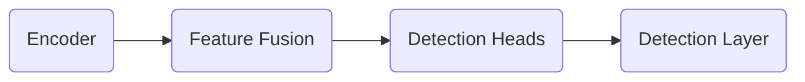

OD model

An important step of compiling an OD model is defining prototxt.
Prototxt file contains all relevant information of the detection layer.
[Process This: Efficient object detection using Yolov5 and TDA4x processors | Video | TI.com](https://www.ti.com/video/6286792047001)

Each Deep Neural Network has few components:
1.  **model**: This directory contains the DNN being targeted to infer
2.  **artifacts**: This directory contains the artifacts generated after the compilation of DNN for SDK. These artifacts can be generated and validated with simple file based examples provided in Edge AI TIDL Tools
3.  **param.yaml**: A configuration file in yaml format to provide basic information about DNN, and associated pre and post processing parameters
4.  ***dataset.yaml :** This configuration file in yaml format illustrate the details of dataset used for model training.
5.  ***run.log :** This is run log of model.

[edgeai-benchmark](https://github.com/TexasInstruments/edgeai-benchmark): Custom model benchmark can also be easily done (please refer to the documentation and example). Uses [edgeai-tidl-tools](https://github.com/TexasInstruments/edgeai-tidl-tools) for model compilation and inference

1. 首先，使用PyTorch训练模型并导出.onnx和prototxt文件;
2. 其次，使用edgeai-benchmark来对.onnx和prototxt文件进行基准测试，以获取param.yaml文件。可以使用脚本[edgeai-benchmark/run_custom_pc.sh](https://github.com/TexasInstruments/edgeai-benchmark/blob/master/run\_custom\_pc.sh)来调用[edgeai-benchmark/custom.py](https://github.com/TexasInstruments/edgeai-benchmark/blob/master/scripts/benchmark\_custom.py)。如果模型不在该文件列出的类型之中，可以参考[edgeai-benchmark/configs](https://github.com/TexasInstruments/edgeai-benchmark/tree/master/configs)目录中的示例,
这一步将创建一个编译后的模型文件包（tar.gz文件）;
3. 第三步，通过flash手动将上述.tar.gz文件复制到SD卡中（或者在启动后，可以直接使用scp或其他工具进行复制）;
4. 最后，运行/opt/edge_ai_apps/apps_python/app_edgeai.py。

除了上述的第二步，也可以使用edgeai-tidl-tools。但是需要手动编辑param.yaml文件，以使其与edgeai-benchmark生成的文件相匹配。 

# [EdgeAI-Benchmark](https://github.com/TexasInstruments/edgeai-benchmark/tree/master)
This repository provides a collection of scripts for various image recognition tasks such as classification, segmentation, detection and keypoint detection. (Uses [edgeai-tidl-tools](https://github.com/TexasInstruments/edgeai-tidl-tools) for model compilation and inference)