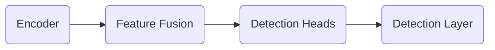

OD model

An important step of compiling an OD model is defining prototxt.
Prototxt file contains all relevant information of the detection layer.
[Process This: Efficient object detection using Yolov5 and TDA4x processors | Video | TI.com](https://www.ti.com/video/6286792047001)

Each Deep Neural Network has few components:
1.  **model**: This directory contains the DNN being targeted to infer
2.  **artifacts**: This directory contains the artifacts generated after the compilation of DNN for SDK. These artifacts can be generated and validated with simple file based examples provided in Edge AI TIDL Tools
3.  **param.yaml**: A configuration file in yaml format to provide basic information about DNN, and associated pre and post processing parameters
4.  ***dataset.yaml :** This configuration file in yaml format illustrate the details of dataset used for model training.
5.  ***run.log :** This is run log of model.

[edgeai-benchmark](https://github.com/TexasInstruments/edgeai-benchmark): Custom model benchmark can also be easily done (please refer to the documentation and example). Uses [edgeai-tidl-tools](https://github.com/TexasInstruments/edgeai-tidl-tools) for model compilation and inference

1\. First, train the model on pytorch and export the .onnx and prototxt file.

2\. Second, use the edgeai-benchmark whose inputs are .onnx and prototxt file to get the param.yaml

You can use the script [https://github.com/TexasInstruments/edgeai-benchmark/blob/master/run\_custom\_pc.sh](https://github.com/TexasInstruments/edgeai-benchmark/blob/master/run_custom_pc.sh) which calls [https://github.com/TexasInstruments/edgeai-benchmark/blob/master/scripts/benchmark\_custom.py](https://github.com/TexasInstruments/edgeai-benchmark/blob/master/scripts/benchmark_custom.py)

In the above .py file, make suitable modifications - for example comment out the portions that do not apply to your case and use your .onnx and .prototxt

If your model is not one of the type that is listed in that file, you can look at the examples in: <https://github.com/TexasInstruments/edgeai-benchmark/tree/master/configs>

The above step will create a compiled model artifact package - a tar.gz file

3\. Third, copy manually the above .tar.gz file on sd card sd card by flash (or once the booted, you can copy directly via scp of some other utility)

4\. Last, run /opt/edge\_ai\_apps/apps\_python/app\_edgeai.py

Instead of Step 2, above, it also possible to use edgeai-tidl-tools. But then you have to manually edit the param.yaml file to match with edgeai-benchmark would generate.